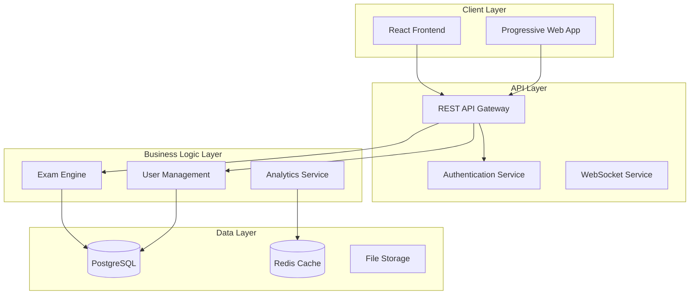
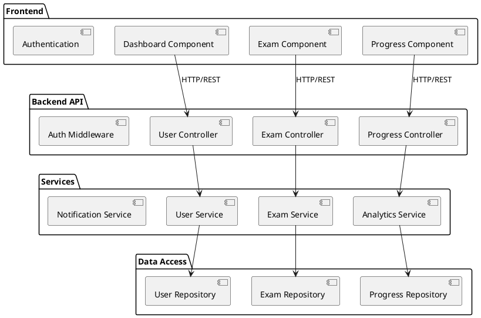
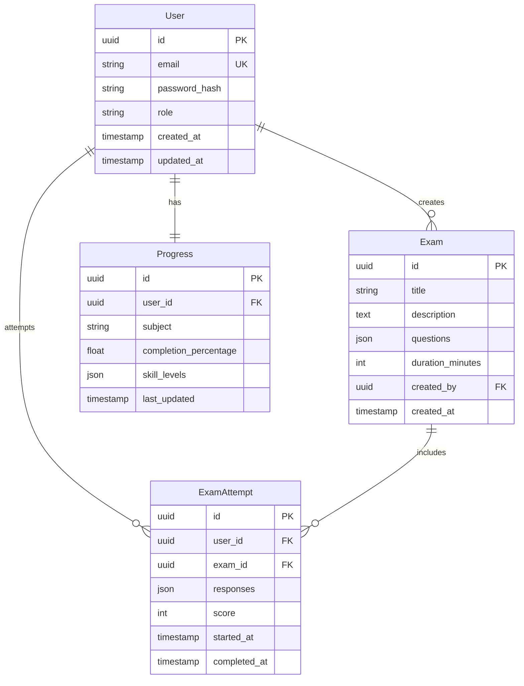
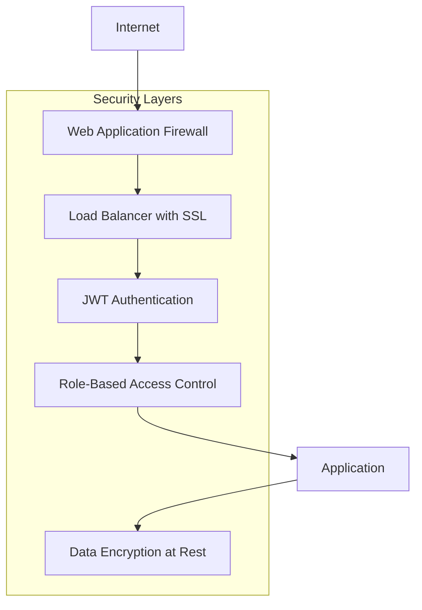

# Technical Design: {{FEATURE_NAME}}

## System Architecture Overview

## Component Design

## Database Design

## API Specifications

### Authentication Endpoints
| Method | Endpoint | Description | Request | Response |
|--------|----------|-------------|---------|----------|
| POST | `/api/auth/login` | User login | `{email, password}` | `{token, refreshToken, user}` |
| POST | `/api/auth/refresh` | Refresh token | `{refreshToken}` | `{token, refreshToken}` |
| POST | `/api/auth/logout` | User logout | `{refreshToken}` | `{success: true}` |

## Performance Considerations
- Database query optimization with proper indexing
- Redis caching for frequently accessed data
- CDN for static assets
- Connection pooling for database connections
- Lazy loading for large datasets

## Security Architecture
