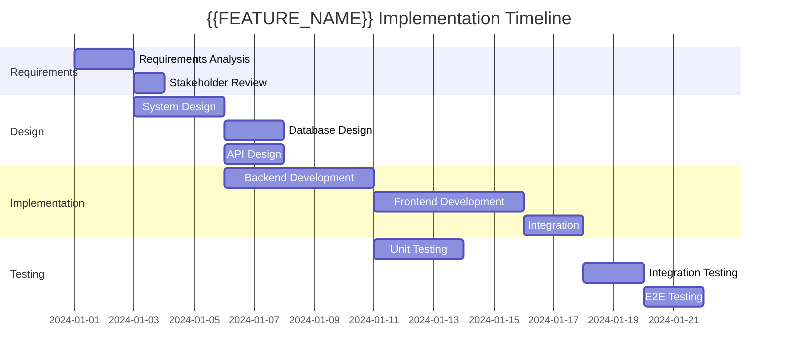

# Implementation Plan: {{FEATURE_NAME}}

## Development Timeline


## Task Breakdown Structure
```mermaid
mindmap
  root){{FEATURE_NAME}}(
    Requirements
      Functional Requirements
      Non-functional Requirements
      Acceptance Criteria
    Design
      System Architecture
      Database Schema
      API Specification
      UI/UX Design
    Implementation
      Backend Development
        API Endpoints
        Business Logic
        Database Integration
      Frontend Development
        Components
        State Management
        API Integration
      Testing
        Unit Tests
        Integration Tests
        E2E Tests
    Deployment
      Environment Setup
      CI/CD Pipeline
      Monitoring Setup
```

## Technical Tasks

### Phase 1: Foundation (Backend)
| Task ID | Description | Estimated Hours | Dependencies | Assigned Agent |
|---------|-------------|----------------|--------------|----------------|
| T001 | Database schema migration | 2 | - | backend-executor |
| T002 | User authentication API | 4 | T001 | backend-executor |
| T003 | Exam management API | 6 | T001, T002 | backend-executor |
| T004 | Progress tracking API | 4 | T001, T002 | backend-executor |

### Phase 2: User Interface (Frontend)
| Task ID | Description | Estimated Hours | Dependencies | Assigned Agent |
|---------|-------------|----------------|--------------|----------------|
| T005 | Authentication components | 3 | T002 | frontend-executor |
| T006 | Dashboard components | 6 | T002, T004 | frontend-executor |
| T007 | Exam interface components | 8 | T003 | frontend-executor |
| T008 | Progress visualization | 5 | T004 | frontend-executor |

### Phase 3: Quality & Deployment
| Task ID | Description | Estimated Hours | Dependencies | Assigned Agent |
|---------|-------------|----------------|--------------|----------------|
| T009 | Unit test suite | 6 | T001-T004 | quality-fixer |
| T010 | Integration tests | 4 | T005-T008 | quality-fixer |
| T011 | Performance optimization | 3 | T009, T010 | performance-optimizer |
| T012 | Security audit | 2 | T009, T010 | security-executor |

## Risk Assessment Matrix
| Risk | Probability | Impact | Mitigation Strategy |
|------|-------------|--------|-------------------|
| Database performance issues | Medium | High | Implement query optimization and caching |
| Third-party API limitations | Low | Medium | Implement fallback mechanisms |
| Security vulnerabilities | Low | Critical | Regular security audits and penetration testing |
| User adoption challenges | Medium | Medium | User feedback integration and iterative improvements |

## Quality Gates
- [ ] All unit tests pass (coverage > 85%)
- [ ] All integration tests pass
- [ ] Performance benchmarks met (< 200ms response time)
- [ ] Security audit completed with zero critical issues
- [ ] Accessibility compliance verified (WCAG 2.1 AA)
- [ ] Code review completed by technical-designer
- [ ] Documentation updated and reviewed