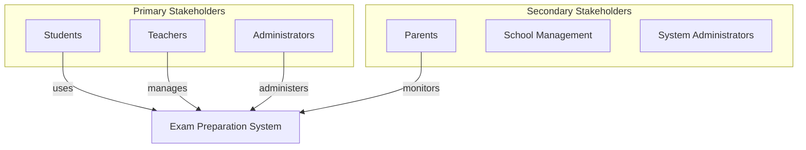
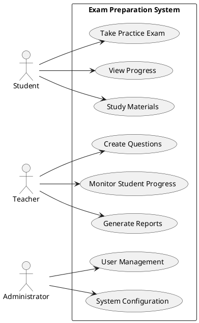

# Requirements Specification: {{FEATURE_NAME}}

## Overview
{{FEATURE_DESCRIPTION}}

## Stakeholder Analysis

## Functional Requirements

| ID | Requirement | Priority | Acceptance Criteria |
|----|-------------|----------|-------------------|
| REQ-001 | {{REQUIREMENT_1}} | High | {{CRITERIA_1}} |
| REQ-002 | {{REQUIREMENT_2}} | Medium | {{CRITERIA_2}} |

## Use Case Diagram

## Non-Functional Requirements

### Performance Requirements
| Metric | Target | Measurement Method |
|--------|--------|-------------------|
| Response Time | < 200ms | API monitoring |
| Throughput | 1000+ concurrent users | Load testing |
| Availability | 99.9% uptime | System monitoring |

### Security Requirements
- Authentication: JWT-based with refresh tokens
- Authorization: Role-based access control (RBAC)
- Data Protection: End-to-end encryption for sensitive data
- Audit Logging: Complete audit trail for all user actions

## Success Metrics
- [ ] User adoption rate > 80%
- [ ] Performance benchmarks met
- [ ] Security audit passed
- [ ] Accessibility compliance (WCAG 2.1 AA)