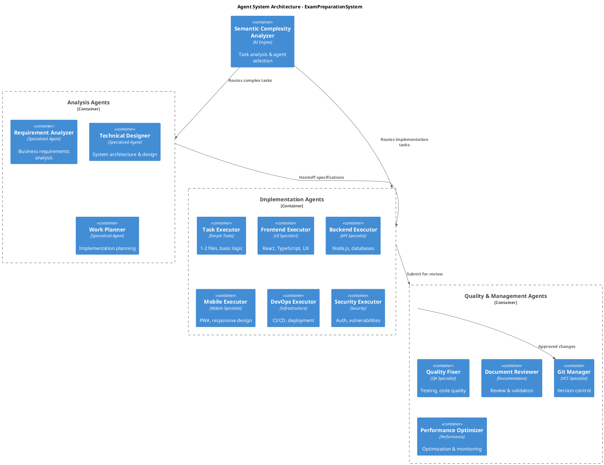

# 🔒 Claude Code Excellence System v3.0 (4.9/5 Target)

## 🎯 Flexible Development Workflows

### Workflow Control Commands
```bash
# Continuous workflow (all phases automatically)
/auto-dev "requirement description"

# Step-by-step workflow (manual progression)  
/spec "requirement description"      # Only requirements analysis
/design                             # Only technical design (after /spec)
/plan                              # Only implementation planning (after /design)
/implement                         # Only implementation (after /plan)

# Phase jumping (skip to specific phase)
/spec-design "requirement"         # Requirements + Design only
/design-implement "requirement"    # Design + Implementation only
/quick-implement "simple task"     # Direct implementation for simple tasks
```

### Task Context Management System
```xml
<task-context-system>
  <auto-update-triggers>
    <new-task>Create new CLAUDE-TASK-CONTEXT.md with template</new-task>
    <phase-completion>Update progress checklist automatically</phase-completion>
    <branch-switch>Archive old context, create new context</branch-switch>
    <session-end>Archive context to .claude/history/</session-end>
  </auto-update-triggers>
  
  <context-template>
    <header>
      <task-id>{{UUID}}</task-id>
      <task-title>{{DESCRIPTION}}</task-title>
      <branch>{{BRANCH_NAME}}</branch>
      <workflow-mode>{{auto|manual|hybrid}}</workflow-mode>
      <started>{{TIMESTAMP}}</started>
      <last-updated>{{TIMESTAMP}}</last-updated>
    </header>
    
    <progress-tracking>
      <current-phase>{{requirements|design|planning|implementation|testing|documentation}}</current-phase>
      <completion-percentage>{{0-100}}</completion-percentage>
      <quality-gates-passed>{{LIST}}</quality-gates-passed>
      <blockers>{{LIST_OF_ISSUES}}</blockers>
    </progress-tracking>
    
    <deliverables-status>
      <requirements-doc>{{not-started|in-progress|completed|reviewed}}</requirements-doc>
      <design-doc>{{not-started|in-progress|completed|reviewed}}</design-doc>
      <implementation-plan>{{not-started|in-progress|completed|reviewed}}</implementation-plan>
      <source-code>{{not-started|in-progress|completed|tested}}</source-code>
      <documentation>{{not-started|in-progress|completed|reviewed}}</documentation>
    </deliverables-status>
  </context-template>
</task-context-system>
```

## 🏗️ Enhanced Agent Architecture with SysML Modeling

### Agent System Architecture (PlantUML)


### Advanced Agent Selection with Semantic Analysis
```xml
<semantic-complexity-engine>
  <analysis-dimensions>
    <syntactic-complexity>
      <file-count weight="0.2">{{estimated-files}}</file-count>
      <code-volume weight="0.15">{{estimated-loc}}</code-volume>
      <interdependencies weight="0.15">{{cross-references}}</interdependencies>
    </syntactic-complexity>
    
    <semantic-complexity>
      <domain-complexity weight="0.25">{{business-logic-depth}}</domain-complexity>
      <algorithm-complexity weight="0.2">{{computational-complexity}}</algorithm-complexity>
      <integration-complexity weight="0.15">{{external-systems}}</integration-complexity>
    </semantic-complexity>
    
    <technical-specialization>
      <ui-ux-requirements weight="0.2">{{interface-complexity}}</ui-ux-requirements>
      <mobile-optimization weight="0.15">{{responsive-pwa-needs}}</mobile-optimization>
      <security-criticality weight="0.2">{{security-requirements}}</security-criticality>
      <performance-criticality weight="0.15">{{optimization-needs}}</performance-criticality>
      <devops-requirements weight="0.1">{{deployment-complexity}}</devops-requirements>
    </technical-specialization>
  </analysis-dimensions>
  
  <selection-algorithm>
    <step1>Parse natural language requirement</step1>
    <step2>Extract technical keywords and context</step2>
    <step3>Calculate complexity scores across dimensions</step3>
    <step4>Identify required specializations</step4>
    <step5>Match to optimal agent based on expertise matrix</step5>
    <step6>Validate agent capabilities against requirements</step6>
  </selection-algorithm>
</semantic-complexity-engine>
```

## 🤖 15 Specialized Agents System

### Core Development Agents
- **requirement-analyzer**: Business requirements with SysML stakeholder analysis  
- **technical-designer**: System architecture with UML component diagrams
- **work-planner**: Implementation planning with Gantt chart visualization
- **task-executor**: Simple tasks (1-2 files, basic logic)
- **frontend-executor**: React/TypeScript UI development (complex, 3+ files)
- **backend-executor**: Node.js/API development (complex, 3+ files)

### Specialized Implementation Agents  
- **mobile-executor**: PWA optimization, responsive design, touch interfaces
- **devops-executor**: CI/CD pipelines, deployment automation, infrastructure
- **security-executor**: Authentication, vulnerability scanning, compliance
- **performance-optimizer**: System optimization, caching, monitoring

### Quality & Management Agents
- **quality-fixer**: 6-phase quality gates (lint, type, test, build, security, perf)
- **git-manager**: Version control, branching, conflict resolution, PR management
- **document-reviewer**: Documentation validation, consistency checking
- **document-fixer**: Technical writing enhancement, diagram creation

### Agent Selection Rules
- **Simple tasks (≤2 files)**: task-executor
- **UI/Frontend (3+ files)**: frontend-executor  
- **API/Backend (3+ files)**: backend-executor
- **Mobile features**: mobile-executor
- **Performance issues**: performance-optimizer
- **Security concerns**: security-executor
- **Quality problems**: quality-fixer → technical-designer (if unfixable)
- **Git operations**: git-manager exclusively

## 🛠 6-Phase Quality Excellence System

### Phase 1: Code Quality & Formatting
```bash
biome format . --write --config-path=config/quality/biome.json
biome check . --apply --config-path=config/quality/biome.json
```

### Phase 2: TypeScript Type Safety
```bash
tsc --noEmit --project config/build/tsconfig.json
```

### Phase 3: Test Coverage & Validation
```bash
npm test -- --coverage --watchAll=false
# Target: 85%+ coverage
```

### Phase 4: Build Integrity
```bash
npm run build:frontend && npm run build:backend
```

### Phase 5: Security Audit
```bash
npm audit --audit-level=moderate
# Target: Zero high/critical vulnerabilities
```

### Phase 6: Performance Validation
```bash
./scripts/automation/performance-monitor.sh
# Target: 92+/100 overall score
```

## 📊 Performance Excellence Metrics (4.9/5 Target)

### Scoring Matrix (Target: 92+/100)
- **Code Quality**: 95+/100 (Biome lint score)
- **Type Safety**: 95+/100 (TypeScript errors = 0)
- **Test Coverage**: 85%+ (Frontend + Backend combined)
- **Security**: 95+/100 (Zero high/critical vulnerabilities)
- **Performance**: 90+/100 (Build success + speed)

### Excellence Levels
- **4.9/5 EXCEPTIONAL**: 92+ overall score
- **4.5/5 EXCELLENT**: 88-91 overall score  
- **4.0/5 GOOD**: 84-87 overall score
- **3.5/5 SATISFACTORY**: 75-83 overall score

## 🚫 Atomic Commit Rules (Strictly Enforced)

### One Commit = One Responsibility
- ✅ Single logical change only
- ✅ Maximum 3 files (unless tightly coupled)
- ✅ Independently revertible
- ❌ Multiple features mixed

### Commit Sequence (Mandatory Order)
1. **Database/Schema** → 2. **Backend API** → 3. **Frontend** → 4. **Docs** → 5. **Tests** → 6. **Config**

### Branch Strategy (main direct commit = FORBIDDEN)
```bash
# ✅ CORRECT WORKFLOW
git checkout -b feature/task-name
git add specific-files  
git commit -m "type: description"
git push -u origin feature/task-name
# Create PR for review

# ❌ FORBIDDEN
git commit -m "changes"  # Direct to main = IMMEDIATE FAILURE
```

## 📋 4-Stage PR Review Process

### Mandatory Review Stages
1. **Stage 1**: quality-fixer (Quality & Testing)
2. **Stage 2**: technical-designer (Design Conformance)  
3. **Stage 3**: document-reviewer (Documentation)
4. **Stage 4**: requirement-analyzer (Requirements Validation)

### Approval Requirements
- All 4 stages must PASS
- git-manager executes merge only
- Auto-merge disabled

## 📁 Organized File Structure

### Configuration Organization
```
config/
├── quality/          # Biome, EditorConfig, linting rules
├── build/           # TypeScript, build tool configurations
└── environment/     # .env files, MCP servers, runtime config
```

### Documentation Structure  
```
docs/
├── requirements/    # Business requirements with SysML
├── design/         # Technical design with UML diagrams
├── plans/          # Implementation plans with Gantt charts
├── architecture/   # System architecture documentation
└── api/           # API specifications and schemas
```

### Development Tools
```
scripts/automation/
├── performance-monitor.sh    # Real-time excellence scoring
├── quality-check.sh         # 6-phase quality validation
└── setup-environment.sh     # Environment initialization
```

### Claude Configuration
```
.claude/
├── templates/      # SysML/UML documentation templates
├── history/        # Task context archives  
├── agents/         # Agent configuration files
└── metrics/        # Performance tracking data
```

## 🔄 Session Management

### Session End Requirements
1. **Status Check**: `git status` for pending changes
2. **Staging**: Add related files to staging area
3. **Context Archive**: Save CLAUDE-TASK-CONTEXT.md to .claude/history/
4. **Summary Commit**: Create session summary with timestamp
5. **Branch Push**: Push to current branch (never main)

### Session Commit Format
```
session: Auto-commit session changes

- Configuration organization completed
- Agent system enhancement implemented  
- Performance monitoring system activated
- Session completed at {{TIMESTAMP}}

🤖 Generated with [Claude Code](https://claude.ai/code)
Co-Authored-By: Claude <noreply@anthropic.com>
```

## ⚡ Context Preservation Rules

### Critical Memory Protection
1. **Session Start**: Always read this CLAUDE.md file first
2. **Agent Launch**: Confirm specialization boundaries  
3. **Pre-Commit**: Verify atomic commit compliance
4. **Pre-PR**: Confirm 4-stage review readiness

### Priority Matrix
1. **🔥 CRITICAL**: Atomic commits, agent boundaries, main branch protection
2. **⚠️ HIGH**: Quality gates, performance targets, security compliance  
3. **📋 MEDIUM**: Documentation standards, file organization

## 🎯 Excellence Achievement Checklist

### Pre-Work Validation
```
□ CLAUDE.md rules reviewed and understood?
□ Agent specialization boundaries clear?
□ Quality gates configured and operational?
□ Performance monitoring system active?
□ Atomic commit strategy confirmed?
```

### Post-Work Validation  
```
□ All changes atomic and focused?
□ Quality score 92+ achieved?
□ No direct main branch commits?
□ Documentation updated with diagrams?
□ Session context properly archived?
```

**🏆 SUCCESS METRIC**: Achieve and maintain 4.9/5 excellence through systematic application of these rules, intelligent agent utilization, and continuous performance monitoring.