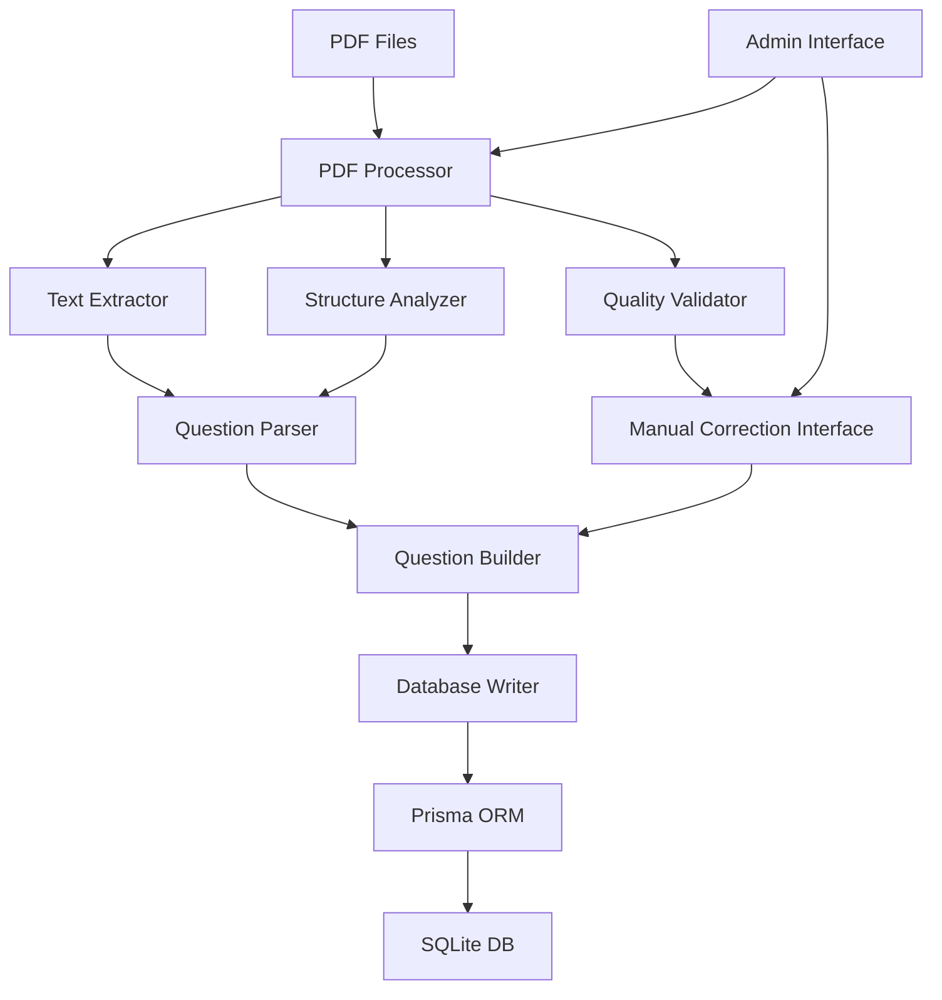

# ADR-0002: PDF過去問自動処理システムのアーキテクチャ設計

## ステータス
Proposed

## 作成日
2025-08-02

## 背景と解決すべき課題

### 課題
PDFファイルから過去問データを自動的に抽出し、システムに登録する機能を実装する必要がある：
- 構造化されたPDFファイル（午前II、午後I、午後II）からの問題抽出
- 年度別フォルダ構成（2020-2024）での一括処理
- 問題・解答・解説の分離ファイルからの統合データ作成

### 技術的制約
- 既存システム（SQLite + Prisma ORM + Express）への最小限の影響
- Node.js + TypeScript環境での実装
- 個人利用前提（商用ライブラリ制約）
- 法的リスク回避（引用記載、個人利用範囲内）

### 解決すべき設計課題
1. PDF処理エンジンの選定と統合方法
2. データ抽出・構造化アルゴリズムの設計
3. 品質管理・バリデーション機能
4. エラーハンドリングと手動修正フロー
5. 大量データ処理のパフォーマンス最適化

## 検討した選択肢

### 案A: pdf-parse + 正規表現ベース処理

**概要**: 軽量なpdf-parseライブラリで文字列抽出し、正規表現で構造化

**技術仕様**:
```typescript
interface PDFProcessor {
  extractText(pdfPath: string): Promise<string>
  parseQuestions(text: string, type: 'morning2' | 'afternoon1' | 'afternoon2'): Question[]
  validateQuestion(question: Question): ValidationResult
}
```

**利点**:
- 軽量で高速なデータ処理
- 依存関係が最小限（pdf-parse のみ）
- カスタマイズ性が高い
- 無料ライブラリのみで実装可能

**欠点**:
- 複雑なPDFレイアウトへの対応が困難
- 正規表現メンテナンスの複雑性
- 図表・画像の抽出が限定的
- 年度間でのフォーマット変更への脆弱性

**工数**: 5日
**主なリスク**: PDFフォーマット変更時の破綻、複雑な図表処理

### 案B: PDF-lib + OCR統合処理

**概要**: PDF-libで高度なPDF解析とOCR技術の組み合わせ

**技術仕様**:
```typescript
interface AdvancedPDFProcessor {
  extractStructuredData(pdfPath: string): Promise<PDFDocument>
  performOCR(imageData: Buffer): Promise<string>
  extractImages(pdf: PDFDocument): Promise<ImageData[]>
  parseComplexLayouts(data: PDFDocument): Question[]
}
```

**利点**:
- 複雑なレイアウトへの対応力
- 図表・画像の高精度抽出
- PDFメタデータの活用
- 将来のフォーマット変更への堅牢性

**欠点**:
- OCRライブラリの複雑な設定
- 処理時間の大幅な増加
- メモリ消費量の増大
- ライセンス問題（商用OCR）

**工数**: 10日
**主なリスク**: 性能問題、ライセンス制約、実装複雑性

### 案C: ハイブリッド処理（段階的解析）

**概要**: pdf-parse基本処理 + 必要時のみ高度処理の段階的アプローチ

**技術仕様**:
```typescript
interface HybridPDFProcessor {
  // Stage 1: 基本テキスト抽出
  basicExtraction(pdfPath: string): Promise<BasicQuestionData>
  
  // Stage 2: 構造解析
  structuralAnalysis(data: BasicQuestionData): Promise<StructuredQuestion>
  
  // Stage 3: 品質チェックと補完
  qualityValidation(question: StructuredQuestion): Promise<ValidationResult>
  
  // Stage 4: 手動修正インターフェース
  manualCorrection(question: StructuredQuestion): Promise<CorrectedQuestion>
}
```

**利点**:
- 段階的実装による開発リスク軽減
- 基本機能の早期実現
- 高度機能の選択的実装
- デバッグ・修正の容易性

**欠点**:
- アーキテクチャの複雑化
- 処理パイプラインの管理コスト
- 各段階での品質保証の必要性

**工数**: 7日
**主なリスク**: パイプライン設計の複雑性、段階間データの整合性

## 比較マトリクス

| 評価軸 | 案A (正規表現) | 案B (OCR統合) | 案C (ハイブリッド) |
|--------|----------------|---------------|-------------------|
| 実装工数 | 5日 | 10日 | 7日 |
| 保守性 | 中 | 低 | 高 |
| 拡張性 | 低 | 高 | 高 |
| パフォーマンス | 高 | 低 | 中 |
| 精度 | 中 | 高 | 高 |
| リスク | 中 | 高 | 低 |
| 実装複雑性 | 低 | 高 | 中 |
| 運用コスト | 低 | 高 | 中 |

## 推奨案と根拠

### 推奨: 案C（ハイブリッド処理・段階的解析）

**主な理由**:
1. **段階的実装**: Phase 1で基本機能を実現し、リスクを軽減
2. **実装現実性**: 個人プロジェクトの制約下で実現可能な工数
3. **品質保証**: 各段階での検証により高い精度を確保
4. **拡張性**: 将来的な機能追加（OCR、画像処理）への対応準備

**トレードオフ**:
- アーキテクチャの複雑性を受け入れる
- 段階間のデータフロー管理コストを許容
- モジュール化による若干の性能オーバーヘッドを受け入れる

**技術的判断理由**:
- MVP優先（午前II問題から開始）に適合
- 段階的品質向上による確実な成果創出
- 個人利用制約下での実装可能性を重視

## 実装ガイドライン

### 1. システムアーキテクチャ



### 2. データベーススキーマ拡張

```sql
-- PDF処理結果の追跡
model PDFSource {
  id          String   @id @default(cuid())
  filePath    String
  fileName    String
  fileHash    String   // ファイル重複チェック用
  processedAt DateTime @default(now())
  status      String   // "processing", "completed", "failed"
  errorLog    String?
  
  questions   Question[] @relation("PDFSourceQuestions")
  
  @@unique([fileHash])
}

-- Question テーブル拡張
model Question {
  // 既存フィールド
  id          String     @id @default(cuid())
  content     String
  explanation String?
  difficulty  Int        @default(1)
  year        Int?
  session     String?
  categoryId  String
  
  // PDF処理関連の新規フィールド
  sourceType  String?    // "manual", "pdf_auto", "pdf_corrected"
  pdfSourceId String?
  pdfSource   PDFSource? @relation("PDFSourceQuestions", fields: [pdfSourceId], references: [id])
  originalText String?   // PDF元テキスト（デバッグ用）
  qualityScore Float?    // 抽出品質スコア 0.0-1.0
  needsReview Boolean    @default(false) // 手動確認が必要
  
  // 既存リレーション
  category    Category   @relation(fields: [categoryId], references: [id])
  choices     Choice[]
  answers     Answer[]
  reviewItems ReviewItem[]
  
  createdAt   DateTime   @default(now())
  updatedAt   DateTime   @updatedAt
}

-- 処理ログテーブル
model ProcessingLog {
  id          String   @id @default(cuid())
  operation   String   // "pdf_extraction", "validation", "correction"
  status      String   // "success", "warning", "error"
  message     String
  details     String?  // JSON形式の詳細情報
  questionId  String?
  pdfSourceId String?
  createdAt   DateTime @default(now())
}
```

### 3. API設計

```typescript
// PDF処理管理API
interface PDFProcessingAPI {
  // PDF処理開始
  POST /api/admin/pdf/process
  body: { 
    filePath: string
    questionType: 'morning2' | 'afternoon1' | 'afternoon2'
    year?: number
    session?: string
  }
  
  // 処理状況確認
  GET /api/admin/pdf/status/:processId
  
  // 処理結果一覧
  GET /api/admin/pdf/results
  
  // 手動修正インターフェース
  GET /api/admin/pdf/review/:questionId
  POST /api/admin/pdf/correct/:questionId
}
```

### 4. 段階的実装計画

#### Phase 1: 基本PDF処理（Week 1-2）
```typescript
class BasicPDFProcessor {
  async extractText(pdfPath: string): Promise<string>
  async parseAM2Questions(text: string): Promise<QuestionData[]>
  async validateBasicStructure(questions: QuestionData[]): Promise<ValidationResult>
}
```

#### Phase 2: 構造解析強化（Week 3）
```typescript
class StructureAnalyzer {
  async identifyQuestionBoundaries(text: string): Promise<QuestionSegment[]>
  async extractChoices(segment: QuestionSegment): Promise<Choice[]>
  async detectCorrectAnswers(segment: QuestionSegment): Promise<number[]>
}
```

#### Phase 3: 品質管理・手動修正（Week 4）
```typescript
class QualityManager {
  async calculateQualityScore(question: QuestionData): Promise<number>
  async identifyReviewNeeds(question: QuestionData): Promise<ReviewFlag[]>
  async generateCorrectionInterface(question: QuestionData): Promise<CorrectionForm>
}
```

## 結果と期待される効果

### 期待される成果
1. **効率化**: 手動問題入力の大幅な時間短縮
2. **データ品質**: 構造化されたデータの一貫性確保
3. **拡張性**: 将来の新試験形式への対応準備
4. **トレーサビリティ**: PDF処理の透明性と修正履歴管理

### 成功指標
- 午前II問題（50問/年度）の90%自動抽出成功率
- 手動修正が必要な問題を10%以下に抑制
- 1年度分（150問）の処理時間を30分以内に短縮

## リスク対策

### 技術リスク
- **フォーマット変更**: 年度別パターン学習とアダプターパターン適用
- **データ品質**: 多段階検証と品質スコアによる自動フィルタリング
- **性能問題**: バッチ処理とプログレス表示による UX 改善

### 運用リスク
- **法的リスク**: 個人利用範囲の明確化と引用元情報の適切な記録
- **データ整合性**: ロールバック機能と処理ログによる問題追跡
- **ユーザビリティ**: 管理画面での直感的な修正インターフェース提供

## 次のステップ

1. **Phase 1実装**: 基本PDF処理機能の開発
2. **テストデータ**: 1年度分のPDFでの動作検証
3. **品質改善**: ユーザビリティテストと精度向上
4. **機能拡張**: 午後問題対応と画像処理機能追加

## 参考情報

### 技術スタック
- **PDF処理**: pdf-parse (基本), PDF-lib (将来)
- **正規表現**: 年度別パターンファイルでの管理
- **バリデーション**: Zod による型安全な検証
- **UI**: React + Material-UI 管理画面