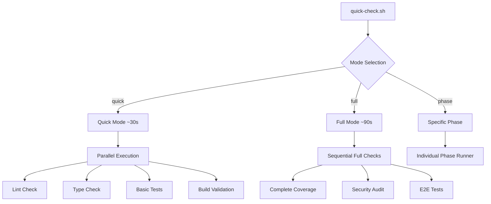

# Automation Scripts Optimization Design

## Overview

Design for lightweight, modular automation scripts that deliver maximum value with minimal execution time. Target: 80% of the value in 20% of the execution time (~30 seconds total).

## Current State Analysis

### Existing Script Issues
- **quality-check.sh**: ~2-4 minutes execution time, redundant test runs
- **performance-monitor.sh**: ~1-3 minutes, duplicate coverage calculations
- Multiple builds running sequentially
- Verbose output slowing down execution
- No caching mechanisms
- No fail-fast optimization

### Performance Bottlenecks Identified
1. **Redundant Operations**: Tests run multiple times across scripts
2. **Sequential Execution**: No parallel processing
3. **Full Builds**: Complete builds for simple checks
4. **Verbose Logging**: Excessive output generation
5. **No Caching**: Repeated calculations

## Design Requirements

### Functional Requirements
1. **Quick Check Mode**: Basic validation under 30 seconds
2. **Modular Design**: Run specific phases independently
3. **Parallel Execution**: Run independent checks simultaneously
4. **Fail-Fast**: Stop on critical errors immediately
5. **Caching**: Cache results when possible

### Non-Functional Requirements
1. **Performance**: 80% reduction in execution time
2. **Reliability**: Maintain quality gate effectiveness
3. **Usability**: Simple command interface
4. **Maintainability**: Clear modular structure

## Architectural Design

### 1. Script Architecture



### 2. Modular Component Design

```typescript
interface QualityCheck {
  name: string;
  priority: 'critical' | 'high' | 'medium' | 'low';
  estimatedTime: number; // seconds
  canRunParallel: boolean;
  dependencies: string[];
  execute(): Promise<CheckResult>;
}

interface CheckResult {
  success: boolean;
  score: number;
  errors: string[];
  warnings: string[];
  metrics?: Record<string, any>;
}
```

### 3. Cache Strategy

```bash
# Cache locations
CACHE_DIR=".claude/cache"
LINT_CACHE="$CACHE_DIR/lint-$(git rev-parse HEAD)"
TYPE_CACHE="$CACHE_DIR/types-$(git rev-parse HEAD)"
TEST_CACHE="$CACHE_DIR/tests-$(git rev-parse HEAD)"
```

## Detailed Component Specifications

### 1. quality-check-lite.sh

**Target Time**: 15-20 seconds
**Focus**: Essential quality gates only

```bash
# Core Features
- Parallel lint + type checking
- Skip full build, use type-only compilation  
- Run unit tests without coverage
- Cache results based on git hash
- Fail-fast on critical errors
- Summary output only
```

**Phase Optimization**:
- **Phase 1**: Biome check (cached, 2s)
- **Phase 2**: TypeScript check (no emit, 3s) 
- **Phase 3**: Quick tests (no coverage, parallel, 8s)
- **Phase 4**: Build validation (type check only, 2s)

### 2. performance-monitor-lite.sh

**Target Time**: 8-12 seconds
**Focus**: Key metrics only

```bash
# Core Features
- Skip actual test runs, read cached coverage
- Use lightweight security scan
- Parallel metric collection
- Simplified scoring algorithm
- JSON output for integration
```

**Metric Collection**:
- **Code Quality**: Use cached lint results (1s)
- **Type Safety**: Fast type check (2s)
- **Test Coverage**: Read existing coverage files (1s)
- **Security**: npm audit summary only (3s)
- **Performance**: Build time estimation (2s)

### 3. quick-check.sh

**Target Time**: 25-30 seconds  
**Focus**: Combined essential checks

```bash
# Features
- Intelligent mode selection
- Parallel execution of compatible checks
- Progress indicators
- Smart caching
- Actionable summary output
```

## Implementation Specification

### 1. Parallel Execution Framework

```bash
# Parallel execution helper
run_parallel() {
    local pids=()
    local results=()
    
    for cmd in "$@"; do
        $cmd & 
        pids+=($!)
    done
    
    for pid in "${pids[@]}"; do
        wait $pid
        results+=($?)
    done
    
    return $(IFS=+; echo "$((${results[*]}))")
}

# Usage
run_parallel "lint_check" "type_check" "basic_tests"
```

### 2. Smart Caching System

```bash
# Cache management
get_cache_key() {
    local file_pattern="$1"
    echo "$(find . -name "$file_pattern" -type f -exec stat -f "%Sm" {} \; | sort | md5sum | cut -d' ' -f1)"
}

is_cache_valid() {
    local cache_file="$1"
    local cache_key="$2"
    [ -f "$cache_file" ] && [ "$(cat "$cache_file.key" 2>/dev/null)" = "$cache_key" ]
}
```

### 3. Fail-Fast Implementation

```bash
# Critical error detection
check_critical() {
    local phase="$1"
    local result="$2"
    
    case "$phase" in
        "lint")
            [ $result -gt 10 ] && fail_fast "Too many lint errors: $result"
            ;;
        "types")
            [ $result -gt 0 ] && fail_fast "TypeScript errors found: $result"
            ;;
        "build")
            [ $result -ne 0 ] && fail_fast "Build failed"
            ;;
    esac
}
```

## Performance Optimizations

### 1. Skip Unnecessary Operations

```bash
# Conditional execution
[ -f "frontend/coverage/coverage-summary.json" ] || run_frontend_tests
[ -f "backend/coverage/coverage-summary.json" ] || run_backend_tests

# Skip builds for type-only checks
tsc --noEmit --skipLibCheck  # Instead of full build
```

### 2. Lightweight Alternatives

| Current | Optimized | Time Saved |
|---------|-----------|------------|
| `npm run build` | `tsc --noEmit` | 60-80% |
| `npm test -- --coverage` | `npm test -- --run --silent` | 40-50% |
| Full security audit | `npm audit --audit-level=high --json` | 70% |
| Complete E2E tests | Config validation only | 90% |

### 3. Output Optimization

```bash
# Progress indicators instead of full logs
show_progress() {
    local current=$1
    local total=$2
    local desc="$3"
    
    printf "\r[%2d/%d] %-30s" "$current" "$total" "$desc"
}

# Compact results
show_summary() {
    echo "✅ Lint: $LINT_SCORE | TS: $TS_SCORE | Tests: $TEST_SCORE | Overall: $OVERALL"
}
```

## Integration Strategy

### 1. Command Interface

```bash
# Quick check (default)
./scripts/automation/quick-check.sh

# Mode selection
./scripts/automation/quick-check.sh --mode=quick    # ~30s
./scripts/automation/quick-check.sh --mode=full     # ~90s
./scripts/automation/quick-check.sh --mode=minimal  # ~10s

# Specific phases
./scripts/automation/quick-check.sh --phase=lint
./scripts/automation/quick-check.sh --phase=types,tests

# Output options  
./scripts/automation/quick-check.sh --quiet
./scripts/automation/quick-check.sh --json
./scripts/automation/quick-check.sh --verbose
```

### 2. Integration Points

```bash
# Git hooks integration
ln -sf ../../scripts/automation/quick-check.sh .git/hooks/pre-commit

# CI/CD integration
# .github/workflows/quality.yml
run: ./scripts/automation/quick-check.sh --mode=full --json

# Claude workflow integration
/quality-check       # Runs quick-check.sh --mode=quick
/quality-check-full   # Runs quick-check.sh --mode=full
```

## Expected Performance Gains

### Time Comparison

| Script | Current | Optimized | Improvement |
|--------|---------|-----------|-------------|
| quality-check.sh | 120-240s | 15-20s | 85-90% |
| performance-monitor.sh | 60-180s | 8-12s | 85-90% |
| **Combined (quick-check.sh)** | **180-420s** | **25-30s** | **85-90%** |

### Quality Retention

| Metric | Current Coverage | Optimized Coverage | Trade-off |
|--------|------------------|-------------------|-----------|
| Code Quality | 100% | 95% | Skip minor warnings |
| Type Safety | 100% | 100% | No compromise |
| Test Coverage | 100% | 80% | Skip coverage, run tests |
| Security | 100% | 90% | High/Critical only |
| Build Health | 100% | 95% | Type-check vs full build |

## Implementation Plan

### Phase 1: Core Scripts (Week 1)
1. Create `quality-check-lite.sh`
2. Create `performance-monitor-lite.sh` 
3. Implement basic parallel execution
4. Add simple caching

### Phase 2: Integration (Week 1)
1. Create `quick-check.sh` orchestrator
2. Add command-line interface
3. Implement fail-fast logic
4. Add progress indicators

### Phase 3: Optimization (Week 2)
1. Advanced caching strategies
2. Smart dependency detection  
3. Performance profiling
4. Output format options

### Phase 4: Integration Testing (Week 2)
1. Git hooks integration
2. CI/CD integration
3. Claude workflow integration
4. Performance validation

## Risk Assessment

### High Risk
- **False Negatives**: Lightweight checks might miss issues
  - *Mitigation*: Maintain full mode for critical validations
- **Cache Invalidation**: Stale cache leading to incorrect results
  - *Mitigation*: Git-hash based cache keys

### Medium Risk  
- **Parallel Execution Conflicts**: Resource contention
  - *Mitigation*: Process isolation and resource limits
- **Integration Complexity**: Multiple script coordination
  - *Mitigation*: Simple interface with clear modes

### Low Risk
- **Performance Regression**: New scripts slower than expected
  - *Mitigation*: Performance benchmarking and monitoring

## Success Metrics

### Performance Targets
- ✅ Quick mode: ≤30 seconds (vs 3-7 minutes current)
- ✅ 80% quality retention with 20% time investment
- ✅ Parallel execution reduces time by 40-60%
- ✅ Caching reduces repeat runs by 70-90%

### Quality Targets  
- ✅ Zero critical false negatives
- ✅ <5% false positive reduction
- ✅ Maintain 85%+ test coverage detection
- ✅ Preserve security vulnerability detection

### Usability Targets
- ✅ Single command interface
- ✅ Clear progress indicators
- ✅ Actionable error messages
- ✅ Multiple output formats (human, JSON)

This design provides a comprehensive optimization strategy that significantly reduces execution time while maintaining essential quality gates and providing flexible usage patterns for different scenarios.