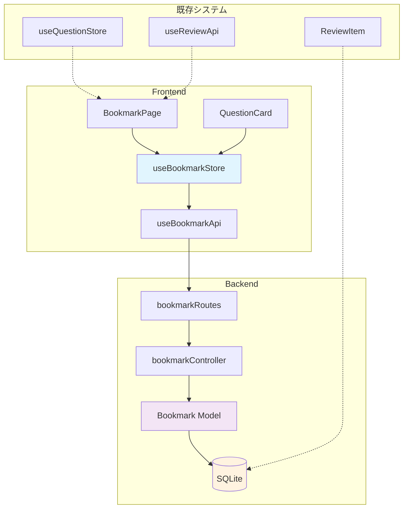
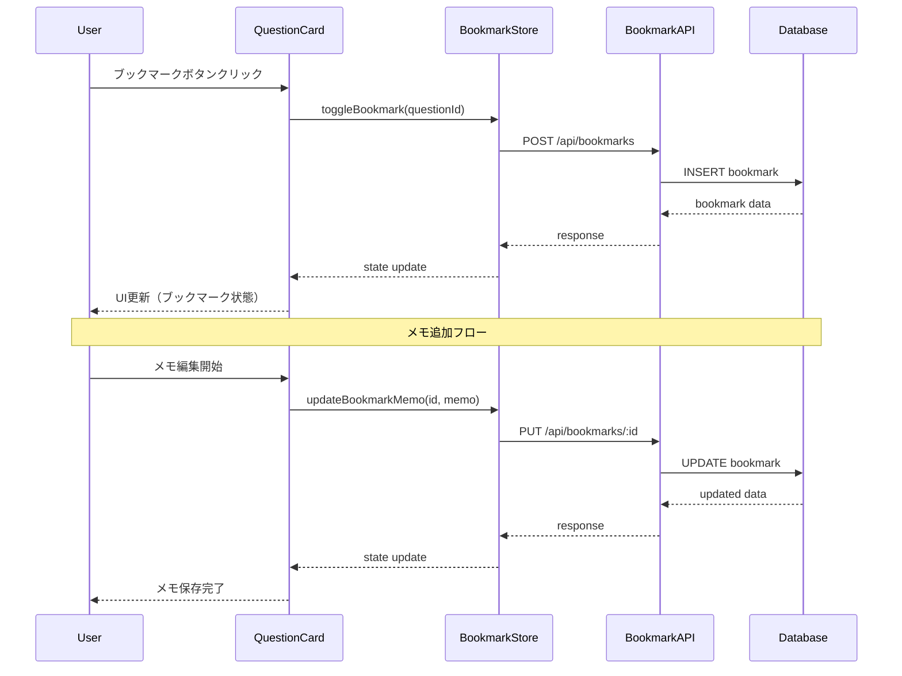
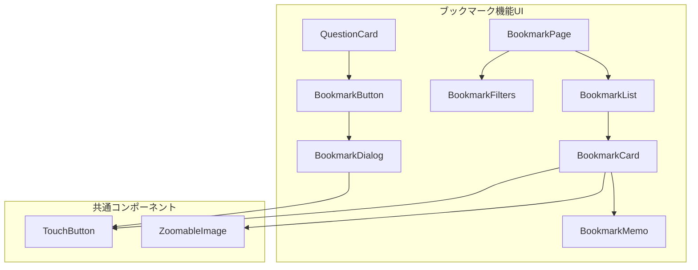

# ブックマーク機能 - 詳細設計書

## 概要

Task 6.1.2 として実装するブックマーク機能の詳細な技術設計書。ADR-0001で決定した独立テーブル設計に基づく実装仕様を定義する。

## 設計方針

### 基本方針
- **責務分離**: 復習機能（自動）とブックマーク機能（手動）を明確に分離
- **既存機能への影響最小化**: 実装済み機能への変更を最小限に抑制
- **モバイルファースト**: タッチ操作に最適化されたUI設計
- **並行開発対応**: 明確なインターフェース定義による作業分離

### アーキテクチャ原則
- Single Responsibility Principle: 各コンポーネントは単一の責務を持つ
- Open/Closed Principle: 将来の拡張（タグ機能等）に対応可能な設計
- 既存パターンの踏襲: プロジェクトの設計パターンに統一

## アーキテクチャ図



## データフロー図



## データベース設計

### Bookmarkテーブル定義

```sql
model Bookmark {
  id         String   @id @default(cuid())
  questionId String
  question   Question @relation(fields: [questionId], references: [id], onDelete: Cascade)
  memo       String?  // メモ機能（最大1000文字）
  priority   Int      @default(1) // 重要度 1-5
  isActive   Boolean  @default(true) // 論理削除対応
  createdAt  DateTime @default(now())
  updatedAt  DateTime @updatedAt
  
  @@unique([questionId])
  @@index([isActive])
  @@index([priority, createdAt])
}
```

### インデックス戦略
```sql
-- パフォーマンス最適化用インデックス
CREATE INDEX idx_bookmark_question_active ON Bookmark (questionId, isActive);
CREATE INDEX idx_bookmark_priority_created ON Bookmark (priority DESC, createdAt DESC);
CREATE INDEX idx_bookmark_active_updated ON Bookmark (isActive, updatedAt DESC);
```

### Questionテーブル拡張
```sql
model Question {
  // 既存フィールド...
  bookmarks Bookmark[] // 関連追加
}
```

## API仕様設計

### エンドポイント一覧

```typescript
// ブックマークAPI仕様
interface BookmarkAPI {
  // ブックマーク一覧取得
  'GET /api/bookmarks': {
    query?: {
      priority?: number;      // 優先度フィルタ
      limit?: number;         // 取得数制限
      offset?: number;        // ページネーション
      sortBy?: 'priority' | 'created' | 'updated';
      sortOrder?: 'asc' | 'desc';
    };
    response: {
      bookmarks: BookmarkData[];
      totalCount: number;
      hasMore: boolean;
    };
  };
  
  // ブックマーク作成
  'POST /api/bookmarks': {
    body: {
      questionId: string;
      memo?: string;
      priority?: number;
    };
    response: BookmarkData;
  };
  
  // ブックマーク更新
  'PUT /api/bookmarks/:id': {
    body: {
      memo?: string;
      priority?: number;
      isActive?: boolean;
    };
    response: BookmarkData;
  };
  
  // ブックマーク削除
  'DELETE /api/bookmarks/:id': {
    response: { success: boolean };
  };
  
  // 問題のブックマーク状態確認
  'GET /api/bookmarks/question/:questionId': {
    response: BookmarkData | null;
  };
}
```

### データ型定義

```typescript
interface BookmarkData {
  id: string;
  questionId: string;
  question?: {
    id: string;
    content: string;
    difficulty: number;
    category: {
      name: string;
    };
  };
  memo?: string;
  priority: number;
  isActive: boolean;
  createdAt: string;
  updatedAt: string;
}

interface BookmarkSummary {
  id: string;
  questionId: string;
  questionContent: string;
  categoryName: string;
  difficulty: number;
  priority: number;
  hasBookmark: boolean;
  memo?: string;
  createdAt: string;
}
```

## バックエンド実装仕様

### Controller実装 (bookmarkController.ts)

```typescript
import { Request, Response } from 'express';
import { PrismaClient } from '@prisma/client';
import { z } from 'zod';

const prisma = new PrismaClient({
  datasources: {
    db: {
      url: 'file:C:/work/05_git/ExamPreparationSystem/database/exam_prep.db'
    }
  }
});

// バリデーションスキーマ
const createBookmarkSchema = z.object({
  questionId: z.string(),
  memo: z.string().max(1000).optional(),
  priority: z.number().min(1).max(5).default(1)
});

const updateBookmarkSchema = z.object({
  memo: z.string().max(1000).optional(),
  priority: z.number().min(1).max(5).optional(),
  isActive: z.boolean().optional()
});

// ブックマーク作成
export const createBookmark = async (req: Request, res: Response) => {
  try {
    const { questionId, memo, priority } = createBookmarkSchema.parse(req.body);
    
    // 既存ブックマークチェック
    const existingBookmark = await prisma.bookmark.findUnique({
      where: { questionId }
    });
    
    if (existingBookmark) {
      if (existingBookmark.isActive) {
        return res.status(409).json({ 
          error: 'ブックマークは既に存在します',
          bookmark: existingBookmark 
        });
      } else {
        // 非アクティブなブックマークを再アクティブ化
        const reactivatedBookmark = await prisma.bookmark.update({
          where: { id: existingBookmark.id },
          data: { 
            isActive: true, 
            memo, 
            priority,
            updatedAt: new Date()
          },
          include: {
            question: {
              include: { category: true }
            }
          }
        });
        
        return res.status(200).json(reactivatedBookmark);
      }
    }
    
    // 新規ブックマーク作成
    const bookmark = await prisma.bookmark.create({
      data: {
        questionId,
        memo,
        priority
      },
      include: {
        question: {
          include: { category: true }
        }
      }
    });
    
    res.status(201).json(bookmark);
  } catch (error) {
    console.error('ブックマーク作成エラー:', error);
    res.status(500).json({ 
      error: 'ブックマークの作成に失敗しました',
      details: error instanceof Error ? error.message : String(error)
    });
  }
};

// その他のコントローラー関数...
```

### Routes実装 (bookmarkRoutes.ts)

```typescript
import express from 'express';
import {
  createBookmark,
  getBookmarks,
  getBookmarkByQuestion,
  updateBookmark,
  deleteBookmark,
  getBookmarkStats
} from '../controllers/bookmarkController';

const router = express.Router();

// ブックマーク一覧取得
router.get('/', getBookmarks);

// 問題別ブックマーク取得
router.get('/question/:questionId', getBookmarkByQuestion);

// ブックマーク統計取得
router.get('/stats', getBookmarkStats);

// ブックマーク作成
router.post('/', createBookmark);

// ブックマーク更新
router.put('/:id', updateBookmark);

// ブックマーク削除
router.delete('/:id', deleteBookmark);

export default router;
```

## フロントエンド実装仕様

### 状態管理 (useBookmarkStore.ts)

```typescript
import { create } from 'zustand';
import { persist } from 'zustand/middleware';

export interface BookmarkItem {
  id: string;
  questionId: string;
  question?: {
    id: string;
    content: string;
    difficulty: number;
    category: { name: string };
  };
  memo?: string;
  priority: number;
  isActive: boolean;
  createdAt: string;
  updatedAt: string;
}

interface BookmarkState {
  // データ状態
  bookmarks: BookmarkItem[];
  currentBookmark: BookmarkItem | null;
  bookmarkMap: Map<string, BookmarkItem>; // questionId -> bookmark
  
  // UI状態
  loading: boolean;
  error: string | null;
  
  // フィルタ・ソート
  filters: {
    priority?: number;
    sortBy: 'priority' | 'created' | 'updated';
    sortOrder: 'asc' | 'desc';
  };
  
  // 統計情報
  stats: {
    totalCount: number;
    priorityDistribution: Record<number, number>;
  };
  
  // Actions
  setBookmarks: (bookmarks: BookmarkItem[]) => void;
  addBookmark: (bookmark: BookmarkItem) => void;
  updateBookmark: (id: string, updates: Partial<BookmarkItem>) => void;
  removeBookmark: (id: string) => void;
  setCurrentBookmark: (bookmark: BookmarkItem | null) => void;
  setLoading: (loading: boolean) => void;
  setError: (error: string | null) => void;
  setFilters: (filters: Partial<BookmarkState['filters']>) => void;
  clearError: () => void;
  
  // ヘルパー関数
  isBookmarked: (questionId: string) => boolean;
  getBookmarkByQuestion: (questionId: string) => BookmarkItem | undefined;
  getFilteredBookmarks: () => BookmarkItem[];
}

export const useBookmarkStore = create<BookmarkState>()(
  persist(
    (set, get) => ({
      // 初期状態
      bookmarks: [],
      currentBookmark: null,
      bookmarkMap: new Map(),
      loading: false,
      error: null,
      filters: {
        sortBy: 'priority',
        sortOrder: 'desc'
      },
      stats: {
        totalCount: 0,
        priorityDistribution: {}
      },
      
      // Actions実装
      setBookmarks: (bookmarks) => {
        const bookmarkMap = new Map();
        bookmarks.forEach(bookmark => {
          bookmarkMap.set(bookmark.questionId, bookmark);
        });
        
        set({ 
          bookmarks, 
          bookmarkMap,
          stats: {
            totalCount: bookmarks.length,
            priorityDistribution: bookmarks.reduce((acc, b) => {
              acc[b.priority] = (acc[b.priority] || 0) + 1;
              return acc;
            }, {} as Record<number, number>)
          }
        });
      },
      
      addBookmark: (bookmark) => {
        const state = get();
        const newBookmarks = [...state.bookmarks, bookmark];
        state.setBookmarks(newBookmarks);
      },
      
      updateBookmark: (id, updates) => {
        const state = get();
        const newBookmarks = state.bookmarks.map(bookmark =>
          bookmark.id === id ? { ...bookmark, ...updates } : bookmark
        );
        state.setBookmarks(newBookmarks);
      },
      
      removeBookmark: (id) => {
        const state = get();
        const newBookmarks = state.bookmarks.filter(bookmark => bookmark.id !== id);
        state.setBookmarks(newBookmarks);
      },
      
      setCurrentBookmark: (bookmark) => set({ currentBookmark: bookmark }),
      setLoading: (loading) => set({ loading }),
      setError: (error) => set({ error }),
      setFilters: (filters) => set((state) => ({
        filters: { ...state.filters, ...filters }
      })),
      clearError: () => set({ error: null }),
      
      // ヘルパー関数
      isBookmarked: (questionId) => {
        const state = get();
        return state.bookmarkMap.has(questionId);
      },
      
      getBookmarkByQuestion: (questionId) => {
        const state = get();
        return state.bookmarkMap.get(questionId);
      },
      
      getFilteredBookmarks: () => {
        const state = get();
        let filtered = [...state.bookmarks];
        
        // 優先度フィルタ
        if (state.filters.priority) {
          filtered = filtered.filter(bookmark => 
            bookmark.priority >= state.filters.priority!
          );
        }
        
        // ソート
        filtered.sort((a, b) => {
          const field = state.filters.sortBy;
          const order = state.filters.sortOrder === 'asc' ? 1 : -1;
          
          switch (field) {
            case 'priority':
              return (a.priority - b.priority) * order;
            case 'created':
              return (new Date(a.createdAt).getTime() - new Date(b.createdAt).getTime()) * order;
            case 'updated':
              return (new Date(a.updatedAt).getTime() - new Date(b.updatedAt).getTime()) * order;
            default:
              return 0;
          }
        });
        
        return filtered;
      }
    }),
    {
      name: 'bookmark-storage',
      partialize: (state) => ({
        filters: state.filters
      })
    }
  )
);
```

### APIフック (useBookmarkApi.ts)

```typescript
import { useState, useCallback } from 'react';
import axios from 'axios';
import { useBookmarkStore, BookmarkItem } from '../stores/useBookmarkStore';

const API_BASE = '/api/bookmarks';

export const useBookmarkApi = () => {
  const {
    setBookmarks,
    addBookmark,
    updateBookmark,
    removeBookmark,
    setLoading,
    setError,
    clearError
  } = useBookmarkStore();
  
  const [localLoading, setLocalLoading] = useState(false);
  
  // ブックマーク一覧取得
  const fetchBookmarks = useCallback(async (params?: {
    priority?: number;
    limit?: number;
    offset?: number;
    sortBy?: string;
    sortOrder?: string;
  }) => {
    try {
      setLoading(true);
      clearError();
      
      const response = await axios.get(API_BASE, { params });
      setBookmarks(response.data.bookmarks);
      
      return response.data;
    } catch (error) {
      const message = error instanceof Error ? error.message : 'ブックマークの取得に失敗しました';
      setError(message);
      throw error;
    } finally {
      setLoading(false);
    }
  }, [setBookmarks, setLoading, setError, clearError]);
  
  // ブックマーク作成
  const createBookmark = useCallback(async (data: {
    questionId: string;
    memo?: string;
    priority?: number;
  }) => {
    try {
      setLocalLoading(true);
      clearError();
      
      const response = await axios.post(API_BASE, data);
      addBookmark(response.data);
      
      return response.data;
    } catch (error) {
      const message = error instanceof Error ? error.message : 'ブックマークの作成に失敗しました';
      setError(message);
      throw error;
    } finally {
      setLocalLoading(false);
    }
  }, [addBookmark, setError, clearError]);
  
  // ブックマーク更新
  const updateBookmarkData = useCallback(async (id: string, data: {
    memo?: string;
    priority?: number;
    isActive?: boolean;
  }) => {
    try {
      setLocalLoading(true);
      clearError();
      
      const response = await axios.put(`${API_BASE}/${id}`, data);
      updateBookmark(id, response.data);
      
      return response.data;
    } catch (error) {
      const message = error instanceof Error ? error.message : 'ブックマークの更新に失敗しました';
      setError(message);
      throw error;
    } finally {
      setLocalLoading(false);
    }
  }, [updateBookmark, setError, clearError]);
  
  // ブックマーク削除
  const deleteBookmark = useCallback(async (id: string) => {
    try {
      setLocalLoading(true);
      clearError();
      
      await axios.delete(`${API_BASE}/${id}`);
      removeBookmark(id);
      
      return { success: true };
    } catch (error) {
      const message = error instanceof Error ? error.message : 'ブックマークの削除に失敗しました';
      setError(message);
      throw error;
    } finally {
      setLocalLoading(false);
    }
  }, [removeBookmark, setError, clearError]);
  
  // 問題のブックマーク状態確認
  const checkBookmarkStatus = useCallback(async (questionId: string) => {
    try {
      const response = await axios.get(`${API_BASE}/question/${questionId}`);
      return response.data;
    } catch (error) {
      if (axios.isAxiosError(error) && error.response?.status === 404) {
        return null;
      }
      throw error;
    }
  }, []);
  
  return {
    loading: localLoading,
    fetchBookmarks,
    createBookmark,
    updateBookmark: updateBookmarkData,
    deleteBookmark,
    checkBookmarkStatus
  };
};
```

## UI/UXアーキテクチャ設計

### コンポーネント構成



### QuestionCard拡張

```typescript
// QuestionCard.tsxへの追加実装
import { useBookmarkStore } from '../stores/useBookmarkStore';
import { useBookmarkApi } from '../hooks/useBookmarkApi';
import BookmarkButton from './BookmarkButton';

const QuestionCard = ({ 
  question,
  // ... 既存props
}: QuestionCardProps) => {
  const { isBookmarked, getBookmarkByQuestion } = useBookmarkStore();
  const { createBookmark, deleteBookmark } = useBookmarkApi();
  
  const bookmarkStatus = isBookmarked(question.id);
  const bookmarkData = getBookmarkByQuestion(question.id);
  
  // ... 既存実装
  
  return (
    <Card sx={{ maxWidth: '100%', mx: 'auto' }}>
      {/* 既存のProgress and Info Bar */}
      <Box sx={{ p: 2, pb: 0 }}>
        <Box display="flex" alignItems="center" justifyContent="between" mb={1}>
          <Box display="flex" alignItems="center" gap={1}>
            {/* 既存のChip要素... */}
          </Box>
          
          <Box display="flex" alignItems="center" gap={1}>
            {/* 既存のTimer... */}
            
            {/* ブックマークボタン追加 */}
            <BookmarkButton
              questionId={question.id}
              isBookmarked={bookmarkStatus}
              bookmark={bookmarkData}
              onBookmarkChange={(bookmarked) => {
                // ブックマーク状態変更時の処理
                console.log(`Question ${question.id} bookmark status: ${bookmarked}`);
              }}
            />
          </Box>
        </Box>
        {/* ... 既存実装 */}
      </Box>
      
      {/* 既存のCardContent... */}
    </Card>
  );
};
```

### BookmarkButton実装

```typescript
import React, { useState } from 'react';
import {
  IconButton,
  Tooltip,
  Dialog,
  DialogTitle,
  DialogContent,
  DialogActions,
  TextField,
  Button,
  Rating,
  Box,
  Typography,
  useTheme,
  useMediaQuery
} from '@mui/material';
import {
  Bookmark as BookmarkIcon,
  BookmarkBorder as BookmarkBorderIcon,
  Edit as EditIcon
} from '@mui/icons-material';
import { useBookmarkApi } from '../hooks/useBookmarkApi';
import { BookmarkItem } from '../stores/useBookmarkStore';
import TouchButton from './TouchButton';

interface BookmarkButtonProps {
  questionId: string;
  isBookmarked: boolean;
  bookmark?: BookmarkItem;
  size?: 'small' | 'medium' | 'large';
  onBookmarkChange?: (isBookmarked: boolean) => void;
}

const BookmarkButton: React.FC<BookmarkButtonProps> = ({
  questionId,
  isBookmarked,
  bookmark,
  size = 'medium',
  onBookmarkChange
}) => {
  const theme = useTheme();
  const isMobile = useMediaQuery(theme.breakpoints.down('md'));
  const { createBookmark, updateBookmark, deleteBookmark, loading } = useBookmarkApi();
  
  const [showDialog, setShowDialog] = useState(false);
  const [memo, setMemo] = useState(bookmark?.memo || '');
  const [priority, setPriority] = useState(bookmark?.priority || 1);
  
  const handleBookmarkToggle = async () => {
    try {
      if (isBookmarked && bookmark) {
        await deleteBookmark(bookmark.id);
        onBookmarkChange?.(false);
      } else {
        if (isMobile) {
          // モバイルでは直接作成
          await createBookmark({ questionId, priority: 1 });
          onBookmarkChange?.(true);
        } else {
          // デスクトップではダイアログ表示
          setShowDialog(true);
        }
      }
    } catch (error) {
      console.error('ブックマーク操作エラー:', error);
    }
  };
  
  const handleSaveBookmark = async () => {
    try {
      if (bookmark) {
        await updateBookmark(bookmark.id, { memo, priority });
      } else {
        await createBookmark({ questionId, memo, priority });
      }
      setShowDialog(false);
      onBookmarkChange?.(true);
    } catch (error) {
      console.error('ブックマーク保存エラー:', error);
    }
  };
  
  const handleEditBookmark = () => {
    setMemo(bookmark?.memo || '');
    setPriority(bookmark?.priority || 1);
    setShowDialog(true);
  };
  
  return (
    <>
      <Box sx={{ display: 'flex', alignItems: 'center', gap: 0.5 }}>
        <Tooltip title={isBookmarked ? 'ブックマーク済み' : 'ブックマークに追加'}>
          <IconButton
            onClick={handleBookmarkToggle}
            disabled={loading}
            size={size}
            color={isBookmarked ? 'primary' : 'default'}
            sx={{
              minHeight: isMobile ? 44 : 32,
              minWidth: isMobile ? 44 : 32,
            }}
          >
            {isBookmarked ? <BookmarkIcon /> : <BookmarkBorderIcon />}
          </IconButton>
        </Tooltip>
        
        {isBookmarked && !isMobile && (
          <Tooltip title="メモを編集">
            <IconButton
              onClick={handleEditBookmark}
              size="small"
              color="action"
            >
              <EditIcon fontSize="small" />
            </IconButton>
          </Tooltip>
        )}
      </Box>
      
      {/* ブックマーク編集ダイアログ */}
      <Dialog
        open={showDialog}
        onClose={() => setShowDialog(false)}
        maxWidth="sm"
        fullWidth
        fullScreen={isMobile}
      >
        <DialogTitle>
          {bookmark ? 'ブックマーク編集' : 'ブックマーク追加'}
        </DialogTitle>
        <DialogContent>
          <Box sx={{ pt: 2 }}>
            <Typography variant="subtitle2" gutterBottom>
              重要度
            </Typography>
            <Rating
              value={priority}
              onChange={(_, newValue) => setPriority(newValue || 1)}
              max={5}
              size={isMobile ? 'large' : 'medium'}
              sx={{ mb: 3 }}
            />
            
            <TextField
              label="メモ"
              multiline
              rows={4}
              fullWidth
              value={memo}
              onChange={(e) => setMemo(e.target.value)}
              placeholder="この問題についてのメモを入力..."
              inputProps={{ maxLength: 1000 }}
              helperText={`${memo.length}/1000文字`}
            />
          </Box>
        </DialogContent>
        <DialogActions sx={{ p: 2, gap: 1 }}>
          <Button onClick={() => setShowDialog(false)}>
            キャンセル
          </Button>
          <TouchButton
            variant="contained"
            onClick={handleSaveBookmark}
            disabled={loading}
            touchSize={isMobile ? 'large' : 'medium'}
          >
            保存
          </TouchButton>
        </DialogActions>
      </Dialog>
    </>
  );
};

export default BookmarkButton;
```

### BookmarkPage実装

```typescript
import React, { useState, useEffect } from 'react';
import {
  Container,
  Typography,
  Box,
  Card,
  CardContent,
  Chip,
  IconButton,
  Menu,
  MenuItem,
  FormControl,
  InputLabel,
  Select,
  TextField,
  InputAdornment,
  Grid,
  Alert,
  LinearProgress,
  Fab,
  useTheme,
  useMediaQuery
} from '@mui/material';
import {
  MoreVert as MoreIcon,
  Search as SearchIcon,
  Sort as SortIcon,
  FilterList as FilterIcon,
  BookmarkBorder as EmptyBookmarkIcon
} from '@mui/icons-material';
import { useBookmarkStore } from '../stores/useBookmarkStore';
import { useBookmarkApi } from '../hooks/useBookmarkApi';
import BookmarkCard from '../components/BookmarkCard';
import TouchButton from '../components/TouchButton';

const BookmarkPage: React.FC = () => {
  const theme = useTheme();
  const isMobile = useMediaQuery(theme.breakpoints.down('md'));
  
  const {
    bookmarks,
    loading,
    error,
    filters,
    stats,
    getFilteredBookmarks,
    setFilters,
    clearError
  } = useBookmarkStore();
  
  const { fetchBookmarks } = useBookmarkApi();
  
  const [searchQuery, setSearchQuery] = useState('');
  const [showFilters, setShowFilters] = useState(false);
  
  // 初期データ読み込み
  useEffect(() => {
    fetchBookmarks();
  }, [fetchBookmarks]);
  
  // フィルタ済みブックマーク取得
  const filteredBookmarks = getFilteredBookmarks().filter(bookmark =>
    !searchQuery || 
    bookmark.question?.content.toLowerCase().includes(searchQuery.toLowerCase()) ||
    bookmark.memo?.toLowerCase().includes(searchQuery.toLowerCase())
  );
  
  const handleSortChange = (sortBy: string, sortOrder: string) => {
    setFilters({ sortBy: sortBy as any, sortOrder: sortOrder as any });
  };
  
  const handlePriorityFilter = (priority: number | undefined) => {
    setFilters({ priority });
  };
  
  if (loading && bookmarks.length === 0) {
    return (
      <Container maxWidth="lg">
        <LinearProgress />
        <Box sx={{ pt: 3 }}>
          <Typography variant="h5" align="center">
            ブックマークを読み込み中...
          </Typography>
        </Box>
      </Container>
    );
  }
  
  return (
    <Container maxWidth="lg">
      <Box sx={{ py: 3 }}>
        {/* Header */}
        <Box sx={{ mb: 3 }}>
          <Typography variant="h4" component="h1" gutterBottom>
            ブックマーク
          </Typography>
          <Typography variant="body2" color="text.secondary">
            重要な問題をブックマークして効率的に学習しましょう
          </Typography>
        </Box>
        
        {/* Statistics */}
        <Box sx={{ mb: 3 }}>
          <Grid container spacing={2}>
            <Grid item xs={12} sm={6} md={3}>
              <Card>
                <CardContent sx={{ textAlign: 'center' }}>
                  <Typography variant="h6" component="div">
                    {stats.totalCount}
                  </Typography>
                  <Typography variant="body2" color="text.secondary">
                    総ブックマーク数
                  </Typography>
                </CardContent>
              </Card>
            </Grid>
            {[1, 2, 3, 4, 5].map(priority => (
              <Grid item xs={6} sm={3} md={1.8} key={priority}>
                <Card>
                  <CardContent sx={{ textAlign: 'center', py: 1 }}>
                    <Typography variant="body1" component="div">
                      {stats.priorityDistribution[priority] || 0}
                    </Typography>
                    <Box sx={{ display: 'flex', justifyContent: 'center', mt: 0.5 }}>
                      {'★'.repeat(priority)}
                    </Box>
                  </CardContent>
                </Card>
              </Grid>
            ))}
          </Grid>
        </Box>
        
        {/* Search and Filters */}
        <Box sx={{ mb: 3 }}>
          <Grid container spacing={2} alignItems="center">
            <Grid item xs={12} md={6}>
              <TextField
                fullWidth
                placeholder="問題文やメモから検索..."
                value={searchQuery}
                onChange={(e) => setSearchQuery(e.target.value)}
                InputProps={{
                  startAdornment: (
                    <InputAdornment position="start">
                      <SearchIcon />
                    </InputAdornment>
                  ),
                }}
              />
            </Grid>
            <Grid item xs={6} md={3}>
              <FormControl fullWidth>
                <InputLabel>並び順</InputLabel>
                <Select
                  value={`${filters.sortBy}-${filters.sortOrder}`}
                  onChange={(e) => {
                    const [sortBy, sortOrder] = e.target.value.split('-');
                    handleSortChange(sortBy, sortOrder);
                  }}
                >
                  <MenuItem value="priority-desc">重要度順 (高→低)</MenuItem>
                  <MenuItem value="priority-asc">重要度順 (低→高)</MenuItem>
                  <MenuItem value="created-desc">作成日順 (新→古)</MenuItem>
                  <MenuItem value="created-asc">作成日順 (古→新)</MenuItem>
                  <MenuItem value="updated-desc">更新日順 (新→古)</MenuItem>
                </Select>
              </FormControl>
            </Grid>
            <Grid item xs={6} md={3}>
              <FormControl fullWidth>
                <InputLabel>重要度フィルタ</InputLabel>
                <Select
                  value={filters.priority || ''}
                  onChange={(e) => handlePriorityFilter(e.target.value ? Number(e.target.value) : undefined)}
                >
                  <MenuItem value="">すべて</MenuItem>
                  <MenuItem value={5}>★★★★★ 以上</MenuItem>
                  <MenuItem value={4}>★★★★ 以上</MenuItem>
                  <MenuItem value={3}>★★★ 以上</MenuItem>
                  <MenuItem value={2}>★★ 以上</MenuItem>
                  <MenuItem value={1}>★ 以上</MenuItem>
                </Select>
              </FormControl>
            </Grid>
          </Grid>
        </Box>
        
        {/* Error Display */}
        {error && (
          <Alert severity="error" onClose={clearError} sx={{ mb: 3 }}>
            {error}
          </Alert>
        )}
        
        {/* Bookmark List */}
        {filteredBookmarks.length === 0 ? (
          <Box sx={{ textAlign: 'center', py: 8 }}>
            <EmptyBookmarkIcon sx={{ fontSize: 64, color: 'text.secondary', mb: 2 }} />
            <Typography variant="h6" color="text.secondary" gutterBottom>
              {bookmarks.length === 0 
                ? 'まだブックマークがありません'
                : '検索条件に一致するブックマークがありません'
              }
            </Typography>
            <Typography variant="body2" color="text.secondary">
              重要な問題をブックマークして、効率的に復習しましょう
            </Typography>
          </Box>
        ) : (
          <Grid container spacing={2}>
            {filteredBookmarks.map((bookmark) => (
              <Grid item xs={12} md={6} lg={4} key={bookmark.id}>
                <BookmarkCard bookmark={bookmark} />
              </Grid>
            ))}
          </Grid>
        )}
        
        {/* Loading Indicator */}
        {loading && <LinearProgress sx={{ mt: 2 }} />}
      </Box>
    </Container>
  );
};

export default BookmarkPage;
```

## テスト戦略

### ユニットテスト

```typescript
// useBookmarkStore.test.ts
import { act, renderHook } from '@testing-library/react';
import { useBookmarkStore } from '../stores/useBookmarkStore';

describe('useBookmarkStore', () => {
  beforeEach(() => {
    // ストア状態をリセット
    useBookmarkStore.getState().setBookmarks([]);
  });
  
  it('should add bookmark correctly', () => {
    const { result } = renderHook(() => useBookmarkStore());
    
    const mockBookmark = {
      id: 'test-1',
      questionId: 'question-1',
      memo: 'Test memo',
      priority: 3,
      isActive: true,
      createdAt: new Date().toISOString(),
      updatedAt: new Date().toISOString()
    };
    
    act(() => {
      result.current.addBookmark(mockBookmark);
    });
    
    expect(result.current.bookmarks).toHaveLength(1);
    expect(result.current.bookmarks[0]).toEqual(mockBookmark);
    expect(result.current.isBookmarked('question-1')).toBe(true);
  });
  
  it('should filter bookmarks by priority', () => {
    const { result } = renderHook(() => useBookmarkStore());
    
    const bookmarks = [
      { id: '1', questionId: 'q1', priority: 1, isActive: true, createdAt: '2025-01-01', updatedAt: '2025-01-01' },
      { id: '2', questionId: 'q2', priority: 3, isActive: true, createdAt: '2025-01-01', updatedAt: '2025-01-01' },
      { id: '3', questionId: 'q3', priority: 5, isActive: true, createdAt: '2025-01-01', updatedAt: '2025-01-01' }
    ];
    
    act(() => {
      result.current.setBookmarks(bookmarks);
      result.current.setFilters({ priority: 3 });
    });
    
    const filtered = result.current.getFilteredBookmarks();
    expect(filtered).toHaveLength(2);
    expect(filtered.every(b => b.priority >= 3)).toBe(true);
  });
});
```

### 統合テスト

```typescript
// bookmarkController.test.ts
import request from 'supertest';
import express from 'express';
import bookmarkRoutes from '../routes/bookmarkRoutes';

const app = express();
app.use(express.json());
app.use('/api/bookmarks', bookmarkRoutes);

describe('Bookmark API', () => {
  it('should create bookmark successfully', async () => {
    const bookmarkData = {
      questionId: 'test-question-1',
      memo: 'Test memo',
      priority: 3
    };
    
    const response = await request(app)
      .post('/api/bookmarks')
      .send(bookmarkData)
      .expect(201);
    
    expect(response.body).toHaveProperty('id');
    expect(response.body.questionId).toBe(bookmarkData.questionId);
    expect(response.body.memo).toBe(bookmarkData.memo);
    expect(response.body.priority).toBe(bookmarkData.priority);
  });
  
  it('should prevent duplicate bookmarks', async () => {
    const bookmarkData = {
      questionId: 'test-question-1',
      memo: 'Test memo',
      priority: 3
    };
    
    // 最初の作成
    await request(app)
      .post('/api/bookmarks')
      .send(bookmarkData)
      .expect(201);
    
    // 重複作成の試行
    await request(app)
      .post('/api/bookmarks')
      .send(bookmarkData)
      .expect(409);
  });
});
```

## パフォーマンス最適化

### データベース最適化

```sql
-- 頻繁なクエリ用インデックス
CREATE INDEX idx_bookmark_active_priority ON Bookmark (isActive, priority DESC);
CREATE INDEX idx_bookmark_question_lookup ON Bookmark (questionId) WHERE isActive = true;

-- 統計用クエリ最適化
CREATE INDEX idx_bookmark_stats ON Bookmark (isActive, priority, createdAt);
```

### フロントエンド最適化

```typescript
// BookmarkCard.tsx - メモ化による再レンダリング抑制
import React, { memo } from 'react';

const BookmarkCard = memo(({ bookmark }: BookmarkCardProps) => {
  // Implementation...
}, (prevProps, nextProps) => {
  return prevProps.bookmark.id === nextProps.bookmark.id &&
         prevProps.bookmark.updatedAt === nextProps.bookmark.updatedAt;
});

// useBookmarkApi.ts - キャッシュ戦略
const useBookmarkApi = () => {
  const [cache, setCache] = useState<Map<string, BookmarkItem>>(new Map());
  
  const fetchBookmarks = useCallback(async (params) => {
    // キャッシュチェック
    const cacheKey = JSON.stringify(params);
    if (cache.has(cacheKey)) {
      return cache.get(cacheKey);
    }
    
    // API呼び出し
    const result = await axios.get(API_BASE, { params });
    
    // キャッシュ保存（5分間）
    setTimeout(() => cache.delete(cacheKey), 5 * 60 * 1000);
    cache.set(cacheKey, result.data);
    
    return result.data;
  }, [cache]);
};
```

## 並行開発ガイドライン

### 担当分離

**バックエンド担当**:
- `backend/prisma/schema.prisma` - Bookmarkモデル追加
- `backend/src/controllers/bookmarkController.ts` - 新規作成
- `backend/src/routes/bookmarkRoutes.ts` - 新規作成
- `backend/src/index.ts` - ルート追加

**フロントエンド担当**:
- `frontend/src/stores/useBookmarkStore.ts` - 新規作成
- `frontend/src/hooks/useBookmarkApi.ts` - 新規作成
- `frontend/src/components/BookmarkButton.tsx` - 新規作成
- `frontend/src/components/BookmarkCard.tsx` - 新規作成
- `frontend/src/pages/BookmarkPage.tsx` - 新規作成

**統合担当**:
- `frontend/src/components/QuestionCard.tsx` - ブックマークボタン統合
- `frontend/src/App.tsx` - ルート追加
- テスト実装とE2Eテスト

### インターフェース契約

```typescript
// 共通型定義ファイル: types/bookmark.ts
export interface BookmarkAPI {
  createBookmark(data: CreateBookmarkRequest): Promise<BookmarkResponse>;
  updateBookmark(id: string, data: UpdateBookmarkRequest): Promise<BookmarkResponse>;
  deleteBookmark(id: string): Promise<void>;
  getBookmarks(params?: GetBookmarksParams): Promise<BookmarkListResponse>;
  getBookmarkByQuestion(questionId: string): Promise<BookmarkResponse | null>;
}

// API通信での共通エラーハンドリング
export interface APIError {
  message: string;
  code: string;
  details?: any;
}
```

### 開発フロー

1. **Phase 1** (並行開発): バックエンドAPI実装 + フロントエンド基本実装
2. **Phase 2** (統合): API連携テスト + UI統合
3. **Phase 3** (テスト): E2Eテスト + バグ修正
4. **Phase 4** (最適化): パフォーマンス最適化 + ユーザビリティ改善

## 成功指標

### 機能指標
- ✅ ブックマーク基本操作（追加・削除・編集・一覧）の実装完了
- ✅ メモ機能（1000文字まで）の実装完了
- ✅ 重要度（1-5段階）の実装完了
- ✅ モバイル・デスクトップ両対応UI実装完了

### 品質指標
- ✅ 既存復習機能への影響ゼロ
- ✅ ユニットテストカバレッジ 80% 以上
- ✅ API統合テスト全パス
- ✅ モバイル実機動作確認完了

### パフォーマンス指標
- ✅ ブックマーク一覧表示 2秒以内
- ✅ ブックマーク操作（追加・削除）1秒以内
- ✅ 大量データ（100件以上）での快適な操作

この設計書に基づいて、並行開発チームが効率的にブックマーク機能を実装できます。