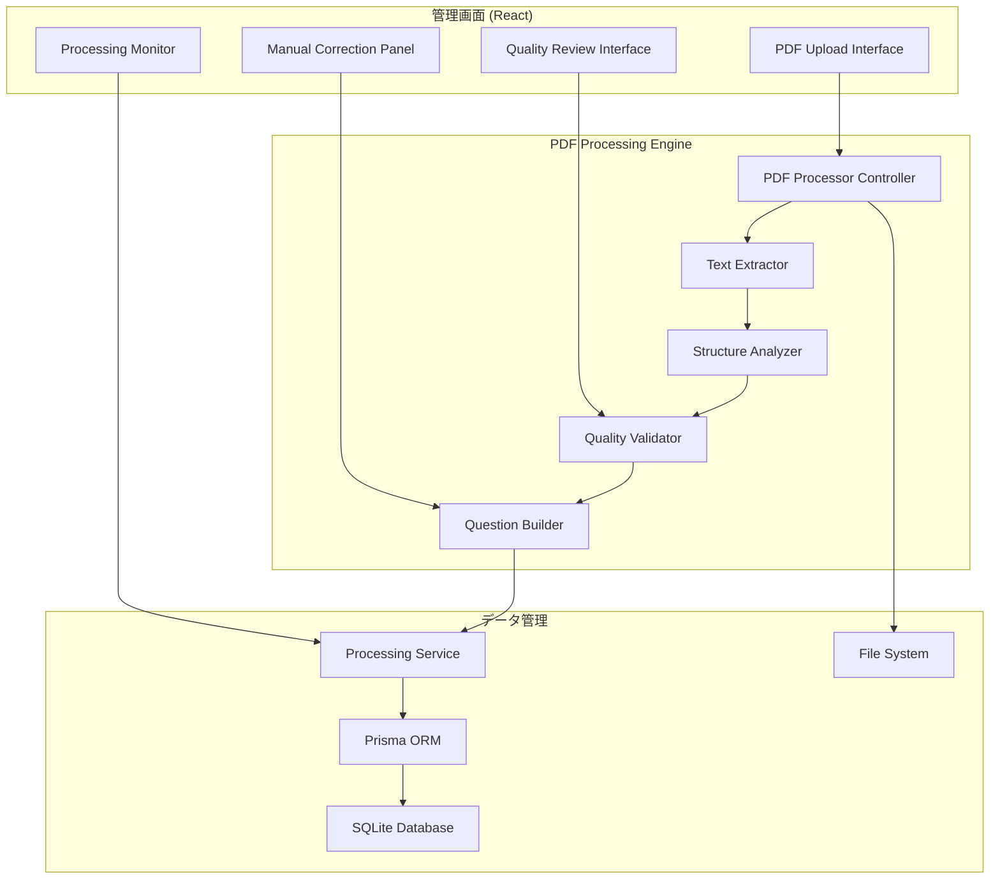
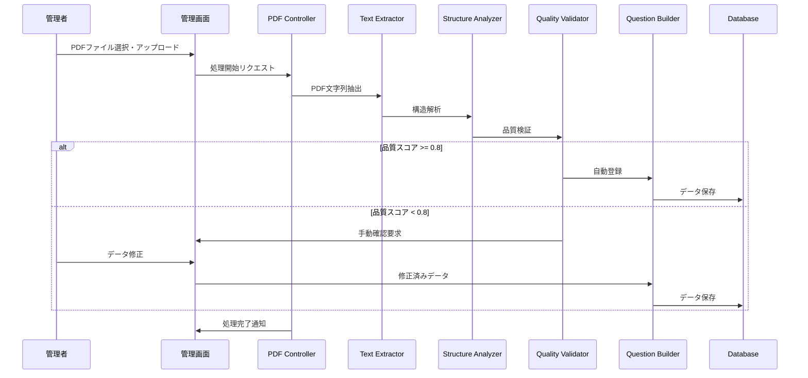

# PDF過去問自動処理システム詳細設計書

## 概要

PDFファイルから過去問データを自動抽出し、データベースに登録するシステムの詳細設計。ADR-0002で決定されたハイブリッド処理アーキテクチャに基づく実装仕様書。

## 1. 要件と目標

### 1.1 機能要件
- **PDF解析**: 午前II、午後I、午後II問題の自動抽出
- **データ構造化**: 問題、選択肢、解答、解説の構造化
- **品質管理**: 抽出精度の検証と品質スコア算出
- **手動修正**: 低品質データの修正インターフェース
- **バッチ処理**: 年度別フォルダの一括処理

### 1.2 非機能要件
- **処理性能**: 1年度分（150問）を30分以内で処理
- **精度目標**: 午前II問題で90%の自動抽出成功率
- **可用性**: 処理失敗時のロールバック機能
- **拡張性**: 新試験形式への対応可能な設計

## 2. システムアーキテクチャ

### 2.1 全体アーキテクチャ



### 2.2 処理フロー



## 3. 詳細設計

### 3.1 PDF Processing Engine

#### 3.1.1 PDFProcessorController

```typescript
interface PDFProcessorController {
  processFile(request: ProcessingRequest): Promise<ProcessingResult>
  getProcessingStatus(processId: string): Promise<ProcessingStatus>
  cancelProcessing(processId: string): Promise<void>
}

interface ProcessingRequest {
  filePath: string
  questionType: 'morning2' | 'afternoon1' | 'afternoon2'
  year?: number
  session?: string
  options?: ProcessingOptions
}

interface ProcessingOptions {
  batchSize?: number
  qualityThreshold?: number
  enableManualReview?: boolean
  preserveOriginalText?: boolean
}

class PDFProcessorController implements PDFProcessorController {
  private textExtractor: TextExtractor
  private structureAnalyzer: StructureAnalyzer
  private qualityValidator: QualityValidator
  private questionBuilder: QuestionBuilder
  
  async processFile(request: ProcessingRequest): Promise<ProcessingResult> {
    const processId = this.generateProcessId()
    
    try {
      // 1. ファイル検証
      await this.validateFile(request.filePath)
      
      // 2. 重複チェック
      const existingSource = await this.checkDuplicate(request.filePath)
      if (existingSource) {
        throw new DuplicateFileError('File already processed')
      }
      
      // 3. PDF処理開始
      const textData = await this.textExtractor.extract(request.filePath)
      const structuredData = await this.structureAnalyzer.analyze(textData, request.questionType)
      const validatedData = await this.qualityValidator.validate(structuredData)
      
      // 4. 品質別処理分岐
      const results = await this.processValidatedData(validatedData, request)
      
      // 5. 処理結果記録
      await this.recordProcessingResult(processId, results)
      
      return results
    } catch (error) {
      await this.handleProcessingError(processId, error)
      throw error
    }
  }
}
```

#### 3.1.2 TextExtractor

```typescript
interface TextExtractor {
  extract(filePath: string): Promise<ExtractedText>
}

interface ExtractedText {
  content: string
  metadata: PDFMetadata
  pages: PageData[]
}

interface PDFMetadata {
  title?: string
  author?: string
  subject?: string
  creator?: string
  pageCount: number
  fileSize: number
}

interface PageData {
  pageNumber: number
  content: string
  boundingBoxes?: BoundingBox[]
}

class TextExtractor implements TextExtractor {
  async extract(filePath: string): Promise<ExtractedText> {
    const pdfData = await fs.readFile(filePath)
    const parsed = await pdfParse(pdfData)
    
    return {
      content: parsed.text,
      metadata: {
        title: parsed.info?.Title,
        author: parsed.info?.Author,
        subject: parsed.info?.Subject,
        creator: parsed.info?.Creator,
        pageCount: parsed.numpages,
        fileSize: pdfData.length
      },
      pages: this.parsePages(parsed.text)
    }
  }
  
  private parsePages(text: string): PageData[] {
    // ページ区切り文字での分割
    const pageTexts = text.split(/\f|\n\s*\n\s*ページ\s*\d+/)
    
    return pageTexts.map((pageText, index) => ({
      pageNumber: index + 1,
      content: pageText.trim()
    }))
  }
}
```

#### 3.1.3 StructureAnalyzer

```typescript
interface StructureAnalyzer {
  analyze(textData: ExtractedText, questionType: QuestionType): Promise<StructuredQuestion[]>
}

interface StructuredQuestion {
  questionNumber: number
  content: string
  choices: Choice[]
  correctAnswers: number[]
  explanation?: string
  year?: number
  session?: string
  confidence: number
  originalText: string
}

class StructureAnalyzer implements StructureAnalyzer {
  private readonly patterns: Record<QuestionType, QuestionPattern>
  
  constructor() {
    this.patterns = {
      morning2: new AM2QuestionPattern(),
      afternoon1: new PM1QuestionPattern(),
      afternoon2: new PM2QuestionPattern()
    }
  }
  
  async analyze(textData: ExtractedText, questionType: QuestionType): Promise<StructuredQuestion[]> {
    const pattern = this.patterns[questionType]
    const questions: StructuredQuestion[] = []
    
    // 問題区切りの識別
    const questionSegments = await this.segmentQuestions(textData.content, pattern)
    
    for (const segment of questionSegments) {
      try {
        const question = await this.parseQuestionSegment(segment, pattern)
        questions.push(question)
      } catch (error) {
        console.warn(`Failed to parse question segment: ${error.message}`)
        // 解析失敗した問題も記録（手動修正用）
        questions.push(this.createFailedQuestion(segment, error))
      }
    }
    
    return questions
  }
  
  private async segmentQuestions(text: string, pattern: QuestionPattern): Promise<QuestionSegment[]> {
    const questionRegex = pattern.getQuestionStartRegex()
    const matches = Array.from(text.matchAll(questionRegex))
    
    const segments: QuestionSegment[] = []
    
    for (let i = 0; i < matches.length; i++) {
      const match = matches[i]
      const nextMatch = matches[i + 1]
      
      const start = match.index!
      const end = nextMatch ? nextMatch.index! : text.length
      const content = text.slice(start, end)
      
      segments.push({
        questionNumber: parseInt(match[1]),
        content: content.trim(),
        startIndex: start,
        endIndex: end
      })
    }
    
    return segments
  }
}

// 午前II問題パターン
class AM2QuestionPattern implements QuestionPattern {
  getQuestionStartRegex(): RegExp {
    return /問(\d+)\s*[\.\)]\s*/g
  }
  
  getChoiceRegex(): RegExp {
    return /^[ア-エ]\s*\.?\s*(.+)$/gm
  }
  
  getAnswerRegex(): RegExp {
    return /解答\s*[：:]\s*([ア-エ])/
  }
  
  getExplanationRegex(): RegExp {
    return /解説\s*[：:]?\s*([\s\S]*?)(?=問\d+|$)/
  }
}
```

#### 3.1.4 QualityValidator

```typescript
interface QualityValidator {
  validate(questions: StructuredQuestion[]): Promise<ValidatedQuestion[]>
}

interface ValidatedQuestion extends StructuredQuestion {
  qualityScore: number
  validationErrors: ValidationError[]
  needsReview: boolean
}

interface ValidationError {
  type: 'missing_content' | 'invalid_choices' | 'no_answer' | 'format_error'
  message: string
  severity: 'error' | 'warning'
}

class QualityValidator implements QualityValidator {
  private readonly qualityThreshold = 0.8
  
  async validate(questions: StructuredQuestion[]): Promise<ValidatedQuestion[]> {
    return Promise.all(questions.map(q => this.validateQuestion(q)))
  }
  
  private async validateQuestion(question: StructuredQuestion): Promise<ValidatedQuestion> {
    const errors: ValidationError[] = []
    let score = 1.0
    
    // 必須要素チェック
    if (!question.content || question.content.length < 10) {
      errors.push({
        type: 'missing_content',
        message: '問題文が短すぎるか空です',
        severity: 'error'
      })
      score -= 0.3
    }
    
    // 選択肢チェック
    if (question.choices.length < 2) {
      errors.push({
        type: 'invalid_choices',
        message: '選択肢が不足しています',
        severity: 'error'
      })
      score -= 0.4
    }
    
    // 解答チェック
    if (question.correctAnswers.length === 0) {
      errors.push({
        type: 'no_answer',
        message: '正解が見つかりません',
        severity: 'error'
      })
      score -= 0.3
    }
    
    // フォーマットチェック
    if (question.content.includes('？') || question.content.includes('■')) {
      errors.push({
        type: 'format_error',
        message: '文字化けまたは特殊文字が含まれています',
        severity: 'warning'
      })
      score -= 0.1
    }
    
    return {
      ...question,
      qualityScore: Math.max(0, score),
      validationErrors: errors,
      needsReview: score < this.qualityThreshold
    }
  }
}
```

### 3.2 データベース設計

#### 3.2.1 スキーマ拡張

```sql
-- PDF処理ソース管理
model PDFSource {
  id              String   @id @default(cuid())
  filePath        String
  fileName        String
  fileHash        String   @unique
  questionType    String   // "morning2", "afternoon1", "afternoon2"
  year            Int?
  session         String?
  
  -- 処理状況
  status          String   // "processing", "completed", "failed", "partial"
  processedAt     DateTime @default(now())
  completedAt     DateTime?
  
  -- 統計情報
  totalQuestions  Int      @default(0)
  successCount    Int      @default(0)
  failureCount    Int      @default(0)
  reviewCount     Int      @default(0)
  
  -- メタデータ
  metadata        String?  // JSON形式のPDFメタデータ
  errorLog        String?
  
  questions       Question[] @relation("PDFSourceQuestions")
  processingLogs  ProcessingLog[]
  
  createdAt       DateTime @default(now())
  updatedAt       DateTime @updatedAt
}

-- Question テーブル拡張
model Question {
  -- 既存フィールド
  id          String     @id @default(cuid())
  content     String
  explanation String?
  difficulty  Int        @default(1)
  year        Int?
  session     String?
  categoryId  String
  
  -- PDF処理関連フィールド
  sourceType      String?    // "manual", "pdf_auto", "pdf_corrected"
  pdfSourceId     String?
  pdfSource       PDFSource? @relation("PDFSourceQuestions", fields: [pdfSourceId], references: [id])
  originalText    String?    // PDF元テキスト（デバッグ用）
  qualityScore    Float?     // 0.0-1.0
  needsReview     Boolean    @default(false)
  questionNumber  Int?       // PDF内での問題番号
  
  -- 検証・修正履歴
  validationErrors String?   // JSON形式のバリデーションエラー
  correctionHistory String? // JSON形式の修正履歴
  lastReviewedAt   DateTime?
  reviewedBy       String?   // 修正者識別
  
  -- 既存リレーション
  category    Category   @relation(fields: [categoryId], references: [id])
  choices     Choice[]
  answers     Answer[]
  reviewItems ReviewItem[]
  
  createdAt   DateTime   @default(now())
  updatedAt   DateTime   @updatedAt
}

-- 処理ログ
model ProcessingLog {
  id          String     @id @default(cuid())
  pdfSourceId String
  pdfSource   PDFSource  @relation(fields: [pdfSourceId], references: [id], onDelete: Cascade)
  
  operation   String     // "extraction", "analysis", "validation", "correction"
  level       String     // "info", "warning", "error"
  message     String
  details     String?    // JSON形式の詳細情報
  
  questionId  String?    // 関連する問題ID
  duration    Int?       // 処理時間（ミリ秒）
  
  createdAt   DateTime   @default(now())
}
```

### 3.3 API設計

#### 3.3.1 PDF処理管理API

```typescript
// PDF処理開始
POST /api/admin/pdf/process
Content-Type: multipart/form-data

{
  file: File,
  questionType: "morning2" | "afternoon1" | "afternoon2",
  year?: number,
  session?: string,
  options?: {
    qualityThreshold?: number,
    batchSize?: number,
    enableAutoCorrection?: boolean
  }
}

Response: {
  processId: string,
  status: "started",
  estimatedDuration?: number
}

// 処理状況確認
GET /api/admin/pdf/status/:processId

Response: {
  processId: string,
  status: "processing" | "completed" | "failed" | "partial",
  progress: {
    totalQuestions: number,
    processedCount: number,
    successCount: number,
    failureCount: number,
    reviewCount: number
  },
  estimatedRemaining?: number,
  errors?: ProcessingError[]
}

// 手動確認が必要な問題一覧
GET /api/admin/pdf/review?pdfSourceId=xxx&status=needs_review

Response: {
  questions: ReviewQuestion[],
  pagination: PaginationInfo
}

// 問題の手動修正
POST /api/admin/pdf/correct/:questionId

{
  content: string,
  choices: Choice[],
  correctAnswers: number[],
  explanation?: string,
  notes?: string
}

Response: {
  questionId: string,
  status: "corrected",
  qualityScore: number
}
```

### 3.4 管理画面UI設計

#### 3.4.1 PDF処理管理画面

```typescript
interface PDFProcessingPage {
  // ファイルアップロード
  fileUpload: FileUploadComponent
  
  // 処理設定
  processingSettings: {
    questionType: QuestionTypeSelector
    year: YearSelector
    session: SessionSelector
    qualityThreshold: SliderInput
    batchSize: NumberInput
  }
  
  // 処理状況表示
  processingStatus: {
    progressBar: ProgressBarComponent
    realTimeStats: StatsDisplayComponent
    logViewer: LogViewerComponent
  }
  
  // 結果確認
  resultsView: {
    successfulQuestions: QuestionListComponent
    failedQuestions: ErrorListComponent
    reviewNeeded: ReviewListComponent
  }
}

// メインコンポーネント
const PDFProcessingPage: React.FC = () => {
  const [processing, setProcessing] = useState<ProcessingState | null>(null)
  const [results, setResults] = useState<ProcessingResult | null>(null)
  
  const handleFileUpload = async (file: File, settings: ProcessingSettings) => {
    const formData = new FormData()
    formData.append('file', file)
    formData.append('settings', JSON.stringify(settings))
    
    const response = await fetch('/api/admin/pdf/process', {
      method: 'POST',
      body: formData
    })
    
    const result = await response.json()
    setProcessing({ processId: result.processId, ...result })
    
    // ポーリングで状況確認
    startStatusPolling(result.processId)
  }
  
  return (
    <Container>
      <Paper sx={{ p: 3 }}>
        <Typography variant="h4" gutterBottom>
          PDF問題自動処理
        </Typography>
        
        {!processing && (
          <FileUploadSection onUpload={handleFileUpload} />
        )}
        
        {processing && (
          <ProcessingStatusSection 
            processing={processing}
            onComplete={setResults}
          />
        )}
        
        {results && (
          <ResultsSection results={results} />
        )}
      </Paper>
    </Container>
  )
}
```

#### 3.4.2 手動修正インターフェース

```typescript
interface QuestionCorrectionDialog {
  question: ReviewQuestion
  onSave: (correctedQuestion: CorrectedQuestion) => Promise<void>
  onSkip: () => void
  onCancel: () => void
}

const QuestionCorrectionDialog: React.FC<QuestionCorrectionDialog> = ({
  question, onSave, onSkip, onCancel
}) => {
  const [content, setContent] = useState(question.content)
  const [choices, setChoices] = useState(question.choices)
  const [correctAnswers, setCorrectAnswers] = useState(question.correctAnswers)
  const [explanation, setExplanation] = useState(question.explanation || '')
  
  return (
    <Dialog open maxWidth="lg" fullWidth>
      <DialogTitle>
        問題修正 - 問{question.questionNumber}
        <Chip 
          label={`品質スコア: ${(question.qualityScore * 100).toFixed(1)}%`}
          color={question.qualityScore >= 0.8 ? 'success' : 'warning'}
          size="small"
        />
      </DialogTitle>
      
      <DialogContent>
        <Grid container spacing={2}>
          {/* 元テキスト表示 */}
          <Grid item xs={12} md={6}>
            <Typography variant="h6">元テキスト</Typography>
            <Paper sx={{ p: 2, maxHeight: 300, overflow: 'auto' }}>
              <Typography variant="body2" style={{ whiteSpace: 'pre-wrap' }}>
                {question.originalText}
              </Typography>
            </Paper>
          </Grid>
          
          {/* 修正フォーム */}
          <Grid item xs={12} md={6}>
            <Typography variant="h6">修正</Typography>
            <TextField
              label="問題文"
              multiline
              rows={4}
              fullWidth
              value={content}
              onChange={(e) => setContent(e.target.value)}
              sx={{ mb: 2 }}
            />
            
            {/* 選択肢編集 */}
            <ChoicesEditor 
              choices={choices}
              correctAnswers={correctAnswers}
              onChange={setChoices}
              onCorrectAnswersChange={setCorrectAnswers}
            />
            
            <TextField
              label="解説"
              multiline
              rows={3}
              fullWidth
              value={explanation}
              onChange={(e) => setExplanation(e.target.value)}
              sx={{ mt: 2 }}
            />
          </Grid>
          
          {/* エラー情報表示 */}
          {question.validationErrors.length > 0 && (
            <Grid item xs={12}>
              <Alert severity="warning">
                <Typography variant="body2">検出された問題:</Typography>
                <ul>
                  {question.validationErrors.map((error, index) => (
                    <li key={index}>{error.message}</li>
                  ))}
                </ul>
              </Alert>
            </Grid>
          )}
        </Grid>
      </DialogContent>
      
      <DialogActions>
        <Button onClick={onCancel}>キャンセル</Button>
        <Button onClick={onSkip}>スキップ</Button>
        <Button 
          onClick={() => onSave({ content, choices, correctAnswers, explanation })}
          variant="contained"
        >
          保存
        </Button>
      </DialogActions>
    </Dialog>
  )
}
```

## 4. 実装フェーズ計画

### Phase 1: 基盤実装（Week 1-2）
- PDFProcessorController基本実装
- TextExtractor（pdf-parse統合）
- 基本的なAM2QuestionPattern
- データベーススキーマ追加
- 基本的な管理画面UI

### Phase 2: 構造解析強化（Week 3）
- StructureAnalyzer完全実装
- 午前II問題の詳細パターン解析
- QualityValidator基本機能
- エラーハンドリング強化

### Phase 3: 品質管理・UI（Week 4）
- 手動修正インターフェース
- 品質スコア算出ロジック完成
- バッチ処理最適化
- 統合テスト

### Phase 4: 拡張・最適化（Week 5）
- 午後問題対応検討
- パフォーマンス最適化
- ユーザビリティ改善
- ドキュメント整備

## 5. テスト戦略

### 5.1 単体テスト
```typescript
describe('TextExtractor', () => {
  test('should extract text from valid PDF', async () => {
    const extractor = new TextExtractor()
    const result = await extractor.extract('./test-data/sample-am2.pdf')
    
    expect(result.content).toBeTruthy()
    expect(result.metadata.pageCount).toBeGreaterThan(0)
    expect(result.pages).toHaveLength(result.metadata.pageCount)
  })
})

describe('StructureAnalyzer', () => {
  test('should parse AM2 questions correctly', async () => {
    const analyzer = new StructureAnalyzer()
    const mockText = `
      問1 コンピュータの基本構成に関する問題...
      ア. CPU
      イ. GPU  
      ウ. RAM
      エ. ROM
      
      問2 ネットワークに関する問題...
    `
    
    const result = await analyzer.analyze({ content: mockText } as ExtractedText, 'morning2')
    
    expect(result).toHaveLength(2)
    expect(result[0].questionNumber).toBe(1)
    expect(result[0].choices).toHaveLength(4)
  })
})
```

### 5.2 統合テスト
```typescript
describe('PDF Processing Integration', () => {
  test('should process complete AM2 PDF file', async () => {
    const controller = new PDFProcessorController()
    const request: ProcessingRequest = {
      filePath: './test-data/2023-spring-am2.pdf',
      questionType: 'morning2',
      year: 2023,
      session: '春期'
    }
    
    const result = await controller.processFile(request)
    
    expect(result.totalQuestions).toBe(25) // 午前II問題数
    expect(result.successCount).toBeGreaterThan(20) // 80%以上成功
    expect(result.averageQualityScore).toBeGreaterThan(0.8)
  })
})
```

### 5.3 E2Eテスト
```typescript
describe('PDF Processing E2E', () => {
  test('complete workflow from upload to question creation', async () => {
    // 1. ファイルアップロード
    const uploadResponse = await request(app)
      .post('/api/admin/pdf/process')
      .attach('file', './test-data/sample.pdf')
      .field('questionType', 'morning2')
      .expect(200)
    
    const { processId } = uploadResponse.body
    
    // 2. 処理完了まで待機
    let status
    do {
      await new Promise(resolve => setTimeout(resolve, 1000))
      status = await request(app)
        .get(`/api/admin/pdf/status/${processId}`)
        .expect(200)
    } while (status.body.status === 'processing')
    
    // 3. 結果確認
    expect(status.body.status).toBe('completed')
    expect(status.body.progress.successCount).toBeGreaterThan(0)
    
    // 4. データベース確認
    const questions = await prisma.question.findMany({
      where: { sourceType: 'pdf_auto' }
    })
    expect(questions.length).toBeGreaterThan(0)
  })
})
```

## 6. エラーハンドリング

### 6.1 エラー分類と対応

```typescript
class PDFProcessingError extends Error {
  constructor(
    message: string,
    public code: string,
    public details?: any
  ) {
    super(message)
    this.name = 'PDFProcessingError'
  }
}

class ErrorHandler {
  static handle(error: Error, context: ProcessingContext): ProcessingResult {
    if (error instanceof PDFProcessingError) {
      switch (error.code) {
        case 'INVALID_PDF':
          return this.handleInvalidPDF(error, context)
        case 'PARSING_FAILED':
          return this.handleParsingFailure(error, context)
        case 'QUALITY_TOO_LOW':
          return this.handleLowQuality(error, context)
        default:
          return this.handleUnknownError(error, context)
      }
    }
    
    return this.handleUnknownError(error, context)
  }
  
  private static handleInvalidPDF(error: PDFProcessingError, context: ProcessingContext): ProcessingResult {
    return {
      status: 'failed',
      errorType: 'invalid_file',
      message: 'PDFファイルが破損しているか、対応していない形式です',
      retryable: false
    }
  }
  
  private static handleParsingFailure(error: PDFProcessingError, context: ProcessingContext): ProcessingResult {
    return {
      status: 'partial',
      errorType: 'parsing_error',
      message: '一部の問題の解析に失敗しました。手動修正が必要です',
      retryable: true,
      partialData: error.details?.partialQuestions || []
    }
  }
}
```

## 7. パフォーマンス最適化

### 7.1 メモリ管理
```typescript
class MemoryOptimizedProcessor {
  private readonly BATCH_SIZE = 10
  private readonly MAX_MEMORY = 512 * 1024 * 1024 // 512MB
  
  async processBatch(questions: RawQuestion[]): Promise<ProcessedQuestion[]> {
    const results: ProcessedQuestion[] = []
    
    for (let i = 0; i < questions.length; i += this.BATCH_SIZE) {
      const batch = questions.slice(i, i + this.BATCH_SIZE)
      const batchResults = await this.processQuestionBatch(batch)
      results.push(...batchResults)
      
      // メモリ使用量チェック
      const memoryUsage = process.memoryUsage()
      if (memoryUsage.heapUsed > this.MAX_MEMORY) {
        global.gc && global.gc() // ガベージコレクション実行
      }
      
      // プログレス更新
      await this.updateProgress(i + batch.length, questions.length)
    }
    
    return results
  }
}
```

### 7.2 並列処理
```typescript
class ParallelProcessor {
  private readonly WORKER_COUNT = Math.min(4, os.cpus().length)
  
  async processQuestions(questions: RawQuestion[]): Promise<ProcessedQuestion[]> {
    const chunks = this.chunkArray(questions, this.WORKER_COUNT)
    
    const workerPromises = chunks.map((chunk, index) => 
      this.createWorker(chunk, index)
    )
    
    const results = await Promise.all(workerPromises)
    return results.flat()
  }
  
  private async createWorker(questions: RawQuestion[], workerId: number): Promise<ProcessedQuestion[]> {
    return new Promise((resolve, reject) => {
      const worker = new Worker('./pdf-processing-worker.js', {
        workerData: { questions, workerId }
      })
      
      worker.on('message', resolve)
      worker.on('error', reject)
      worker.on('exit', (code) => {
        if (code !== 0) {
          reject(new Error(`Worker ${workerId} stopped with exit code ${code}`))
        }
      })
    })
  }
}
```

## 8. 監視・ログ

### 8.1 処理監視
```typescript
class ProcessingMonitor {
  private metrics: ProcessingMetrics = {
    totalFiles: 0,
    successfulFiles: 0,
    failedFiles: 0,
    averageProcessingTime: 0,
    qualityScoreDistribution: {}
  }
  
  recordProcessing(result: ProcessingResult): void {
    this.metrics.totalFiles++
    
    if (result.status === 'completed') {
      this.metrics.successfulFiles++
    } else {
      this.metrics.failedFiles++
    }
    
    this.updateAverageTime(result.duration)
    this.updateQualityDistribution(result.qualityScores)
    
    // メトリクス永続化
    this.persistMetrics()
  }
  
  getHealthStatus(): HealthStatus {
    const successRate = this.metrics.successfulFiles / this.metrics.totalFiles
    const avgQuality = this.calculateAverageQuality()
    
    return {
      status: successRate > 0.8 && avgQuality > 0.7 ? 'healthy' : 'degraded',
      successRate,
      averageQuality: avgQuality,
      lastProcessed: new Date(),
      recommendations: this.generateRecommendations()
    }
  }
}
```

## 9. 設定管理

### 9.1 設定ファイル
```typescript
// config/pdf-processing.json
{
  "patterns": {
    "morning2": {
      "questionStart": "問(\\d+)\\s*[\\.)\\s]",
      "choicePattern": "^([ア-エ])\\s*\\.?\\s*(.+)$",
      "answerPattern": "解答\\s*[：:]\\s*([ア-エ])",
      "explanationPattern": "解説\\s*[：:]?\\s*([\\s\\S]*?)(?=問\\d+|$)"
    }
  },
  "quality": {
    "minimumScore": 0.8,
    "weights": {
      "contentLength": 0.2,
      "choicesCount": 0.3,
      "hasAnswer": 0.3,
      "formatCorrectness": 0.2
    }
  },
  "processing": {
    "batchSize": 10,
    "maxMemoryMB": 512,
    "timeoutSeconds": 300,
    "retryAttempts": 3
  }
}

// 設定管理クラス
class ConfigManager {
  private static config: ProcessingConfig
  
  static load(): ProcessingConfig {
    if (!this.config) {
      this.config = require('../config/pdf-processing.json')
    }
    return this.config
  }
  
  static getPatternFor(questionType: QuestionType): QuestionPattern {
    const patterns = this.load().patterns
    return patterns[questionType] || patterns.morning2
  }
}
```

## 10. セキュリティ考慮事項

### 10.1 ファイル検証
```typescript
class FileValidator {
  private readonly ALLOWED_MIME_TYPES = ['application/pdf']
  private readonly MAX_FILE_SIZE = 50 * 1024 * 1024 // 50MB
  
  async validateFile(filePath: string): Promise<ValidationResult> {
    const stats = await fs.stat(filePath)
    
    // ファイルサイズチェック
    if (stats.size > this.MAX_FILE_SIZE) {
      throw new ValidationError('File size exceeds maximum allowed size')
    }
    
    // MIMEタイプチェック
    const mimeType = await this.detectMimeType(filePath)
    if (!this.ALLOWED_MIME_TYPES.includes(mimeType)) {
      throw new ValidationError('Invalid file type')
    }
    
    // PDFヘッダー検証
    await this.validatePDFHeader(filePath)
    
    return { valid: true }
  }
  
  private async validatePDFHeader(filePath: string): Promise<void> {
    const buffer = Buffer.alloc(5)
    const fd = await fs.open(filePath, 'r')
    await fd.read(buffer, 0, 5, 0)
    await fd.close()
    
    if (!buffer.toString().startsWith('%PDF-')) {
      throw new ValidationError('Invalid PDF header')
    }
  }
}
```

## 11. 今後の拡張計画

### 11.1 機能拡張
- **画像処理**: 図表・回路図の自動抽出とOCR処理
- **午後問題対応**: 記述式問題の構造解析
- **学習支援**: 自動カテゴリ分類と難易度推定
- **品質改善**: 機械学習による解析精度向上

### 11.2 技術改善
- **処理エンジン**: WebAssembly活用による高速化
- **UI/UX**: リアルタイム編集とプレビュー機能
- **分散処理**: 大量ファイル処理のためのワーカー分散
- **API拡張**: GraphQL対応とリアルタイム通信

このPDF処理システムにより、手動での問題入力作業を大幅に効率化し、高品質な問題データベースの構築を実現します。