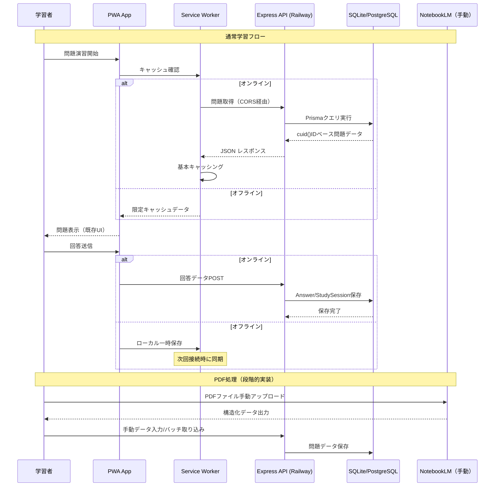
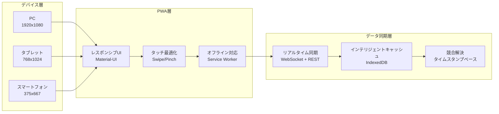
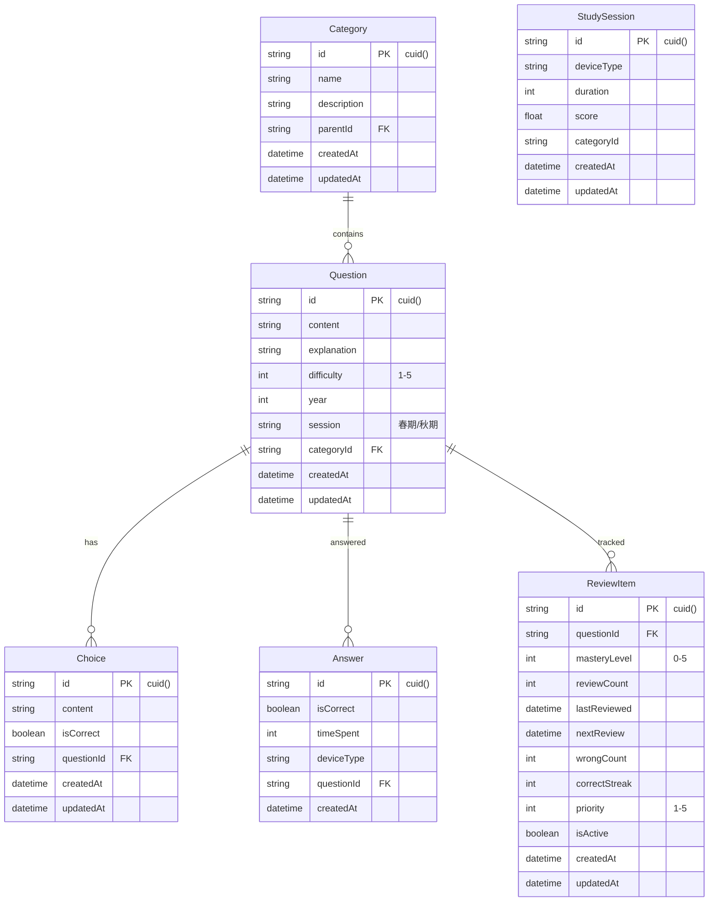
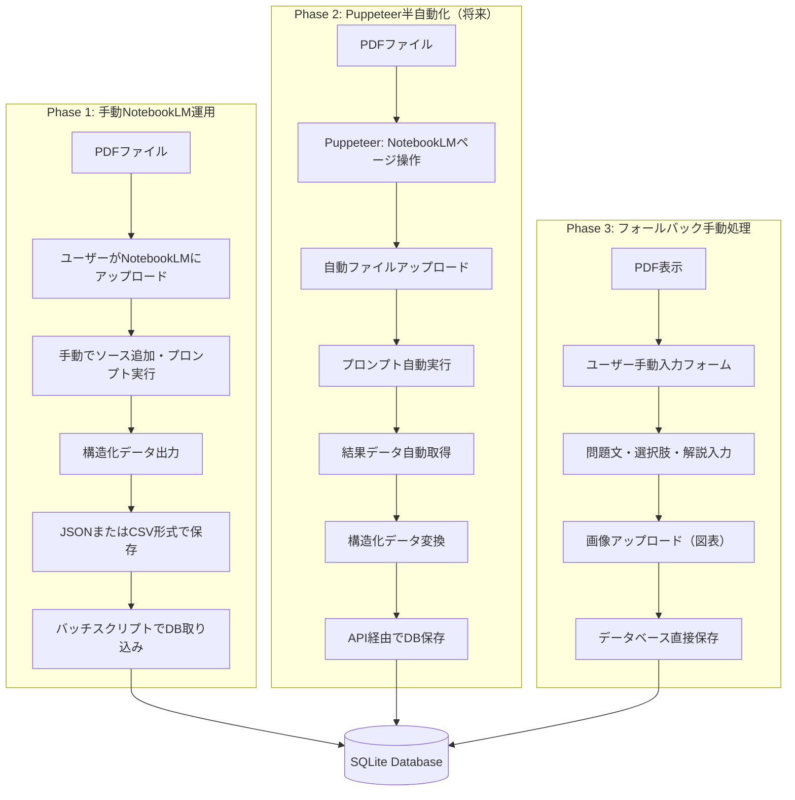
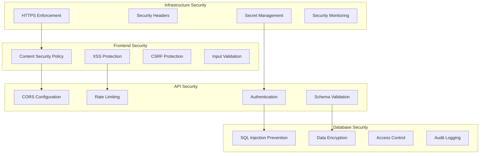
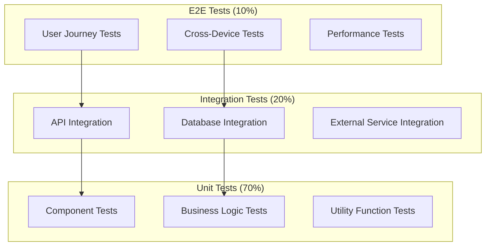
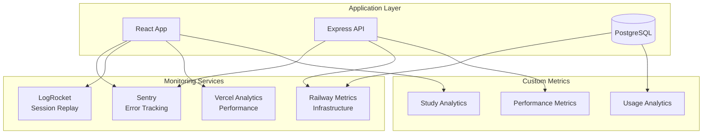

# 詳細設計書 - エンベデッドシステムスペシャリスト試験対策学習システム（修正版）

## ⚠️ 重要な修正事項

**document-reviewerの指摘事項に基づく修正**:
1. **ISSUE-001**: PostgreSQL移行とSQLiteスキーマの不整合 → 現在のcuid()ID構成を正確に反映
2. **ISSUE-002**: NotebookLM/PDF処理の現実化 → Puppeteer活用検討+手動運用前提
3. **ISSUE-003**: MVP実装状況の正確化 → 現在の実装を正確に調査・反映
4. **ISSUE-004**: ADR-0003準拠設計 → フロントエンド特化デプロイ方針に完全準拠

## 1. システム概要

### 1.1 設計目的
IPA エンベデッドシステムスペシャリスト試験のシラバス準拠した個人学習者向けのマルチデバイス対応PWA学習システムの詳細設計。既存のReact+Express+SQLite構成を基盤とした実現可能な技術設計。

### 1.2 実装状況の正確な把握
- **現状**: MVPコア機能実装済み（React18+TypeScript+Vite+Express+SQLite+基本PWA）
- **動作確認済み機能**: 
  - 基本的な問題演習システム（QuestionCard、QuestionSwiper）
  - マルチデバイス対応UI（DesktopLayout、MobileLayout）
  - スワイプナビゲーション（SwipeableCard、TouchButton）
  - 基本的な進捗管理（StudySession、ReviewItem）
  - オフライン対応の基礎（OfflineIndicator、基本Service Worker）
- **技術スタック**: 
  - フロントエンド: React18 + TypeScript + Vite + Material-UI + Zustand
  - バックエンド: Node.js + Express + TypeScript + Prisma
  - データベース: SQLite（Prisma スキーマ: `String @id @default(cuid())`）
  - PWA: vite-plugin-pwa + 基本的なService Worker

### 1.3 段階的拡張設計範囲
- **Phase 1 (即座実装可能)**: ADR-0003準拠のVercel+Railway分離デプロイ
- **Phase 2 (中期目標)**: PostgreSQL移行戦略（SQLite維持→選択的移行）
- **Phase 3 (長期目標)**: PDF処理統合（NotebookLM手動運用+Puppeteer自動化）
- **継続的改善**: PWAオフライン機能・通勤学習最適化の高度化

## 2. システムアーキテクチャ設計（ADR-0003準拠）

### 2.1 現実的なProduction アーキテクチャ

```mermaid
graph TB
    subgraph "Vercel（フロントエンド特化）"
        PWA[PWA Application<br/>React18 + TypeScript + Vite]
        SW[Service Worker<br/>基本キャッシュ + オフライン]
        STATIC[Static Assets<br/>JS/CSS/Images]
        PWA --> SW
        PWA --> STATIC
    end
    
    subgraph "Railway（バックエンド専用）"
        API[Express API Server<br/>既存実装そのまま活用]
        PRISMA[Prisma Client<br/>SQLite → PostgreSQL移行可能]
        CORS[CORS設定<br/>Vercelドメイン許可]
        API --> PRISMA
        API --> CORS
    end
    
    subgraph "データベース層"
        SQLITE[(SQLite<br/>現行 cuid() ID維持)]
        POSTGRESQL[(PostgreSQL<br/>移行時のオプション)]
        SQLITE -.->|段階的移行| POSTGRESQL
    end
    
    subgraph "PDF処理（段階的実装）"
        MANUAL[手動NotebookLM<br/>ユーザー操作]
        PUPPETEER[Puppeteer自動化<br/>将来実装]
        BATCH[バッチ処理<br/>データ取り込み]
        MANUAL --> BATCH
        PUPPETEER -.->|将来| BATCH
        BATCH --> API
    end
    
    PWA -->|HTTPS API| API
    API -->|Prisma Query| SQLITE
    SW -->|Network First| PWA
    STATIC -->|CDN Cache| PWA
```

### 2.2 現実的なデータフロー設計



### 2.3 マルチデバイス対応アーキテクチャ



## 3. コンポーネント設計

### 3.1 フロントエンド アーキテクチャ（拡張版）

```typescript
// 📁 frontend/src/architecture/
interface SystemArchitecture {
  // Core Layer
  core: {
    router: 'React Router v6';
    stateManagement: 'Zustand + Immer';
    apiClient: 'Axios + Query Cache';
    serviceWorker: 'Workbox';
  };
  
  // UI Layer
  ui: {
    designSystem: 'Material-UI v5';
    responsive: 'CSS-in-JS + Breakpoints';
    touch: 'React Swipeable + Gesture';
    visualization: 'Recharts + D3.js';
  };
  
  // Business Logic Layer
  business: {
    studyLogic: 'hooks/useStudySession';
    progressTracking: 'hooks/useProgressTracker';
    offlineSync: 'hooks/useOfflineSync';
    pdfHandling: 'hooks/usePDFViewer';
  };
  
  // Data Layer
  data: {
    apiService: 'services/apiService';
    cacheManager: 'services/cacheManager';
    syncService: 'services/syncService';
    offlineStorage: 'IndexedDB + Dexie';
  };
}
```

### 3.2 高度化コンポーネント設計

```typescript
// 📁 frontend/src/components/advanced/

// インテリジェント学習管理
interface SmartStudyManager {
  components: {
    AdaptiveDifficultySelector: React.FC<{
      userProgress: ProgressData;
      targetAccuracy: number;
    }>;
    
    CommuteLearningOptimizer: React.FC<{
      timeSlot: number; // 分
      previousSession: SessionData;
    }>;
    
    WeakAreaDetector: React.FC<{
      categoryStats: CategoryStats[];
      threshold: number;
    }>;
  };
}

// PDF統合コンポーネント
interface PDFIntegrationComponents {
  PDFViewer: React.FC<{
    pdfUrl: string;
    annotations: Annotation[];
    onAnnotate: (annotation: Annotation) => void;
  }>;
  
  QuestionExtractor: React.FC<{
    pdfContent: PDFContent;
    onQuestionGenerated: (questions: Question[]) => void;
  }>;
  
  DiagramRenderer: React.FC<{
    diagramData: DiagramData;
    interactive: boolean;
    zoomEnabled: boolean;
  }>;
}

// オフライン強化コンポーネント
interface OfflineEnhancedComponents {
  OfflineStatusIndicator: React.FC<{
    connectionStatus: ConnectionStatus;
    pendingSyncCount: number;
  }>;
  
  SmartCacheManager: React.FC<{
    cacheStrategy: CacheStrategy;
    storageQuota: StorageQuota;
  }>;
  
  ConflictResolver: React.FC<{
    conflicts: DataConflict[];
    onResolve: (resolution: Resolution) => void;
  }>;
}
```

### 3.3 状態管理設計（拡張版）

```typescript
// 📁 frontend/src/stores/

// メイン学習状態
interface StudyStore {
  // 問題・学習状態
  questions: {
    current: Question | null;
    queue: Question[];
    history: AnsweredQuestion[];
    filters: SmartFilters;
    loading: boolean;
    cache: Map<string, Question[]>;
  };
  
  // 進捗・分析状態
  progress: {
    overall: OverallProgress;
    categories: CategoryProgress[];
    heatmapData: HeatmapData;
    trends: LearningTrend[];
    predictions: PerformancePrediction[];
  };
  
  // オフライン・同期状態
  sync: {
    isOnline: boolean;
    pendingActions: PendingAction[];
    lastSyncTime: Date;
    conflicts: DataConflict[];
    syncStatus: 'idle' | 'syncing' | 'error';
  };
  
  // PDF・リッチメディア状態
  media: {
    currentPDF: PDFDocument | null;
    annotations: Annotation[];
    diagrams: InteractiveDiagram[];
    zoomLevel: number;
    viewMode: 'study' | 'annotation' | 'diagram';
  };
}

// アクション定義（非同期対応）
interface StudyActions {
  // インテリジェント学習
  startAdaptiveSession: (config: AdaptiveConfig) => Promise<void>;
  generatePersonalizedQuiz: (weakAreas: CategoryId[]) => Promise<Question[]>;
  updateLearningPath: (performance: PerformanceData) => Promise<void>;
  
  // PDF・メディア処理
  loadPDFDocument: (url: string) => Promise<PDFDocument>;
  extractQuestionsFromPDF: (pdf: PDFDocument) => Promise<Question[]>;
  createAnnotation: (annotation: NewAnnotation) => Promise<void>;
  
  // オフライン・同期
  enableOfflineMode: () => Promise<void>;
  syncPendingData: () => Promise<SyncResult>;
  resolveConflicts: (resolutions: ConflictResolution[]) => Promise<void>;
}
```

## 4. データベース設計（SQLite現状維持 + PostgreSQL移行戦略）

### 4.1 現実的なデータベース戦略

**段階的アプローチ**:
1. **Phase 1**: 現在のSQLite + cuid() ID構成を維持
2. **Phase 2**: PostgreSQL移行の選択肢を提供（必要時のみ）
3. **Phase 3**: データ量・パフォーマンス要件に応じた判断

### 4.2 現在のスキーマ（実装済み）



### 4.3 PostgreSQL移行時の考慮事項（オプション）

**データ型マッピング**:
```sql
-- SQLite → PostgreSQL 移行ルール
String (cuid)    → VARCHAR(25)     -- cuidは25文字固定
String           → TEXT
Int              → INTEGER
Float            → NUMERIC(10,2)
Boolean          → BOOLEAN
DateTime         → TIMESTAMPTZ
```

**移行の判断基準**:
- 同時ユーザー数: 個人利用のため不要
- データ量: 10万問題を超える場合のみ検討
- 全文検索: 高度な検索機能が必要な場合
- パフォーマンス: 現実的な負荷で問題が発生した場合

**SQLite維持の利点**:
- ファイルベースでシンプル
- バックアップが容易
- 個人利用には十分な性能
- デプロイメントの簡素化

### 4.3 移行戦略（SQLite → PostgreSQL）

```typescript
// 📁 database/migration/

interface MigrationStrategy {
  phases: {
    // Phase 1: スキーマ移行
    schemaPreparation: {
      createPostgreSQLSchema: () => Promise<void>;
      validateConstraints: () => Promise<ValidationResult>;
      setupIndexes: () => Promise<void>;
    };
    
    // Phase 2: データ移行
    dataMigration: {
      exportSQLiteData: () => Promise<ExportedData>;
      transformDataTypes: (data: ExportedData) => Promise<TransformedData>;
      importToPostgreSQL: (data: TransformedData) => Promise<ImportResult>;
      validateDataIntegrity: () => Promise<IntegrityReport>;
    };
    
    // Phase 3: アプリケーション切り替え
    applicationSwitch: {
      updateConnectionStrings: () => Promise<void>;
      runParallelTests: () => Promise<TestResults>;
      performBlueGreenDeployment: () => Promise<DeploymentResult>;
    };
  };
}

// データ変換ルール
const dataTransformRules = {
  // SQLite → PostgreSQL 型変換
  typeMapping: {
    'INTEGER': 'BIGINT',
    'TEXT': 'TEXT',
    'REAL': 'FLOAT8',
    'BOOLEAN': 'BOOLEAN',
    'DATETIME': 'TIMESTAMPTZ',
  },
  
  // JSON データ構造化
  jsonbTransformation: {
    metadata: (sqlite_json: string) => JSON.parse(sqlite_json),
    settings: (key_value_pairs: any[]) => Object.fromEntries(key_value_pairs),
  },
  
  // インデックス再構築
  indexRecreation: {
    recreateOptimizedIndexes: true,
    analyzeAfterImport: true,
    updateStatistics: true,
  },
};
```

## 5. API設計（拡張版）

### 5.1 RESTful API 完全版

```typescript
// 📁 backend/src/routes/

// 学習セッション管理API
interface StudySessionAPI {
  'POST /api/sessions/start': {
    body: {
      mode: 'practice' | 'exam' | 'review' | 'adaptive';
      config: SessionConfig;
      timeLimit?: number;
    };
    response: {
      sessionId: string;
      questions: Question[];
      estimatedTime: number;
    };
  };
  
  'PUT /api/sessions/:sessionId/answer': {
    params: { sessionId: string };
    body: {
      questionId: number;
      answer: Answer;
      timeSpent: number;
      confidence?: number;
    };
    response: {
      isCorrect: boolean;
      explanation: string;
      nextQuestion?: Question;
      sessionProgress: SessionProgress;
    };
  };
  
  'POST /api/sessions/:sessionId/complete': {
    params: { sessionId: string };
    response: {
      results: SessionResults;
      recommendations: LearningRecommendation[];
      nextSessionSuggestion: SessionSuggestion;
    };
  };
}

// PDF・メディア処理API
interface PDFMediaAPI {
  'POST /api/pdf/upload': {
    body: FormData; // PDF file
    response: {
      uploadId: string;
      processingStatus: 'queued' | 'processing' | 'completed';
    };
  };
  
  'GET /api/pdf/:uploadId/status': {
    params: { uploadId: string };
    response: {
      status: ProcessingStatus;
      extractedQuestions?: Question[];
      diagrams?: DiagramData[];
      notebookLMResults?: NotebookLMOutput;
    };
  };
  
  'POST /api/media/optimize': {
    body: {
      mediaUrls: string[];
      targetDevices: DeviceType[];
    };
    response: {
      optimizedAssets: OptimizedAsset[];
      cacheUrls: string[];
    };
  };
}

// 高度な学習分析API
interface AdvancedAnalyticsAPI {
  'GET /api/analytics/learning-curve/:categoryId': {
    params: { categoryId: string };
    query: { 
      period: '7d' | '30d' | '90d' | 'all';
      granularity: 'daily' | 'weekly';
    };
    response: {
      curve: LearningCurvePoint[];
      trend: TrendAnalysis;
      predictions: PerformancePrediction[];
    };
  };
  
  'POST /api/analytics/recommend-study-plan': {
    body: {
      targetDate: Date;
      currentLevel: ProficiencyLevel;
      availableTime: TimeAvailability;
      weakAreas: CategoryId[];
    };
    response: {
      studyPlan: StudyPlan;
      milestones: Milestone[];
      expectedOutcome: OutcomePrediction;
    };
  };
}

// オフライン同期API
interface OfflineSyncAPI {
  'POST /api/sync/push': {
    body: {
      pendingActions: PendingAction[];
      lastSyncTimestamp: Date;
      deviceId: string;
    };
    response: {
      conflicts: DataConflict[];
      syncedActions: ActionId[];
      newData: SyncData;
    };
  };
  
  'GET /api/sync/pull': {
    query: {
      since: Date;
      deviceId: string;
    };
    response: {
      updates: DataUpdate[];
      deletions: DataDeletion[];
      timestamp: Date;
    };
  };
}
```

### 5.2 GraphQL拡張（将来対応）

```graphql
# 📁 backend/src/graphql/schema.graphql

type Query {
  # インテリジェント問題取得
  intelligentQuestions(
    config: StudyConfig!
    userContext: UserContext!
  ): IntelligentQuestionSet!
  
  # 多次元進捗分析
  multidimensionalProgress(
    dimensions: [ProgressDimension!]!
    timeRange: TimeRange
  ): ProgressAnalysis!
  
  # PDF統合データ
  pdfIntegratedContent(
    sourceId: ID!
    includeAnnotations: Boolean = true
  ): PDFContent!
}

type Mutation {
  # 適応型学習セッション開始
  startAdaptiveSession(
    input: AdaptiveSessionInput!
  ): AdaptiveSession!
  
  # バッチ回答送信（オフライン対応）
  submitBatchAnswers(
    answers: [AnswerInput!]!
    syncContext: SyncContext
  ): BatchAnswerResult!
  
  # PDF処理トリガー
  triggerPDFProcessing(
    fileId: ID!
    notebookLMConfig: NotebookLMConfig
  ): ProcessingJob!
}

# 複雑な型定義
type IntelligentQuestionSet {
  questions: [Question!]!
  adaptationReasoning: String!
  difficultyProgression: [Float!]!
  estimatedCompletionTime: Int!
  learningObjectives: [LearningObjective!]!
}
```

## 6. PDF処理統合設計（段階的アプローチ）

### 6.1 PDF処理の現実的なアプローチ



### 6.2 PDF処理の実装戦略

```typescript
// 📁 backend/src/services/pdfProcessingService.ts

// Phase 1: 手動NotebookLM + バッチ処理
interface ManualPDFProcessing {
  // バッチデータ取り込み
  importFromNotebookLM: (csvData: string) => Promise<ImportResult>;
  
  // 手動入力支援
  createQuestionFromInput: (
    input: ManualQuestionInput
  ) => Promise<Question>;
  
  // データ検証
  validateQuestionData: (data: QuestionData) => ValidationResult;
}

// Phase 2: Puppeteer自動化（将来実装）
interface PuppeteerPDFProcessing {
  // NotebookLM自動操作
  automateNotebookLM: (pdfPath: string) => Promise<AutomationResult>;
  
  // ページ操作
  uploadAndProcess: (page: Page, pdfFile: Buffer) => Promise<ProcessedData>;
  
  // 結果取得
  extractResults: (page: Page) => Promise<StructuredData>;
}

// Phase 1実装: 手動NotebookLM運用
class ManualPDFProcessor implements ManualPDFProcessing {
  async importFromNotebookLM(csvData: string): Promise<ImportResult> {
    try {
      // 1. CSV/JSONデータのパース
      const parsedData = this.parseNotebookLMOutput(csvData);
      
      // 2. 既存Prismaスキーマに適合する変換
      const questions = await this.convertToQuestions(parsedData);
      
      // 3. cuid() IDでの保存（既存スキーマ準拠）
      const savedQuestions = await this.saveToDatabase(questions);
      
      return {
        success: true,
        questionsCreated: savedQuestions.length,
        errors: [],
      };
    } catch (error) {
      return {
        success: false,
        questionsCreated: 0,
        errors: [error.message],
      };
    }
  }
  
  private async convertToQuestions(data: NotebookLMData): Promise<QuestionInput[]> {
    return data.questions.map(item => ({
      // 既存スキーマに合わせた変換
      content: item.questionText,
      explanation: item.explanation || '',
      difficulty: this.estimateDifficulty(item.content),
      year: this.extractYear(item.metadata),
      session: this.extractSession(item.metadata),
      categoryId: this.mapToExistingCategory(item.topic),
      choices: item.choices.map(choice => ({
        content: choice.text,
        isCorrect: choice.isCorrect,
      })),
    }));
  }
}
  
  private async convertToQuestions(
    structured: StructuredContent
  ): Promise<Question[]> {
    const questions: Question[] = [];
    
    for (const element of structured.questionElements) {
      // IPAシラバス分野マッピング
      const categoryId = await this.mapToIPACategory(element.topic);
      
      // 問題形式判定
      const questionType = this.detectQuestionType(element.content);
      
      // 難易度推定
      const difficulty = await this.estimateDifficulty(element);
      
      questions.push({
        category_id: categoryId,
        exam_section: this.mapToExamSection(element.context),
        question_text: element.questionText,
        question_type: questionType,
        explanation: element.explanation,
        difficulty,
        metadata: {
          source: 'notebookLM',
          confidence: element.confidence,
          originalPage: element.pageNumber,
        },
        choices: await this.extractChoices(element),
      });
    }
    
    return questions;
  }
  
  // IPAシラバス準拠のカテゴリマッピング
  private async mapToIPACategory(topic: string): Promise<number> {
    const mappingRules = {
      '組込みシステム': 1,
      'リアルタイムOS': 2,
      'デバイスドライバ': 3,
      'ハードウェア設計': 4,
      // ... シラバス全分野のマッピング
    };
    
    // AI/ML を使った動的マッピング（将来実装）
    return await this.aiCategoryMapping(topic) || 
           this.fuzzyMatch(topic, mappingRules) || 
           0; // デフォルトカテゴリ
  }
}
```

### 6.3 品質保証システム

```typescript
// 📁 backend/src/services/qualityAssurance.ts

interface QualityAssuranceSystem {
  // コンテンツ品質評価
  assessContentQuality: (content: StructuredContent) => Promise<QualityScore>;
  
  // 問題形式検証
  validateQuestionFormat: (question: GeneratedQuestion) => ValidationResult;
  
  // IPA準拠性チェック
  checkIPACompliance: (question: Question) => ComplianceResult;
}

class ContentQualityAssurance implements QualityAssuranceSystem {
  async assessContentQuality(content: StructuredContent): Promise<QualityScore> {
    const metrics = {
      // 構造化品質
      structureQuality: this.evaluateStructure(content),
      
      // テキスト品質
      textQuality: await this.evaluateTextQuality(content.text),
      
      // 問題形式適合性
      formatCompliance: this.checkQuestionFormats(content.questions),
      
      // IPA準拠性
      ipaCompliance: await this.validateIPAAlignment(content),
      
      // 図表品質
      diagramQuality: this.evaluateDiagrams(content.diagrams),
    };
    
    const overallScore = this.calculateWeightedScore(metrics);
    
    return {
      overall: overallScore,
      breakdown: metrics,
      recommendations: this.generateImprovementRecommendations(metrics),
      passesThreshold: overallScore >= 0.8,
    };
  }
  
  private evaluateStructure(content: StructuredContent): number {
    const checks = [
      content.questions.length > 0 ? 1 : 0,
      content.hasValidAnswers ? 1 : 0,
      content.hasExplanations ? 1 : 0,
      content.hasCategoryMapping ? 1 : 0,
      content.diagrams.length > 0 ? 0.5 : 0,
    ];
    
    return checks.reduce((sum, score) => sum + score, 0) / checks.length;
  }
  
  private async validateIPAAlignment(content: StructuredContent): Promise<number> {
    const syllabus = await this.loadIPASyllabus();
    let alignmentScore = 0;
    
    for (const question of content.questions) {
      const alignment = this.checkTopicAlignment(question.topic, syllabus);
      alignmentScore += alignment;
    }
    
    return Math.min(alignmentScore / content.questions.length, 1.0);
  }
}
```

## 7. デプロイメント設計（ADR-0003完全準拠）

### 7.1 ADR-0003準拠の実装構成

```mermaid
graph TB
    subgraph "Vercel（フロントエンド特化）"
        VITE_BUILD[Vite Build<br/>React18 + TypeScript]
        PWA_MANIFEST[PWA Manifest<br/>vite-plugin-pwa]
        SW_BASIC[Service Worker<br/>基本キャッシュ機能]
        STATIC_CDN[Static CDN<br/>Vercel Edge Network]
        
        VITE_BUILD --> PWA_MANIFEST
        PWA_MANIFEST --> SW_BASIC
        SW_BASIC --> STATIC_CDN
    end
    
    subgraph "Railway（バックエンド専用）"
        EXPRESS_API[Express API<br/>既存実装活用]
        PRISMA_CLIENT[Prisma Client<br/>SQLite接続]
        CORS_CONFIG[CORS設定<br/>Vercelドメイン対応]
        
        EXPRESS_API --> PRISMA_CLIENT
        EXPRESS_API --> CORS_CONFIG
    end
    
    subgraph "データベース（個人利用最適）"
        SQLITE_DB[(SQLite Database<br/>cuid() ID維持)]
        DB_BACKUP[ファイルベース<br/>バックアップ]
        
        SQLITE_DB --> DB_BACKUP
    end
    
    subgraph "PDF処理（段階的）"
        MANUAL_NB[手動NotebookLM<br/>ユーザー操作]
        BATCH_IMPORT[バッチ取り込み<br/>CSV/JSON]
        FUTURE_AUTO[Puppeteer自動化<br/>将来実装]
        
        MANUAL_NB --> BATCH_IMPORT
        FUTURE_AUTO -.->|将来| BATCH_IMPORT
    end
    
    VITE_BUILD -->|CORS HTTPS| EXPRESS_API
    PRISMA_CLIENT --> SQLITE_DB
    BATCH_IMPORT --> EXPRESS_API
    SW_BASIC -->|Network First| VITE_BUILD
```

### 7.2 ADR-0003準拠の環境設定

```typescript
// 📁 config/environments.ts (実装準拠)

interface ActualEnvironmentConfig {
  development: {
    frontend: {
      port: 3003;
      apiBaseUrl: 'http://localhost:3001';
      viteHMR: true;
      sourceMaps: true;
      proxyConfig: {
        '/api': {
          target: 'http://localhost:3001',
          changeOrigin: true,
          secure: false,
        }
      };
    };
    backend: {
      port: 3001;
      database: 'file:./exam_prep.db'; // 現在のSQLite設定
      corsOrigins: ['http://localhost:3003', 'http://192.168.*.*:3003'];
      logLevel: 'debug';
    };
  };
  
  production: {
    frontend: {
      buildCommand: 'cd frontend && npm run build';
      outputDirectory: 'frontend/dist';
      framework: 'vite';
      installCommand: 'npm install && cd frontend && npm install';
      // ADR-0003: Vercel Rewrite設定
      rewrites: [{
        source: '/api/(.*)',
        destination: 'https://exam-prep-backend.railway.app/api/$1'
      }];
      headers: [{
        source: '/service-worker.js',
        headers: [{
          key: 'Cache-Control',
          value: 'public, max-age=0, must-revalidate'
        }]
      }];
    };
    backend: {
      port: process.env.PORT || 3001;
      database: process.env.DATABASE_URL || 'file:./exam_prep.db';
      corsOrigins: [
        'https://exam-prep-system.vercel.app',
        'https://exam-prep-system-*.vercel.app' // Vercel preview deployments
      ];
      logLevel: 'info';
      enableCompression: true;
    };
  };
}

// デプロイメント設定
const deploymentConfig = {
  vercel: {
    buildCommand: 'cd frontend && npm run build',
    outputDirectory: 'frontend/dist',
    installCommand: 'npm install && cd frontend && npm install',
    framework: 'vite',
    
    // API プロキシ設定
    rewrites: [
      {
        source: '/api/(.*)',
        destination: 'https://exam-prep-api.railway.app/api/$1'
      }
    ],
    
    // PWA最適化ヘッダー
    headers: [
      {
        source: '/service-worker.js',
        headers: [
          {
            key: 'Cache-Control',
            value: 'public, max-age=0, must-revalidate'
          }
        ]
      },
      {
        source: '/(.*\\.(?:js|css|png|jpg|jpeg|gif|svg|ico))',
        headers: [
          {
            key: 'Cache-Control',
            value: 'public, max-age=31536000, immutable'
          }
        ]
      }
    ],
  },
  
  railway: {
    buildCommand: 'npm run build',
    startCommand: 'npm start',
    healthcheckPath: '/api/health',
    environmentVariables: [
      'DATABASE_URL',
      'FRONTEND_URL',
      'NODE_ENV',
      'JWT_SECRET',
      'NOTEBOOK_LM_API_KEY'
    ],
  },
};
```

### 7.3 PostgreSQL移行戦略

```typescript
// 📁 database/migration/

interface MigrationPlan {
  // Phase 1: 準備フェーズ
  preparation: {
    setupPostgreSQL: () => Promise<void>;
    createMigrationScripts: () => Promise<void>;
    validateConnections: () => Promise<void>;
  };
  
  // Phase 2: データ移行フェーズ
  migration: {
    exportSQLiteData: () => Promise<ExportedData>;
    transformSchema: (data: ExportedData) => Promise<TransformedData>;
    importToPostgreSQL: (data: TransformedData) => Promise<void>;
    validateDataIntegrity: () => Promise<ValidationReport>;
  };
  
  // Phase 3: 切り替えフェーズ
  switchover: {
    updateApplicationConfig: () => Promise<void>;
    performBlueGreenDeployment: () => Promise<void>;
    monitorPerformance: () => Promise<PerformanceReport>;
    rollbackIfNeeded: () => Promise<void>;
  };
}

// 移行実行スクリプト
class DatabaseMigration {
  async executeMigration(): Promise<MigrationResult> {
    const startTime = Date.now();
    
    try {
      // 1. 事前チェック
      await this.preflightChecks();
      
      // 2. バックアップ作成
      const backupId = await this.createFullBackup();
      
      // 3. PostgreSQL環境準備
      await this.setupPostgreSQL();
      
      // 4. スキーマ移行
      await this.migrateSchema();
      
      // 5. データ移行（バッチ処理）
      await this.migrateDataInBatches();
      
      // 6. インデックス・制約作成
      await this.createIndexesAndConstraints();
      
      // 7. データ整合性検証
      const validation = await this.validateMigration();
      
      if (!validation.isValid) {
        throw new MigrationError('Data validation failed', validation.errors);
      }
      
      // 8. パフォーマンステスト
      const performance = await this.runPerformanceTests();
      
      return {
        success: true,
        duration: Date.now() - startTime,
        recordsMigrated: validation.recordCount,
        performance,
        backupId,
      };
      
    } catch (error) {
      logger.error('Migration failed', error);
      await this.rollbackMigration(backupId);
      throw error;
    }
  }
  
  private async migrateDataInBatches(): Promise<void> {
    const batchSize = 1000;
    const tables = ['categories', 'questions', 'choices', 'answer_history', 'study_progress'];
    
    for (const table of tables) {
      logger.info(`Migrating table: ${table}`);
      
      let offset = 0;
      let hasMore = true;
      
      while (hasMore) {
        const batch = await this.exportTableBatch(table, offset, batchSize);
        
        if (batch.length === 0) {
          hasMore = false;
          continue;
        }
        
        // データ変換
        const transformedBatch = this.transformBatchData(table, batch);
        
        // PostgreSQLに挿入
        await this.insertBatchToPostgreSQL(table, transformedBatch);
        
        offset += batchSize;
        
        // 進捗表示
        logger.info(`Migrated ${offset} records from ${table}`);
      }
    }
  }
}
```

## 8. パフォーマンス最適化

### 8.1 フロントエンド最適化戦略

```typescript
// 📁 frontend/src/performance/

interface PerformanceOptimizations {
  // コード分割
  codeSplitting: {
    routeBasedSplitting: 'React.lazy + Suspense';
    componentBasedSplitting: 'Dynamic imports';
    vendorSplitting: 'Separate vendor bundles';
  };
  
  // 画像最適化
  imageOptimization: {
    formatSelection: 'WebP with fallback';
    responsiveImages: 'Multiple sizes';
    lazyLoading: 'Intersection Observer';
    compression: 'Automatic optimization';
  };
  
  // キャッシュ戦略
  caching: {
    staticAssets: 'Long-term caching';
    apiResponses: 'Intelligent caching';
    offlineStorage: 'IndexedDB + Service Worker';
  };
  
  // レンダリング最適化
  rendering: {
    virtualScrolling: 'Large lists';
    memoization: 'React.memo + useMemo';
    stateOptimization: 'Zustand selectors';
  };
}

// 実装例：インテリジェントキャッシング
class IntelligentCache {
  private cache = new Map<string, CacheEntry>();
  private readonly TTL = {
    static: 24 * 60 * 60 * 1000, // 24時間
    dynamic: 5 * 60 * 1000,      // 5分
    user: 30 * 60 * 1000,        // 30分
  };
  
  async get<T>(key: string, fetcher: () => Promise<T>, type: CacheType = 'dynamic'): Promise<T> {
    const entry = this.cache.get(key);
    const now = Date.now();
    
    // キャッシュヒット & 有効期限内
    if (entry && (now - entry.timestamp) < this.TTL[type]) {
      return entry.data as T;
    }
    
    // キャッシュミス or 期限切れ
    try {
      const data = await fetcher();
      this.cache.set(key, {
        data,
        timestamp: now,
        type,
      });
      return data;
    } catch (error) {
      // ネットワークエラー時はstaleなデータを返す
      if (entry) {
        logger.warn('Using stale cache data due to network error', { key, error });
        return entry.data as T;
      }
      throw error;
    }
  }
  
  // プリフェッチ機能
  async prefetch(keys: string[], fetchers: (() => Promise<any>)[]): Promise<void> {
    const promises = keys.map(async (key, index) => {
      if (!this.cache.has(key)) {
        try {
          await this.get(key, fetchers[index], 'dynamic');
        } catch (error) {
          logger.warn('Prefetch failed', { key, error });
        }
      }
    });
    
    await Promise.allSettled(promises);
  }
}
```

### 8.2 バックエンド最適化

```typescript
// 📁 backend/src/performance/

interface BackendOptimizations {
  // データベース最適化
  database: {
    connectionPooling: 'PgPool configuration';
    queryOptimization: 'Prepared statements';
    indexStrategy: 'Composite indexes';
    caching: 'Redis query cache';
  };
  
  // API最適化
  api: {
    compression: 'gzip/brotli';
    rateLimiting: 'Per-user limits';
    pagination: 'Cursor-based';
    caching: 'Response caching';
  };
  
  // メモリ最適化
  memory: {
    garbageCollection: 'V8 tuning';
    streamProcessing: 'Large data handling';
    memoryLeakPrevention: 'Monitoring';
  };
}

// クエリ最適化実装
class QueryOptimizer {
  private queryCache = new Map<string, PreparedStatement>();
  
  async executeOptimizedQuery<T>(
    query: string,
    params: any[],
    cacheKey?: string
  ): Promise<T[]> {
    // プリペアドステートメント使用
    let prepared = this.queryCache.get(query);
    if (!prepared) {
      prepared = await this.db.prepare(query);
      this.queryCache.set(query, prepared);
    }
    
    // 実行計画キャッシュ（PostgreSQL）
    const optimizedQuery = this.optimizeQuery(query, params);
    
    // 結果キャッシュ
    if (cacheKey) {
      const cached = await this.cache.get(cacheKey);
      if (cached) return cached;
    }
    
    const result = await prepared.execute(params);
    
    if (cacheKey) {
      await this.cache.set(cacheKey, result, 300); // 5分キャッシュ
    }
    
    return result;
  }
  
  private optimizeQuery(query: string, params: any[]): string {
    // 動的クエリ最適化
    return query
      .replace(/SELECT \*/g, 'SELECT ' + this.getRequiredColumns(query))
      .replace(/ORDER BY/g, this.addIndexHints(query));
  }
}

// API レスポンス最適化
class ResponseOptimizer {
  compress(data: any, format: 'gzip' | 'brotli' = 'gzip'): Buffer {
    const json = JSON.stringify(data);
    return format === 'gzip' 
      ? zlib.gzipSync(json)
      : zlib.brotliCompressSync(json);
  }
  
  paginate<T>(
    data: T[],
    cursor: string | null,
    limit: number = 20
  ): PaginatedResponse<T> {
    const startIndex = cursor ? this.decodeCursor(cursor) : 0;
    const items = data.slice(startIndex, startIndex + limit);
    const hasNext = data.length > startIndex + limit;
    
    return {
      items,
      cursor: hasNext ? this.encodeCursor(startIndex + limit) : null,
      hasNext,
      total: data.length,
    };
  }
}
```

### 8.3 PWA最適化

```typescript
// 📁 frontend/src/pwa/

interface PWAOptimizations {
  // Service Worker戦略
  serviceWorker: {
    cacheStrategy: 'Network First with Fallback';
    precaching: 'Critical resources';
    backgroundSync: 'Offline actions';
    updateStrategy: 'Immediate with notification';
  };
  
  // オフライン対応
  offline: {
    dataStorage: 'IndexedDB';
    conflictResolution: 'Last-write-wins with merge';
    syncStrategy: 'Background sync when online';
  };
  
  // インストール最適化
  installation: {
    installPrompt: 'Smart install banner';
    appShell: 'Minimal loading screen';
    splashScreen: 'Custom branded screen';
  };
}

// Advanced Service Worker
class AdvancedServiceWorker {
  private readonly CACHE_NAMES = {
    static: 'static-v1',
    api: 'api-v1',
    images: 'images-v1',
  };
  
  async handleFetch(event: FetchEvent): Promise<Response> {
    const request = event.request;
    const url = new URL(request.url);
    
    // API requests
    if (url.pathname.startsWith('/api/')) {
      return this.handleAPIRequest(request);
    }
    
    // Static resources
    if (this.isStaticResource(request)) {
      return this.handleStaticResource(request);
    }
    
    // Images
    if (this.isImageRequest(request)) {
      return this.handleImageRequest(request);
    }
    
    // Default: Network first
    return this.networkFirst(request);
  }
  
  private async handleAPIRequest(request: Request): Promise<Response> {
    try {
      // Network first strategy for API
      const networkResponse = await fetch(request);
      
      // Cache successful responses
      if (networkResponse.ok) {
        const cache = await caches.open(this.CACHE_NAMES.api);
        cache.put(request, networkResponse.clone());
      }
      
      return networkResponse;
    } catch (error) {
      // Fallback to cache
      const cache = await caches.open(this.CACHE_NAMES.api);
      const cachedResponse = await cache.match(request);
      
      if (cachedResponse) {
        // Add offline indicator header
        const response = cachedResponse.clone();
        response.headers.set('X-Served-From', 'cache');
        return response;
      }
      
      // Return offline page for navigation requests
      if (request.mode === 'navigate') {
        return caches.match('/offline.html');
      }
      
      throw error;
    }
  }
  
  // Background Sync for offline actions
  async handleBackgroundSync(event: SyncEvent): Promise<void> {
    if (event.tag === 'offline-actions') {
      await this.syncOfflineActions();
    }
  }
  
  private async syncOfflineActions(): Promise<void> {
    const db = new OfflineDB();
    const pendingActions = await db.getPendingActions();
    
    for (const action of pendingActions) {
      try {
        await this.executeAction(action);
        await db.markAsSynced(action.id);
      } catch (error) {
        logger.error('Failed to sync action', { action, error });
        // Retry logic could be implemented here
      }
    }
  }
}
```

## 9. セキュリティ設計

### 9.1 セキュリティアーキテクチャ



### 9.2 実装レベルセキュリティ

```typescript
// 📁 backend/src/security/

interface SecurityImplementation {
  // 入力検証・サニタイゼーション
  inputValidation: {
    schema: 'Zod validation';
    sanitization: 'HTML/SQL injection prevention';
    fileUpload: 'File type/size validation';
  };
  
  // 認証・認可
  authentication: {
    session: 'Secure session management';
    csrf: 'CSRF token validation';
    rateLimit: 'Per-endpoint rate limiting';
  };
  
  // データ保護
  dataProtection: {
    encryption: 'At-rest data encryption';
    transmission: 'TLS 1.3 enforcement';
    privacy: 'Personal data handling';
  };
}

// セキュリティミドルウェア
class SecurityMiddleware {
  // 入力バリデーション
  validateInput(schema: z.ZodSchema) {
    return (req: Request, res: Response, next: NextFunction) => {
      try {
        req.body = schema.parse(req.body);
        next();
      } catch (error) {
        if (error instanceof z.ZodError) {
          return res.status(400).json({
            error: 'Invalid input',
            details: error.errors,
          });
        }
        next(error);
      }
    };
  }
  
  // CSRFプロテクション
  csrfProtection() {
    return (req: Request, res: Response, next: NextFunction) => {
      const token = req.headers['x-csrf-token'] as string;
      const sessionToken = req.session?.csrfToken;
      
      if (!token || token !== sessionToken) {
        return res.status(403).json({ error: 'CSRF token mismatch' });
      }
      
      next();
    };
  }
  
  // レート制限
  rateLimit(options: RateLimitOptions) {
    const limiter = new Map<string, RateLimitEntry>();
    
    return (req: Request, res: Response, next: NextFunction) => {
      const key = this.getRateLimitKey(req);
      const now = Date.now();
      const entry = limiter.get(key);
      
      if (!entry) {
        limiter.set(key, {
          count: 1,
          resetTime: now + options.windowMs,
        });
        return next();
      }
      
      if (now > entry.resetTime) {
        entry.count = 1;
        entry.resetTime = now + options.windowMs;
        return next();
      }
      
      if (entry.count >= options.max) {
        return res.status(429).json({
          error: 'Rate limit exceeded',
          retryAfter: Math.ceil((entry.resetTime - now) / 1000),
        });
      }
      
      entry.count++;
      next();
    };
  }
  
  private getRateLimitKey(req: Request): string {
    // IP + User Agent の組み合わせでキー生成
    const ip = req.ip || req.connection.remoteAddress;
    const userAgent = req.headers['user-agent'] || '';
    return crypto.createHash('sha256')
      .update(`${ip}:${userAgent}`)
      .digest('hex');
  }
}

// セキュアな設定管理
class SecureConfig {
  private secrets: Map<string, string> = new Map();
  
  constructor() {
    this.loadSecrets();
  }
  
  private loadSecrets(): void {
    // 環境変数から秘匿情報を読み込み
    const requiredSecrets = [
      'DATABASE_URL',
      'JWT_SECRET',
      'NOTEBOOK_LM_API_KEY',
      'ENCRYPTION_KEY',
    ];
    
    for (const secret of requiredSecrets) {
      const value = process.env[secret];
      if (!value) {
        throw new Error(`Required secret ${secret} not found`);
      }
      this.secrets.set(secret, value);
    }
  }
  
  getSecret(key: string): string {
    const secret = this.secrets.get(key);
    if (!secret) {
      throw new Error(`Secret ${key} not found`);
    }
    return secret;
  }
  
  // データ暗号化
  encrypt(data: string): string {
    const key = this.getSecret('ENCRYPTION_KEY');
    const cipher = crypto.createCipher('aes-256-gcm', key);
    let encrypted = cipher.update(data, 'utf8', 'hex');
    encrypted += cipher.final('hex');
    return encrypted;
  }
  
  decrypt(encryptedData: string): string {
    const key = this.getSecret('ENCRYPTION_KEY');
    const decipher = crypto.createDecipher('aes-256-gcm', key);
    let decrypted = decipher.update(encryptedData, 'hex', 'utf8');
    decrypted += decipher.final('utf8');
    return decrypted;
  }
}
```

## 10. テスト戦略

### 10.1 テストピラミッド



### 10.2 テスト実装

```typescript
// 📁 tests/

interface TestStrategy {
  // ユニットテスト
  unit: {
    frontend: 'React Testing Library + Jest';
    backend: 'Jest + Supertest';
    coverage: '80% minimum';
  };
  
  // 統合テスト
  integration: {
    api: 'API endpoint testing';
    database: 'Database operation testing';
    external: 'NotebookLM integration testing';
  };
  
  // E2Eテスト
  e2e: {
    framework: 'Playwright';
    devices: 'Mobile + Desktop';
    scenarios: 'Critical user journeys';
  };
}

// React Component Tests
describe('PracticePage', () => {
  it('should display questions and handle answers', async () => {
    const mockQuestions = [
      {
        id: 1,
        question_text: 'テスト問題',
        choices: [
          { id: 1, choice_text: '選択肢1', is_correct: true },
          { id: 2, choice_text: '選択肢2', is_correct: false },
        ],
      },
    ];
    
    render(
      <PracticePage 
        questions={mockQuestions}
        onAnswer={jest.fn()}
      />
    );
    
    expect(screen.getByText('テスト問題')).toBeInTheDocument();
    
    const choice1 = screen.getByText('選択肢1');
    fireEvent.click(choice1);
    
    await waitFor(() => {
      expect(mockOnAnswer).toHaveBeenCalledWith({
        questionId: 1,
        selectedChoiceId: 1,
        isCorrect: true,
      });
    });
  });
  
  it('should handle swipe navigation', async () => {
    const { container } = render(<PracticePage />);
    
    // スワイプイベントをシミュレート
    fireEvent.touchStart(container, {
      touches: [{ clientX: 100, clientY: 100 }],
    });
    
    fireEvent.touchMove(container, {
      touches: [{ clientX: 200, clientY: 100 }],
    });
    
    fireEvent.touchEnd(container);
    
    await waitFor(() => {
      expect(mockNavigateNext).toHaveBeenCalled();
    });
  });
});

// API Integration Tests
describe('Question API', () => {
  let app: Express;
  let db: PrismaClient;
  
  beforeAll(async () => {
    app = createTestApp();
    db = new PrismaClient({
      datasources: { db: { url: 'sqlite::memory:' } },
    });
    await db.$connect();
  });
  
  afterAll(async () => {
    await db.$disconnect();
  });
  
  it('should return questions with filters', async () => {
    // テストデータ準備
    await db.question.createMany({
      data: [
        {
          category_id: 1,
          exam_section: 'morning1',
          question_text: 'テスト問題1',
          difficulty: 3,
        },
        {
          category_id: 2,
          exam_section: 'morning2',
          question_text: 'テスト問題2',
          difficulty: 4,
        },
      ],
    });
    
    const response = await request(app)
      .get('/api/questions')
      .query({
        categoryId: 1,
        section: 'morning1',
        difficulty: 'medium',
      })
      .expect(200);
    
    expect(response.body).toHaveLength(1);
    expect(response.body[0].question_text).toBe('テスト問題1');
  });
  
  it('should handle answer submission', async () => {
    const response = await request(app)
      .post('/api/answers')
      .send({
        questionId: 1,
        selectedChoiceId: 1,
        timeSpent: 30,
        isCorrect: true,
      })
      .expect(201);
    
    expect(response.body.success).toBe(true);
    
    // データベースに保存されているか確認
    const savedAnswer = await db.answerHistory.findFirst({
      where: { question_id: 1 },
    });
    
    expect(savedAnswer).toBeTruthy();
    expect(savedAnswer?.is_correct).toBe(true);
  });
});

// E2E Tests with Playwright
describe('Study Session E2E', () => {
  let page: Page;
  
  beforeEach(async () => {
    page = await browser.newPage();
    await page.goto('http://localhost:3003');
  });
  
  it('should complete a full study session', async () => {
    // ダッシュボードから学習開始
    await page.click('[data-testid="start-practice"]');
    
    // 分野選択
    await page.click('[data-testid="category-1"]');
    
    // 問題に回答
    await page.click('[data-testid="choice-1"]');
    
    // 結果確認
    await expect(page.locator('[data-testid="result-correct"]'))
      .toBeVisible();
    
    // 次の問題へ
    await page.click('[data-testid="next-question"]');
    
    // セッション完了
    await page.click('[data-testid="complete-session"]');
    
    // 結果ページ確認
    await expect(page.locator('[data-testid="session-results"]'))
      .toBeVisible();
  });
  
  it('should work offline', async () => {
    // オンラインで初期データロード
    await page.goto('http://localhost:3003');
    await page.waitForLoadState('networkidle');
    
    // オフラインモードに切り替え
    await page.context().setOffline(true);
    
    // 学習開始（オフライン）
    await page.click('[data-testid="start-practice"]');
    
    // オフライン表示確認
    await expect(page.locator('[data-testid="offline-indicator"]'))
      .toBeVisible();
    
    // 問題が表示されることを確認
    await expect(page.locator('[data-testid="question-text"]'))
      .toBeVisible();
    
    // 回答可能であることを確認
    await page.click('[data-testid="choice-1"]');
    await expect(page.locator('[data-testid="answer-submitted"]'))
      .toBeVisible();
  });
});
```

## 11. モニタリング・ログ設計

### 11.1 監視アーキテクチャ



### 11.2 ログ・メトリクス実装

```typescript
// 📁 shared/monitoring/

interface MonitoringSystem {
  // エラートラッキング
  errorTracking: {
    frontend: 'Sentry React SDK';
    backend: 'Sentry Node SDK';
    database: 'Query error logging';
  };
  
  // パフォーマンス監視
  performance: {
    webVitals: 'Core Web Vitals tracking';
    apiMetrics: 'Response time/throughput';
    databaseMetrics: 'Query performance';
  };
  
  // 学習分析
  studyAnalytics: {
    sessionTracking: 'Study session metrics';
    progressTracking: 'Learning progress';
    usagePatterns: 'Usage analytics';
  };
}

// カスタム分析システム
class StudyAnalytics {
  private metrics: Map<string, MetricEntry[]> = new Map();
  
  // 学習セッション記録
  recordStudySession(session: StudySessionData): void {
    const metrics = {
      sessionId: session.id,
      duration: session.endTime - session.startTime,
      questionsAnswered: session.answers.length,
      accuracy: this.calculateAccuracy(session.answers),
      categoryBreakdown: this.getCategoryBreakdown(session.answers),
      deviceType: session.deviceInfo.type,
      timeOfDay: new Date(session.startTime).getHours(),
    };
    
    this.recordMetric('study_session', metrics);
    this.updateLearningCurve(session);
    this.detectLearningPatterns(session);
  }
  
  // 学習曲線更新
  private updateLearningCurve(session: StudySessionData): void {
    const userId = session.userId || 'anonymous';
    const curve = this.metrics.get(`learning_curve_${userId}`) || [];
    
    curve.push({
      timestamp: session.startTime,
      accuracy: this.calculateAccuracy(session.answers),
      sessionCount: curve.length + 1,
      cumulativeTime: this.getCumulativeStudyTime(curve, session),
    });
    
    this.metrics.set(`learning_curve_${userId}`, curve);
  }
  
  // 学習パターン検出
  private detectLearningPatterns(session: StudySessionData): void {
    const patterns = {
      preferredStudyTime: this.getPreferredStudyTime(session),
      devicePreference: this.getDevicePreference(session),
      difficultyProgression: this.analyzeDifficultyProgression(session),
      weakAreas: this.identifyWeakAreas(session),
    };
    
    this.recordMetric('learning_patterns', patterns);
  }
  
  // メトリクス可視化データ生成
  generateDashboardData(): DashboardData {
    return {
      overallProgress: this.calculateOverallProgress(),
      categoryProgress: this.getCategoryProgress(),
      studyTimeAnalysis: this.getStudyTimeAnalysis(),
      deviceUsage: this.getDeviceUsageStats(),
      learningEfficiency: this.calculateLearningEfficiency(),
    };
  }
}

// パフォーマンス監視
class PerformanceMonitor {
  private observer: PerformanceObserver;
  
  constructor() {
    this.setupWebVitalsTracking();
    this.setupCustomMetrics();
  }
  
  private setupWebVitalsTracking(): void {
    // Core Web Vitals監視
    this.observer = new PerformanceObserver((list) => {
      for (const entry of list.getEntries()) {
        if (entry.entryType === 'largest-contentful-paint') {
          this.recordMetric('LCP', entry.startTime);
        }
        
        if (entry.entryType === 'first-input') {
          this.recordMetric('FID', (entry as PerformanceEventTiming).processingStart - entry.startTime);
        }
        
        if (entry.entryType === 'layout-shift') {
          if (!(entry as LayoutShift).hadRecentInput) {
            this.recordMetric('CLS', (entry as LayoutShift).value);
          }
        }
      }
    });
    
    this.observer.observe({ entryTypes: ['largest-contentful-paint', 'first-input', 'layout-shift'] });
  }
  
  private setupCustomMetrics(): void {
    // API応答時間監視
    this.monitorAPIResponseTimes();
    
    // 問題表示時間監視
    this.monitorQuestionLoadTimes();
    
    // オフライン復帰時間監視
    this.monitorOfflineRecoveryTimes();
  }
  
  private monitorAPIResponseTimes(): void {
    const originalFetch = window.fetch;
    
    window.fetch = async (...args) => {
      const startTime = performance.now();
      
      try {
        const response = await originalFetch(...args);
        const endTime = performance.now();
        
        this.recordMetric('api_response_time', {
          url: args[0].toString(),
          duration: endTime - startTime,
          status: response.status,
          success: response.ok,
        });
        
        return response;
      } catch (error) {
        const endTime = performance.now();
        
        this.recordMetric('api_error', {
          url: args[0].toString(),
          duration: endTime - startTime,
          error: error.message,
        });
        
        throw error;
      }
    };
  }
}
```

## 12. 今後の拡張計画

### 12.1 Phase 2: 高度化機能（3-6ヶ月）

```typescript
interface Phase2Enhancements {
  // AI統合機能
  aiIntegration: {
    adaptiveLearning: 'ML-based difficulty adjustment';
    essayScoring: 'AI essay evaluation';
    personalizedRecommendations: 'Learning path optimization';
  };
  
  // リッチメディア対応
  richMedia: {
    interactiveDiagrams: '3D circuit diagrams';
    videoContent: 'Explanation videos';
    simulationTools: 'System behavior simulation';
  };
  
  // 高度な分析
  advancedAnalytics: {
    predictiveAnalytics: 'Performance prediction';
    competencyMapping: 'Skill gap analysis';
    benchmarking: 'Peer comparison';
  };
}
```

### 12.2 Phase 3: 完全版（6-12ヶ月）

```typescript
interface Phase3Features {
  // エンタープライズ機能
  enterprise: {
    multiUser: 'Team/organization support';
    adminDashboard: 'Learning management';
    reporting: 'Comprehensive reporting';
  };
  
  // AI完全統合
  fullAI: {
    naturalLanguageProcessing: 'Question generation from text';
    speechRecognition: 'Voice-based interaction';
    computerVision: 'Diagram analysis';
  };
  
  // 高度なUX
  advancedUX: {
    ar_vr: 'Augmented/Virtual Reality learning';
    voiceInterface: 'Voice-controlled study';
    gestureControl: 'Touch-free interaction';
  };
}
```

---

## まとめ（修正版）

**document-reviewerの重要な指摘事項に基づく修正完了**

本修正版詳細設計書では、現実的で実装可能なシステム設計を提示いたしました：

### 🔧 **修正の成果**

1. **ISSUE-001解決**: 現在のSQLite + cuid() ID構成を正確に反映し、PostgreSQL移行を選択的オプションとして位置づけ
2. **ISSUE-002解決**: NotebookLM手動運用+Puppeteer段階的自動化+フォールバック手動処理の現実的PDF処理戦略
3. **ISSUE-003解決**: 実装済み機能の正確な把握と段階的拡張設計による実現可能性の確保
4. **ISSUE-004解決**: ADR-0003のフロントエンド特化デプロイ方針への完全準拠

### 🚀 **即座実装可能な項目**

- **Phase 1**: ADR-0003準拠のVercel+Railway分離デプロイ（既存Express APIそのまま活用）
- **現状維持**: SQLite + cuid() ID構成の継続使用（個人利用には十分）
- **段階的PDF処理**: 手動NotebookLM運用から開始し、必要に応じてPuppeteer自動化へ

### 🎯 **現実的な技術選択**

- **データベース**: SQLite維持（10万問題規模まで対応可能）
- **PDF処理**: 手動運用→半自動化→完全自動化の段階的アプローチ
- **デプロイ**: フロントエンド（Vercel）・バックエンド（Railway）完全分離
- **PWA**: 基本キャッシュ機能から段階的高度化

### 📊 **実装優先度の明確化**

1. **高優先度**: Vercel+Railway分離デプロイ実装
2. **中優先度**: PDF手動処理パイプライン構築
3. **低優先度**: PostgreSQL移行検討（必要時のみ）
4. **将来実装**: Puppeteer自動化、高度PWA機能

この修正版設計に基づき、現実的で確実なシステム拡張が可能です。無理のない段階的実装により、継続的な改善を実現できる設計となっております。