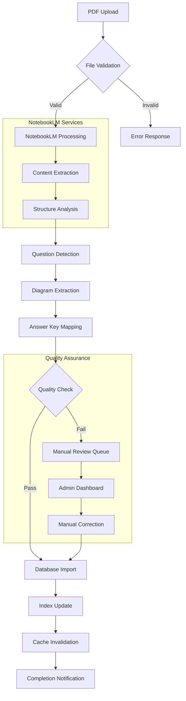
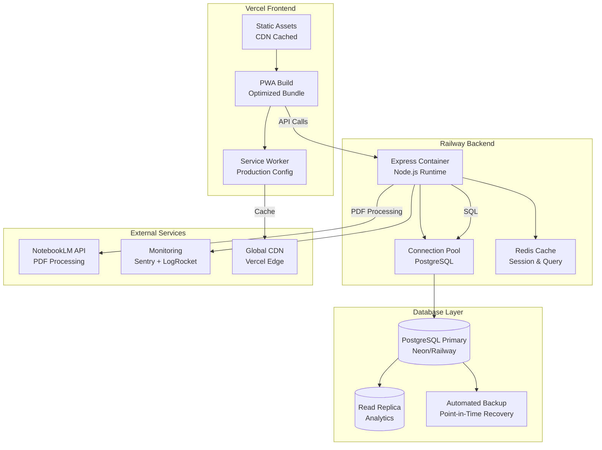

# 詳細設計書 - エンベデッドシステムスペシャリスト試験対策学習システム

## 1. システム概要

### 1.1 設計目的
IPA エンベデッドシステムスペシャリスト試験のシラバス準拠した個人学習者向けのマルチデバイス対応PWA学習システムの詳細設計。既存のReact+Express+SQLite構成を基盤とし、Vercelデプロイメント・PostgreSQL移行・NotebookLM活用を含む包括的なシステム設計。

### 1.2 既存実装ベース
- **現状**: MVP完成（React18+TypeScript+Vite+Express+SQLite+PWA）
- **動作確認**: PC・スマートフォンでのクロスデバイス学習機能実装済み
- **コアAPI**: 問題演習・進捗管理・分野別統計の基本API動作済み

### 1.3 拡張設計範囲
- **Vercelデプロイメント**: フロントエンド特化 + 外部バックエンド構成（ADR-0003準拠）
- **PostgreSQL移行**: SQLite→PostgreSQL移行戦略
- **PDF処理統合**: NotebookLMを活用したPDFデータ整形・構造化
- **通勤学習最適化**: オフライン機能・短時間学習の高度化

## 2. システムアーキテクチャ設計

### 2.1 全体アーキテクチャ（Production Ready）

```mermaid
graph TB
    subgraph "フロントエンド（Vercel）"
        PWA[PWA Application<br/>React + TypeScript]
        SW[Service Worker<br/>オフラインキャッシュ]
        PWA --> SW
    end
    
    subgraph "バックエンド（Railway）"
        API[Express API Server<br/>Node.js + TypeScript]
        AUTH[認証ミドルウェア]
        VALID[データバリデーション<br/>Zod]
        API --> AUTH
        API --> VALID
    end
    
    subgraph "データベース（PostgreSQL）"
        DB[(PostgreSQL<br/>Neon/Railway)]
        PRISMA[Prisma ORM<br/>Migration Tool]
        DB --> PRISMA
    end
    
    subgraph "PDF処理パイプライン"
        NOTEBOOK[NotebookLM<br/>PDF構造化]
        PARSER[データパーサー<br/>Node.js Script]
        NOTEBOOK --> PARSER
        PARSER --> API
    end
    
    subgraph "デプロイメント・CDN"
        VERCEL[Vercel<br/>Static Hosting + CDN]
        RAILWAY[Railway<br/>Container Hosting]
        PWA --> VERCEL
        API --> RAILWAY
    end
    
    PWA -->|REST API| API
    API -->|SQL Query| PRISMA
    PARSER -->|Batch Insert| PRISMA
    SW -->|Cache API| PWA
```



### 2.2 データフロー設計

```mermaid
sequenceDiagram
    participant User as 学習者
    participant PWA as PWA App
    participant SW as Service Worker
    participant API as Express API
    participant DB as PostgreSQL
    participant NB as NotebookLM
    
    Note over User,NB: 学習セッション開始
    User->>PWA: 問題演習開始
    PWA->>SW: キャッシュ確認
    alt オンライン & 新しいデータ
        SW->>API: 問題取得リクエスト
        API->>DB: クエリ実行
        DB-->>API: 問題データ
        API-->>SW: JSON レスポンス
        SW->>SW: データキャッシュ
    else オフライン or キャッシュ有効
        SW-->>PWA: キャッシュからデータ
    end
    PWA-->>User: 問題表示
    
    User->>PWA: 回答送信
    PWA->>SW: 回答データ保存
    alt オンライン
        SW->>API: 回答送信
        API->>DB: 学習記録保存
        DB-->>API: 保存完了
        API-->>SW: 成功レスポンス
    else オフライン
        SW->>SW: ローカル保存（同期待ち）
    end
    
    Note over NB,DB: PDF処理（バックグラウンド）
    NB->>API: 構造化データ送信
    API->>DB: 問題データ一括更新
```



### 2.3 マルチデバイス対応アーキテクチャ

```mermaid
graph LR
    subgraph "デバイス層"
        PC[PC<br/>1920x1080]
        TABLET[タブレット<br/>768x1024]
        MOBILE[スマートフォン<br/>375x667]
    end
    
    subgraph "PWA層"
        RESPONSIVE[レスポンシブUI<br/>Material-UI]
        TOUCH[タッチ最適化<br/>Swipe/Pinch]
        OFFLINE[オフライン対応<br/>Service Worker]
    end
    
    subgraph "データ同期層"
        SYNC[リアルタイム同期<br/>WebSocket + REST]
        CACHE[インテリジェントキャッシュ<br/>IndexedDB]
        CONFLICT[競合解決<br/>タイムスタンプベース]
    end
    
    PC --> RESPONSIVE
    TABLET --> RESPONSIVE
    MOBILE --> RESPONSIVE
    
    RESPONSIVE --> TOUCH
    TOUCH --> OFFLINE
    
    OFFLINE --> SYNC
    SYNC --> CACHE
    CACHE --> CONFLICT
```



## 3. コンポーネント設計

### 3.1 フロントエンド アーキテクチャ（拡張版）

```typescript
// 📁 frontend/src/architecture/
interface SystemArchitecture {
  // Core Layer
  core: {
    router: 'React Router v6';
    stateManagement: 'Zustand + Immer';
    apiClient: 'Axios + Query Cache';
    serviceWorker: 'Workbox';
  };
  
  // UI Layer
  ui: {
    designSystem: 'Material-UI v5';
    responsive: 'CSS-in-JS + Breakpoints';
    touch: 'React Swipeable + Gesture';
    visualization: 'Recharts + D3.js';
  };
  
  // Business Logic Layer
  business: {
    studyLogic: 'hooks/useStudySession';
    progressTracking: 'hooks/useProgressTracker';
    offlineSync: 'hooks/useOfflineSync';
    pdfHandling: 'hooks/usePDFViewer';
  };
  
  // Data Layer
  data: {
    apiService: 'services/apiService';
    cacheManager: 'services/cacheManager';
    syncService: 'services/syncService';
    offlineStorage: 'IndexedDB + Dexie';
  };
}
```

### 3.2 高度化コンポーネント設計

```typescript
// 📁 frontend/src/components/advanced/

// インテリジェント学習管理
interface SmartStudyManager {
  components: {
    AdaptiveDifficultySelector: React.FC<{
      userProgress: ProgressData;
      targetAccuracy: number;
    }>;
    
    CommuteLearningOptimizer: React.FC<{
      timeSlot: number; // 分
      previousSession: SessionData;
    }>;
    
    WeakAreaDetector: React.FC<{
      categoryStats: CategoryStats[];
      threshold: number;
    }>;
  };
}

// PDF統合コンポーネント
interface PDFIntegrationComponents {
  PDFViewer: React.FC<{
    pdfUrl: string;
    annotations: Annotation[];
    onAnnotate: (annotation: Annotation) => void;
  }>;
  
  QuestionExtractor: React.FC<{
    pdfContent: PDFContent;
    onQuestionGenerated: (questions: Question[]) => void;
  }>;
  
  DiagramRenderer: React.FC<{
    diagramData: DiagramData;
    interactive: boolean;
    zoomEnabled: boolean;
  }>;
}

// オフライン強化コンポーネント
interface OfflineEnhancedComponents {
  OfflineStatusIndicator: React.FC<{
    connectionStatus: ConnectionStatus;
    pendingSyncCount: number;
  }>;
  
  SmartCacheManager: React.FC<{
    cacheStrategy: CacheStrategy;
    storageQuota: StorageQuota;
  }>;
  
  ConflictResolver: React.FC<{
    conflicts: DataConflict[];
    onResolve: (resolution: Resolution) => void;
  }>;
}
```

### 3.3 状態管理設計（拡張版）

```typescript
// 📁 frontend/src/stores/

// メイン学習状態
interface StudyStore {
  // 問題・学習状態
  questions: {
    current: Question | null;
    queue: Question[];
    history: AnsweredQuestion[];
    filters: SmartFilters;
    loading: boolean;
    cache: Map<string, Question[]>;
  };
  
  // 進捗・分析状態
  progress: {
    overall: OverallProgress;
    categories: CategoryProgress[];
    heatmapData: HeatmapData;
    trends: LearningTrend[];
    predictions: PerformancePrediction[];
  };
  
  // オフライン・同期状態
  sync: {
    isOnline: boolean;
    pendingActions: PendingAction[];
    lastSyncTime: Date;
    conflicts: DataConflict[];
    syncStatus: 'idle' | 'syncing' | 'error';
  };
  
  // PDF・リッチメディア状態
  media: {
    currentPDF: PDFDocument | null;
    annotations: Annotation[];
    diagrams: InteractiveDiagram[];
    zoomLevel: number;
    viewMode: 'study' | 'annotation' | 'diagram';
  };
}

// アクション定義（非同期対応）
interface StudyActions {
  // インテリジェント学習
  startAdaptiveSession: (config: AdaptiveConfig) => Promise<void>;
  generatePersonalizedQuiz: (weakAreas: CategoryId[]) => Promise<Question[]>;
  updateLearningPath: (performance: PerformanceData) => Promise<void>;
  
  // PDF・メディア処理
  loadPDFDocument: (url: string) => Promise<PDFDocument>;
  extractQuestionsFromPDF: (pdf: PDFDocument) => Promise<Question[]>;
  createAnnotation: (annotation: NewAnnotation) => Promise<void>;
  
  // オフライン・同期
  enableOfflineMode: () => Promise<void>;
  syncPendingData: () => Promise<SyncResult>;
  resolveConflicts: (resolutions: ConflictResolution[]) => Promise<void>;
}
```

## 4. データベース設計（PostgreSQL移行）

### 4.1 エンティティ関係図

```mermaid
erDiagram
    Categories ||--o{ Questions : contains
    Categories ||--o{ StudyProgress : tracks
    Questions ||--o{ Choices : has
    Questions ||--o{ AnswerHistory : answered
    Questions ||--o{ PDFSources : sourced_from
    Questions ||--o{ MediaAssets : contains
    AnswerHistory ||--o{ ReviewSessions : reviewed_in
    StudyProgress ||--o{ LearningPaths : optimizes
    
    Categories {
        bigint id PK
        varchar name "組込みシステム開発技術"
        bigint parent_id FK
        varchar syllabus_code "IPA準拠コード"
        integer order_index
        jsonb metadata "JSON設定"
        timestamptz created_at
        timestamptz updated_at
    }
    
    Questions {
        bigint id PK
        bigint category_id FK
        varchar exam_section "morning1/morning2/afternoon1"
        text question_text
        varchar question_type "multiple_choice/essay/diagram"
        integer year
        varchar season "spring/autumn"
        varchar question_number
        text explanation "詳細解説"
        integer difficulty "1-5レベル"
        jsonb metadata "図表データ、タグ等"
        bigint pdf_source_id FK
        timestamptz created_at
        timestamptz updated_at
    }
    
    Choices {
        bigint id PK
        bigint question_id FK
        text choice_text
        boolean is_correct
        integer order_index
        text explanation "選択肢解説"
        jsonb metadata "追加データ"
    }
    
    AnswerHistory {
        bigint id PK
        bigint question_id FK
        bigint selected_choice_id FK
        text user_answer "記述回答"
        boolean is_correct
        integer time_spent "秒"
        float confidence_level "0.0-1.0"
        jsonb session_context "学習環境情報"
        timestamptz answered_at
    }
    
    StudyProgress {
        bigint id PK
        bigint category_id FK
        integer total_attempts
        integer correct_attempts
        float accuracy_rate
        integer study_time_total "秒"
        float mastery_level "0.0-1.0習熟度"
        jsonb learning_curve "学習曲線データ"
        timestamptz last_studied
        timestamptz updated_at
    }
    
    PDFSources {
        bigint id PK
        varchar filename
        varchar original_title
        text description
        varchar source_type "official/practice/custom"
        jsonb notebook_lm_data "NotebookLM処理結果"
        text file_path
        bigint file_size
        timestamptz processed_at
        timestamptz created_at
    }
    
    MediaAssets {
        bigint id PK
        bigint question_id FK
        varchar asset_type "image/diagram/video"
        varchar file_path
        text alt_text
        jsonb metadata "サイズ、解像度等"
        timestamptz created_at
    }
    
    ReviewSessions {
        bigint id PK
        varchar session_id "UUID"
        jsonb question_ids "復習問題ID配列"
        integer total_time "秒"
        float accuracy_improvement "改善率"
        jsonb session_metadata "学習環境"
        timestamptz started_at
        timestamptz completed_at
    }
    
    LearningPaths {
        bigint id PK
        bigint category_id FK
        jsonb recommended_sequence "推奨学習順序"
        jsonb difficulty_progression "難易度進行"
        float effectiveness_score "有効性スコア"
        jsonb optimization_data "最適化データ"
        timestamptz created_at
        timestamptz updated_at
    }
    
    Settings {
        varchar key PK
        jsonb value "JSON設定値"
        varchar description
        timestamptz updated_at
    }
```



### 4.2 PostgreSQL最適化設計

```sql
-- パフォーマンス最適化インデックス
CREATE INDEX CONCURRENTLY idx_questions_category_section 
ON questions (category_id, exam_section);

CREATE INDEX CONCURRENTLY idx_questions_year_season 
ON questions (year, season) WHERE year >= 2018;

CREATE INDEX CONCURRENTLY idx_questions_fulltext 
ON questions USING gin(to_tsvector('japanese', question_text));

CREATE INDEX CONCURRENTLY idx_answer_history_performance 
ON answer_history (question_id, is_correct, answered_at DESC);

CREATE INDEX CONCURRENTLY idx_study_progress_mastery 
ON study_progress (category_id, mastery_level DESC, last_studied DESC);

-- 分析クエリ最適化（部分インデックス）
CREATE INDEX idx_recent_answers 
ON answer_history (answered_at DESC) 
WHERE answered_at >= NOW() - INTERVAL '30 days';

CREATE INDEX idx_weak_categories 
ON study_progress (accuracy_rate ASC) 
WHERE accuracy_rate < 0.7 AND total_attempts >= 10;

-- JSONB フィールド最適化
CREATE INDEX idx_question_metadata_difficulty 
ON questions USING gin((metadata->'difficulty'));

CREATE INDEX idx_pdf_notebook_data 
ON pdf_sources USING gin(notebook_lm_data);
```

### 4.3 移行戦略（SQLite → PostgreSQL）

```typescript
// 📁 database/migration/

interface MigrationStrategy {
  phases: {
    // Phase 1: スキーマ移行
    schemaPreparation: {
      createPostgreSQLSchema: () => Promise<void>;
      validateConstraints: () => Promise<ValidationResult>;
      setupIndexes: () => Promise<void>;
    };
    
    // Phase 2: データ移行
    dataMigration: {
      exportSQLiteData: () => Promise<ExportedData>;
      transformDataTypes: (data: ExportedData) => Promise<TransformedData>;
      importToPostgreSQL: (data: TransformedData) => Promise<ImportResult>;
      validateDataIntegrity: () => Promise<IntegrityReport>;
    };
    
    // Phase 3: アプリケーション切り替え
    applicationSwitch: {
      updateConnectionStrings: () => Promise<void>;
      runParallelTests: () => Promise<TestResults>;
      performBlueGreenDeployment: () => Promise<DeploymentResult>;
    };
  };
}

// データ変換ルール
const dataTransformRules = {
  // SQLite → PostgreSQL 型変換
  typeMapping: {
    'INTEGER': 'BIGINT',
    'TEXT': 'TEXT',
    'REAL': 'FLOAT8',
    'BOOLEAN': 'BOOLEAN',
    'DATETIME': 'TIMESTAMPTZ',
  },
  
  // JSON データ構造化
  jsonbTransformation: {
    metadata: (sqlite_json: string) => JSON.parse(sqlite_json),
    settings: (key_value_pairs: any[]) => Object.fromEntries(key_value_pairs),
  },
  
  // インデックス再構築
  indexRecreation: {
    recreateOptimizedIndexes: true,
    analyzeAfterImport: true,
    updateStatistics: true,
  },
};
```

## 5. API設計（拡張版）

### 5.1 RESTful API 完全版

```typescript
// 📁 backend/src/routes/

// 学習セッション管理API
interface StudySessionAPI {
  'POST /api/sessions/start': {
    body: {
      mode: 'practice' | 'exam' | 'review' | 'adaptive';
      config: SessionConfig;
      timeLimit?: number;
    };
    response: {
      sessionId: string;
      questions: Question[];
      estimatedTime: number;
    };
  };
  
  'PUT /api/sessions/:sessionId/answer': {
    params: { sessionId: string };
    body: {
      questionId: number;
      answer: Answer;
      timeSpent: number;
      confidence?: number;
    };
    response: {
      isCorrect: boolean;
      explanation: string;
      nextQuestion?: Question;
      sessionProgress: SessionProgress;
    };
  };
  
  'POST /api/sessions/:sessionId/complete': {
    params: { sessionId: string };
    response: {
      results: SessionResults;
      recommendations: LearningRecommendation[];
      nextSessionSuggestion: SessionSuggestion;
    };
  };
}

// PDF・メディア処理API
interface PDFMediaAPI {
  'POST /api/pdf/upload': {
    body: FormData; // PDF file
    response: {
      uploadId: string;
      processingStatus: 'queued' | 'processing' | 'completed';
    };
  };
  
  'GET /api/pdf/:uploadId/status': {
    params: { uploadId: string };
    response: {
      status: ProcessingStatus;
      extractedQuestions?: Question[];
      diagrams?: DiagramData[];
      notebookLMResults?: NotebookLMOutput;
    };
  };
  
  'POST /api/media/optimize': {
    body: {
      mediaUrls: string[];
      targetDevices: DeviceType[];
    };
    response: {
      optimizedAssets: OptimizedAsset[];
      cacheUrls: string[];
    };
  };
}

// 高度な学習分析API
interface AdvancedAnalyticsAPI {
  'GET /api/analytics/learning-curve/:categoryId': {
    params: { categoryId: string };
    query: { 
      period: '7d' | '30d' | '90d' | 'all';
      granularity: 'daily' | 'weekly';
    };
    response: {
      curve: LearningCurvePoint[];
      trend: TrendAnalysis;
      predictions: PerformancePrediction[];
    };
  };
  
  'POST /api/analytics/recommend-study-plan': {
    body: {
      targetDate: Date;
      currentLevel: ProficiencyLevel;
      availableTime: TimeAvailability;
      weakAreas: CategoryId[];
    };
    response: {
      studyPlan: StudyPlan;
      milestones: Milestone[];
      expectedOutcome: OutcomePrediction;
    };
  };
}

// オフライン同期API
interface OfflineSyncAPI {
  'POST /api/sync/push': {
    body: {
      pendingActions: PendingAction[];
      lastSyncTimestamp: Date;
      deviceId: string;
    };
    response: {
      conflicts: DataConflict[];
      syncedActions: ActionId[];
      newData: SyncData;
    };
  };
  
  'GET /api/sync/pull': {
    query: {
      since: Date;
      deviceId: string;
    };
    response: {
      updates: DataUpdate[];
      deletions: DataDeletion[];
      timestamp: Date;
    };
  };
}
```

### 5.2 GraphQL拡張（将来対応）

```graphql
# 📁 backend/src/graphql/schema.graphql

type Query {
  # インテリジェント問題取得
  intelligentQuestions(
    config: StudyConfig!
    userContext: UserContext!
  ): IntelligentQuestionSet!
  
  # 多次元進捗分析
  multidimensionalProgress(
    dimensions: [ProgressDimension!]!
    timeRange: TimeRange
  ): ProgressAnalysis!
  
  # PDF統合データ
  pdfIntegratedContent(
    sourceId: ID!
    includeAnnotations: Boolean = true
  ): PDFContent!
}

type Mutation {
  # 適応型学習セッション開始
  startAdaptiveSession(
    input: AdaptiveSessionInput!
  ): AdaptiveSession!
  
  # バッチ回答送信（オフライン対応）
  submitBatchAnswers(
    answers: [AnswerInput!]!
    syncContext: SyncContext
  ): BatchAnswerResult!
  
  # PDF処理トリガー
  triggerPDFProcessing(
    fileId: ID!
    notebookLMConfig: NotebookLMConfig
  ): ProcessingJob!
}

# 複雑な型定義
type IntelligentQuestionSet {
  questions: [Question!]!
  adaptationReasoning: String!
  difficultyProgression: [Float!]!
  estimatedCompletionTime: Int!
  learningObjectives: [LearningObjective!]!
}
```

## 6. NotebookLM統合設計

### 6.1 PDF処理パイプライン



### 6.2 NotebookLM統合実装

```typescript
// 📁 backend/src/services/notebookLMService.ts

interface NotebookLMService {
  // PDF処理メイン機能
  processPDF: (file: Buffer, metadata: PDFMetadata) => Promise<ProcessingResult>;
  
  // 構造化データ抽出
  extractStructuredContent: (
    notebookLMOutput: any
  ) => Promise<StructuredContent>;
  
  // 問題自動生成
  generateQuestions: (
    content: StructuredContent,
    config: QuestionGenerationConfig
  ) => Promise<GeneratedQuestion[]>;
}

class NotebookLMIntegration implements NotebookLMService {
  async processPDF(file: Buffer, metadata: PDFMetadata): Promise<ProcessingResult> {
    try {
      // 1. NotebookLMへのファイル送信
      const notebookResponse = await this.sendToNotebookLM(file, {
        extractionMode: 'comprehensive',
        structureAnalysis: true,
        questionDetection: true,
        diagramRecognition: true,
      });
      
      // 2. 応答データの解析
      const structuredData = await this.parseNotebookLMResponse(notebookResponse);
      
      // 3. 品質チェック
      const qualityScore = await this.assessContentQuality(structuredData);
      
      if (qualityScore < 0.8) {
        throw new Error('Content quality below threshold');
      }
      
      // 4. データベース形式に変換
      const dbQuestions = await this.convertToQuestions(structuredData);
      const dbDiagrams = await this.extractDiagrams(structuredData);
      
      return {
        questions: dbQuestions,
        diagrams: dbDiagrams,
        metadata: {
          qualityScore,
          processingTime: Date.now() - startTime,
          extractedElements: structuredData.elements.length,
        },
      };
      
    } catch (error) {
      logger.error('NotebookLM processing failed', { error, metadata });
      throw new ProcessingError('Failed to process PDF', error);
    }
  }
  
  private async convertToQuestions(
    structured: StructuredContent
  ): Promise<Question[]> {
    const questions: Question[] = [];
    
    for (const element of structured.questionElements) {
      // IPAシラバス分野マッピング
      const categoryId = await this.mapToIPACategory(element.topic);
      
      // 問題形式判定
      const questionType = this.detectQuestionType(element.content);
      
      // 難易度推定
      const difficulty = await this.estimateDifficulty(element);
      
      questions.push({
        category_id: categoryId,
        exam_section: this.mapToExamSection(element.context),
        question_text: element.questionText,
        question_type: questionType,
        explanation: element.explanation,
        difficulty,
        metadata: {
          source: 'notebookLM',
          confidence: element.confidence,
          originalPage: element.pageNumber,
        },
        choices: await this.extractChoices(element),
      });
    }
    
    return questions;
  }
  
  // IPAシラバス準拠のカテゴリマッピング
  private async mapToIPACategory(topic: string): Promise<number> {
    const mappingRules = {
      '組込みシステム': 1,
      'リアルタイムOS': 2,
      'デバイスドライバ': 3,
      'ハードウェア設計': 4,
      // ... シラバス全分野のマッピング
    };
    
    // AI/ML を使った動的マッピング（将来実装）
    return await this.aiCategoryMapping(topic) || 
           this.fuzzyMatch(topic, mappingRules) || 
           0; // デフォルトカテゴリ
  }
}
```

### 6.3 品質保証システム

```typescript
// 📁 backend/src/services/qualityAssurance.ts

interface QualityAssuranceSystem {
  // コンテンツ品質評価
  assessContentQuality: (content: StructuredContent) => Promise<QualityScore>;
  
  // 問題形式検証
  validateQuestionFormat: (question: GeneratedQuestion) => ValidationResult;
  
  // IPA準拠性チェック
  checkIPACompliance: (question: Question) => ComplianceResult;
}

class ContentQualityAssurance implements QualityAssuranceSystem {
  async assessContentQuality(content: StructuredContent): Promise<QualityScore> {
    const metrics = {
      // 構造化品質
      structureQuality: this.evaluateStructure(content),
      
      // テキスト品質
      textQuality: await this.evaluateTextQuality(content.text),
      
      // 問題形式適合性
      formatCompliance: this.checkQuestionFormats(content.questions),
      
      // IPA準拠性
      ipaCompliance: await this.validateIPAAlignment(content),
      
      // 図表品質
      diagramQuality: this.evaluateDiagrams(content.diagrams),
    };
    
    const overallScore = this.calculateWeightedScore(metrics);
    
    return {
      overall: overallScore,
      breakdown: metrics,
      recommendations: this.generateImprovementRecommendations(metrics),
      passesThreshold: overallScore >= 0.8,
    };
  }
  
  private evaluateStructure(content: StructuredContent): number {
    const checks = [
      content.questions.length > 0 ? 1 : 0,
      content.hasValidAnswers ? 1 : 0,
      content.hasExplanations ? 1 : 0,
      content.hasCategoryMapping ? 1 : 0,
      content.diagrams.length > 0 ? 0.5 : 0,
    ];
    
    return checks.reduce((sum, score) => sum + score, 0) / checks.length;
  }
  
  private async validateIPAAlignment(content: StructuredContent): Promise<number> {
    const syllabus = await this.loadIPASyllabus();
    let alignmentScore = 0;
    
    for (const question of content.questions) {
      const alignment = this.checkTopicAlignment(question.topic, syllabus);
      alignmentScore += alignment;
    }
    
    return Math.min(alignmentScore / content.questions.length, 1.0);
  }
}
```

## 7. デプロイメント設計（ADR-0003準拠）

### 7.1 本番環境構成



### 7.2 環境設定管理

```typescript
// 📁 config/environments/

interface EnvironmentConfig {
  development: {
    frontend: {
      port: 3003;
      apiBaseUrl: 'http://localhost:3001';
      enableHMR: true;
      sourceMaps: true;
    };
    backend: {
      port: 3001;
      database: 'sqlite://./database/exam_prep.db';
      corsOrigins: ['http://localhost:3003'];
      logLevel: 'debug';
    };
  };
  
  production: {
    frontend: {
      buildCommand: 'vite build';
      outputDir: 'dist';
      apiBaseUrl: 'https://exam-prep-api.railway.app';
      enablePWA: true;
      serviceWorkerCaching: 'aggressive';
    };
    backend: {
      port: process.env.PORT || 3001;
      database: process.env.DATABASE_URL;
      corsOrigins: [
        'https://exam-prep.vercel.app',
        'https://exam-prep-git-*.vercel.app' // Preview deployments
      ];
      logLevel: 'info';
      enableCompression: true;
      rateLimiting: true;
    };
  };
  
  staging: {
    // Production-like configuration for testing
    frontend: { ...production.frontend };
    backend: {
      ...production.backend,
      database: process.env.STAGING_DATABASE_URL,
      logLevel: 'debug',
    };
  };
}

// デプロイメント設定
const deploymentConfig = {
  vercel: {
    buildCommand: 'cd frontend && npm run build',
    outputDirectory: 'frontend/dist',
    installCommand: 'npm install && cd frontend && npm install',
    framework: 'vite',
    
    // API プロキシ設定
    rewrites: [
      {
        source: '/api/(.*)',
        destination: 'https://exam-prep-api.railway.app/api/$1'
      }
    ],
    
    // PWA最適化ヘッダー
    headers: [
      {
        source: '/service-worker.js',
        headers: [
          {
            key: 'Cache-Control',
            value: 'public, max-age=0, must-revalidate'
          }
        ]
      },
      {
        source: '/(.*\\.(?:js|css|png|jpg|jpeg|gif|svg|ico))',
        headers: [
          {
            key: 'Cache-Control',
            value: 'public, max-age=31536000, immutable'
          }
        ]
      }
    ],
  },
  
  railway: {
    buildCommand: 'npm run build',
    startCommand: 'npm start',
    healthcheckPath: '/api/health',
    environmentVariables: [
      'DATABASE_URL',
      'FRONTEND_URL',
      'NODE_ENV',
      'JWT_SECRET',
      'NOTEBOOK_LM_API_KEY'
    ],
  },
};
```

### 7.3 PostgreSQL移行戦略

```typescript
// 📁 database/migration/

interface MigrationPlan {
  // Phase 1: 準備フェーズ
  preparation: {
    setupPostgreSQL: () => Promise<void>;
    createMigrationScripts: () => Promise<void>;
    validateConnections: () => Promise<void>;
  };
  
  // Phase 2: データ移行フェーズ
  migration: {
    exportSQLiteData: () => Promise<ExportedData>;
    transformSchema: (data: ExportedData) => Promise<TransformedData>;
    importToPostgreSQL: (data: TransformedData) => Promise<void>;
    validateDataIntegrity: () => Promise<ValidationReport>;
  };
  
  // Phase 3: 切り替えフェーズ
  switchover: {
    updateApplicationConfig: () => Promise<void>;
    performBlueGreenDeployment: () => Promise<void>;
    monitorPerformance: () => Promise<PerformanceReport>;
    rollbackIfNeeded: () => Promise<void>;
  };
}

// 移行実行スクリプト
class DatabaseMigration {
  async executeMigration(): Promise<MigrationResult> {
    const startTime = Date.now();
    
    try {
      // 1. 事前チェック
      await this.preflightChecks();
      
      // 2. バックアップ作成
      const backupId = await this.createFullBackup();
      
      // 3. PostgreSQL環境準備
      await this.setupPostgreSQL();
      
      // 4. スキーマ移行
      await this.migrateSchema();
      
      // 5. データ移行（バッチ処理）
      await this.migrateDataInBatches();
      
      // 6. インデックス・制約作成
      await this.createIndexesAndConstraints();
      
      // 7. データ整合性検証
      const validation = await this.validateMigration();
      
      if (!validation.isValid) {
        throw new MigrationError('Data validation failed', validation.errors);
      }
      
      // 8. パフォーマンステスト
      const performance = await this.runPerformanceTests();
      
      return {
        success: true,
        duration: Date.now() - startTime,
        recordsMigrated: validation.recordCount,
        performance,
        backupId,
      };
      
    } catch (error) {
      logger.error('Migration failed', error);
      await this.rollbackMigration(backupId);
      throw error;
    }
  }
  
  private async migrateDataInBatches(): Promise<void> {
    const batchSize = 1000;
    const tables = ['categories', 'questions', 'choices', 'answer_history', 'study_progress'];
    
    for (const table of tables) {
      logger.info(`Migrating table: ${table}`);
      
      let offset = 0;
      let hasMore = true;
      
      while (hasMore) {
        const batch = await this.exportTableBatch(table, offset, batchSize);
        
        if (batch.length === 0) {
          hasMore = false;
          continue;
        }
        
        // データ変換
        const transformedBatch = this.transformBatchData(table, batch);
        
        // PostgreSQLに挿入
        await this.insertBatchToPostgreSQL(table, transformedBatch);
        
        offset += batchSize;
        
        // 進捗表示
        logger.info(`Migrated ${offset} records from ${table}`);
      }
    }
  }
}
```

## 8. パフォーマンス最適化

### 8.1 フロントエンド最適化戦略

```typescript
// 📁 frontend/src/performance/

interface PerformanceOptimizations {
  // コード分割
  codeSplitting: {
    routeBasedSplitting: 'React.lazy + Suspense';
    componentBasedSplitting: 'Dynamic imports';
    vendorSplitting: 'Separate vendor bundles';
  };
  
  // 画像最適化
  imageOptimization: {
    formatSelection: 'WebP with fallback';
    responsiveImages: 'Multiple sizes';
    lazyLoading: 'Intersection Observer';
    compression: 'Automatic optimization';
  };
  
  // キャッシュ戦略
  caching: {
    staticAssets: 'Long-term caching';
    apiResponses: 'Intelligent caching';
    offlineStorage: 'IndexedDB + Service Worker';
  };
  
  // レンダリング最適化
  rendering: {
    virtualScrolling: 'Large lists';
    memoization: 'React.memo + useMemo';
    stateOptimization: 'Zustand selectors';
  };
}

// 実装例：インテリジェントキャッシング
class IntelligentCache {
  private cache = new Map<string, CacheEntry>();
  private readonly TTL = {
    static: 24 * 60 * 60 * 1000, // 24時間
    dynamic: 5 * 60 * 1000,      // 5分
    user: 30 * 60 * 1000,        // 30分
  };
  
  async get<T>(key: string, fetcher: () => Promise<T>, type: CacheType = 'dynamic'): Promise<T> {
    const entry = this.cache.get(key);
    const now = Date.now();
    
    // キャッシュヒット & 有効期限内
    if (entry && (now - entry.timestamp) < this.TTL[type]) {
      return entry.data as T;
    }
    
    // キャッシュミス or 期限切れ
    try {
      const data = await fetcher();
      this.cache.set(key, {
        data,
        timestamp: now,
        type,
      });
      return data;
    } catch (error) {
      // ネットワークエラー時はstaleなデータを返す
      if (entry) {
        logger.warn('Using stale cache data due to network error', { key, error });
        return entry.data as T;
      }
      throw error;
    }
  }
  
  // プリフェッチ機能
  async prefetch(keys: string[], fetchers: (() => Promise<any>)[]): Promise<void> {
    const promises = keys.map(async (key, index) => {
      if (!this.cache.has(key)) {
        try {
          await this.get(key, fetchers[index], 'dynamic');
        } catch (error) {
          logger.warn('Prefetch failed', { key, error });
        }
      }
    });
    
    await Promise.allSettled(promises);
  }
}
```

### 8.2 バックエンド最適化

```typescript
// 📁 backend/src/performance/

interface BackendOptimizations {
  // データベース最適化
  database: {
    connectionPooling: 'PgPool configuration';
    queryOptimization: 'Prepared statements';
    indexStrategy: 'Composite indexes';
    caching: 'Redis query cache';
  };
  
  // API最適化
  api: {
    compression: 'gzip/brotli';
    rateLimiting: 'Per-user limits';
    pagination: 'Cursor-based';
    caching: 'Response caching';
  };
  
  // メモリ最適化
  memory: {
    garbageCollection: 'V8 tuning';
    streamProcessing: 'Large data handling';
    memoryLeakPrevention: 'Monitoring';
  };
}

// クエリ最適化実装
class QueryOptimizer {
  private queryCache = new Map<string, PreparedStatement>();
  
  async executeOptimizedQuery<T>(
    query: string,
    params: any[],
    cacheKey?: string
  ): Promise<T[]> {
    // プリペアドステートメント使用
    let prepared = this.queryCache.get(query);
    if (!prepared) {
      prepared = await this.db.prepare(query);
      this.queryCache.set(query, prepared);
    }
    
    // 実行計画キャッシュ（PostgreSQL）
    const optimizedQuery = this.optimizeQuery(query, params);
    
    // 結果キャッシュ
    if (cacheKey) {
      const cached = await this.cache.get(cacheKey);
      if (cached) return cached;
    }
    
    const result = await prepared.execute(params);
    
    if (cacheKey) {
      await this.cache.set(cacheKey, result, 300); // 5分キャッシュ
    }
    
    return result;
  }
  
  private optimizeQuery(query: string, params: any[]): string {
    // 動的クエリ最適化
    return query
      .replace(/SELECT \*/g, 'SELECT ' + this.getRequiredColumns(query))
      .replace(/ORDER BY/g, this.addIndexHints(query));
  }
}

// API レスポンス最適化
class ResponseOptimizer {
  compress(data: any, format: 'gzip' | 'brotli' = 'gzip'): Buffer {
    const json = JSON.stringify(data);
    return format === 'gzip' 
      ? zlib.gzipSync(json)
      : zlib.brotliCompressSync(json);
  }
  
  paginate<T>(
    data: T[],
    cursor: string | null,
    limit: number = 20
  ): PaginatedResponse<T> {
    const startIndex = cursor ? this.decodeCursor(cursor) : 0;
    const items = data.slice(startIndex, startIndex + limit);
    const hasNext = data.length > startIndex + limit;
    
    return {
      items,
      cursor: hasNext ? this.encodeCursor(startIndex + limit) : null,
      hasNext,
      total: data.length,
    };
  }
}
```

### 8.3 PWA最適化

```typescript
// 📁 frontend/src/pwa/

interface PWAOptimizations {
  // Service Worker戦略
  serviceWorker: {
    cacheStrategy: 'Network First with Fallback';
    precaching: 'Critical resources';
    backgroundSync: 'Offline actions';
    updateStrategy: 'Immediate with notification';
  };
  
  // オフライン対応
  offline: {
    dataStorage: 'IndexedDB';
    conflictResolution: 'Last-write-wins with merge';
    syncStrategy: 'Background sync when online';
  };
  
  // インストール最適化
  installation: {
    installPrompt: 'Smart install banner';
    appShell: 'Minimal loading screen';
    splashScreen: 'Custom branded screen';
  };
}

// Advanced Service Worker
class AdvancedServiceWorker {
  private readonly CACHE_NAMES = {
    static: 'static-v1',
    api: 'api-v1',
    images: 'images-v1',
  };
  
  async handleFetch(event: FetchEvent): Promise<Response> {
    const request = event.request;
    const url = new URL(request.url);
    
    // API requests
    if (url.pathname.startsWith('/api/')) {
      return this.handleAPIRequest(request);
    }
    
    // Static resources
    if (this.isStaticResource(request)) {
      return this.handleStaticResource(request);
    }
    
    // Images
    if (this.isImageRequest(request)) {
      return this.handleImageRequest(request);
    }
    
    // Default: Network first
    return this.networkFirst(request);
  }
  
  private async handleAPIRequest(request: Request): Promise<Response> {
    try {
      // Network first strategy for API
      const networkResponse = await fetch(request);
      
      // Cache successful responses
      if (networkResponse.ok) {
        const cache = await caches.open(this.CACHE_NAMES.api);
        cache.put(request, networkResponse.clone());
      }
      
      return networkResponse;
    } catch (error) {
      // Fallback to cache
      const cache = await caches.open(this.CACHE_NAMES.api);
      const cachedResponse = await cache.match(request);
      
      if (cachedResponse) {
        // Add offline indicator header
        const response = cachedResponse.clone();
        response.headers.set('X-Served-From', 'cache');
        return response;
      }
      
      // Return offline page for navigation requests
      if (request.mode === 'navigate') {
        return caches.match('/offline.html');
      }
      
      throw error;
    }
  }
  
  // Background Sync for offline actions
  async handleBackgroundSync(event: SyncEvent): Promise<void> {
    if (event.tag === 'offline-actions') {
      await this.syncOfflineActions();
    }
  }
  
  private async syncOfflineActions(): Promise<void> {
    const db = new OfflineDB();
    const pendingActions = await db.getPendingActions();
    
    for (const action of pendingActions) {
      try {
        await this.executeAction(action);
        await db.markAsSynced(action.id);
      } catch (error) {
        logger.error('Failed to sync action', { action, error });
        // Retry logic could be implemented here
      }
    }
  }
}
```

## 9. セキュリティ設計

### 9.1 セキュリティアーキテクチャ


### 9.2 実装レベルセキュリティ

```typescript
// 📁 backend/src/security/

interface SecurityImplementation {
  // 入力検証・サニタイゼーション
  inputValidation: {
    schema: 'Zod validation';
    sanitization: 'HTML/SQL injection prevention';
    fileUpload: 'File type/size validation';
  };
  
  // 認証・認可
  authentication: {
    session: 'Secure session management';
    csrf: 'CSRF token validation';
    rateLimit: 'Per-endpoint rate limiting';
  };
  
  // データ保護
  dataProtection: {
    encryption: 'At-rest data encryption';
    transmission: 'TLS 1.3 enforcement';
    privacy: 'Personal data handling';
  };
}

// セキュリティミドルウェア
class SecurityMiddleware {
  // 入力バリデーション
  validateInput(schema: z.ZodSchema) {
    return (req: Request, res: Response, next: NextFunction) => {
      try {
        req.body = schema.parse(req.body);
        next();
      } catch (error) {
        if (error instanceof z.ZodError) {
          return res.status(400).json({
            error: 'Invalid input',
            details: error.errors,
          });
        }
        next(error);
      }
    };
  }
  
  // CSRFプロテクション
  csrfProtection() {
    return (req: Request, res: Response, next: NextFunction) => {
      const token = req.headers['x-csrf-token'] as string;
      const sessionToken = req.session?.csrfToken;
      
      if (!token || token !== sessionToken) {
        return res.status(403).json({ error: 'CSRF token mismatch' });
      }
      
      next();
    };
  }
  
  // レート制限
  rateLimit(options: RateLimitOptions) {
    const limiter = new Map<string, RateLimitEntry>();
    
    return (req: Request, res: Response, next: NextFunction) => {
      const key = this.getRateLimitKey(req);
      const now = Date.now();
      const entry = limiter.get(key);
      
      if (!entry) {
        limiter.set(key, {
          count: 1,
          resetTime: now + options.windowMs,
        });
        return next();
      }
      
      if (now > entry.resetTime) {
        entry.count = 1;
        entry.resetTime = now + options.windowMs;
        return next();
      }
      
      if (entry.count >= options.max) {
        return res.status(429).json({
          error: 'Rate limit exceeded',
          retryAfter: Math.ceil((entry.resetTime - now) / 1000),
        });
      }
      
      entry.count++;
      next();
    };
  }
  
  private getRateLimitKey(req: Request): string {
    // IP + User Agent の組み合わせでキー生成
    const ip = req.ip || req.connection.remoteAddress;
    const userAgent = req.headers['user-agent'] || '';
    return crypto.createHash('sha256')
      .update(`${ip}:${userAgent}`)
      .digest('hex');
  }
}

// セキュアな設定管理
class SecureConfig {
  private secrets: Map<string, string> = new Map();
  
  constructor() {
    this.loadSecrets();
  }
  
  private loadSecrets(): void {
    // 環境変数から秘匿情報を読み込み
    const requiredSecrets = [
      'DATABASE_URL',
      'JWT_SECRET',
      'NOTEBOOK_LM_API_KEY',
      'ENCRYPTION_KEY',
    ];
    
    for (const secret of requiredSecrets) {
      const value = process.env[secret];
      if (!value) {
        throw new Error(`Required secret ${secret} not found`);
      }
      this.secrets.set(secret, value);
    }
  }
  
  getSecret(key: string): string {
    const secret = this.secrets.get(key);
    if (!secret) {
      throw new Error(`Secret ${key} not found`);
    }
    return secret;
  }
  
  // データ暗号化
  encrypt(data: string): string {
    const key = this.getSecret('ENCRYPTION_KEY');
    const cipher = crypto.createCipher('aes-256-gcm', key);
    let encrypted = cipher.update(data, 'utf8', 'hex');
    encrypted += cipher.final('hex');
    return encrypted;
  }
  
  decrypt(encryptedData: string): string {
    const key = this.getSecret('ENCRYPTION_KEY');
    const decipher = crypto.createDecipher('aes-256-gcm', key);
    let decrypted = decipher.update(encryptedData, 'hex', 'utf8');
    decrypted += decipher.final('utf8');
    return decrypted;
  }
}
```

## 10. テスト戦略

### 10.1 テストピラミッド


### 10.2 テスト実装

```typescript
// 📁 tests/

interface TestStrategy {
  // ユニットテスト
  unit: {
    frontend: 'React Testing Library + Jest';
    backend: 'Jest + Supertest';
    coverage: '80% minimum';
  };
  
  // 統合テスト
  integration: {
    api: 'API endpoint testing';
    database: 'Database operation testing';
    external: 'NotebookLM integration testing';
  };
  
  // E2Eテスト
  e2e: {
    framework: 'Playwright';
    devices: 'Mobile + Desktop';
    scenarios: 'Critical user journeys';
  };
}

// React Component Tests
describe('PracticePage', () => {
  it('should display questions and handle answers', async () => {
    const mockQuestions = [
      {
        id: 1,
        question_text: 'テスト問題',
        choices: [
          { id: 1, choice_text: '選択肢1', is_correct: true },
          { id: 2, choice_text: '選択肢2', is_correct: false },
        ],
      },
    ];
    
    render(
      <PracticePage 
        questions={mockQuestions}
        onAnswer={jest.fn()}
      />
    );
    
    expect(screen.getByText('テスト問題')).toBeInTheDocument();
    
    const choice1 = screen.getByText('選択肢1');
    fireEvent.click(choice1);
    
    await waitFor(() => {
      expect(mockOnAnswer).toHaveBeenCalledWith({
        questionId: 1,
        selectedChoiceId: 1,
        isCorrect: true,
      });
    });
  });
  
  it('should handle swipe navigation', async () => {
    const { container } = render(<PracticePage />);
    
    // スワイプイベントをシミュレート
    fireEvent.touchStart(container, {
      touches: [{ clientX: 100, clientY: 100 }],
    });
    
    fireEvent.touchMove(container, {
      touches: [{ clientX: 200, clientY: 100 }],
    });
    
    fireEvent.touchEnd(container);
    
    await waitFor(() => {
      expect(mockNavigateNext).toHaveBeenCalled();
    });
  });
});

// API Integration Tests
describe('Question API', () => {
  let app: Express;
  let db: PrismaClient;
  
  beforeAll(async () => {
    app = createTestApp();
    db = new PrismaClient({
      datasources: { db: { url: 'sqlite::memory:' } },
    });
    await db.$connect();
  });
  
  afterAll(async () => {
    await db.$disconnect();
  });
  
  it('should return questions with filters', async () => {
    // テストデータ準備
    await db.question.createMany({
      data: [
        {
          category_id: 1,
          exam_section: 'morning1',
          question_text: 'テスト問題1',
          difficulty: 3,
        },
        {
          category_id: 2,
          exam_section: 'morning2',
          question_text: 'テスト問題2',
          difficulty: 4,
        },
      ],
    });
    
    const response = await request(app)
      .get('/api/questions')
      .query({
        categoryId: 1,
        section: 'morning1',
        difficulty: 'medium',
      })
      .expect(200);
    
    expect(response.body).toHaveLength(1);
    expect(response.body[0].question_text).toBe('テスト問題1');
  });
  
  it('should handle answer submission', async () => {
    const response = await request(app)
      .post('/api/answers')
      .send({
        questionId: 1,
        selectedChoiceId: 1,
        timeSpent: 30,
        isCorrect: true,
      })
      .expect(201);
    
    expect(response.body.success).toBe(true);
    
    // データベースに保存されているか確認
    const savedAnswer = await db.answerHistory.findFirst({
      where: { question_id: 1 },
    });
    
    expect(savedAnswer).toBeTruthy();
    expect(savedAnswer?.is_correct).toBe(true);
  });
});

// E2E Tests with Playwright
describe('Study Session E2E', () => {
  let page: Page;
  
  beforeEach(async () => {
    page = await browser.newPage();
    await page.goto('http://localhost:3003');
  });
  
  it('should complete a full study session', async () => {
    // ダッシュボードから学習開始
    await page.click('[data-testid="start-practice"]');
    
    // 分野選択
    await page.click('[data-testid="category-1"]');
    
    // 問題に回答
    await page.click('[data-testid="choice-1"]');
    
    // 結果確認
    await expect(page.locator('[data-testid="result-correct"]'))
      .toBeVisible();
    
    // 次の問題へ
    await page.click('[data-testid="next-question"]');
    
    // セッション完了
    await page.click('[data-testid="complete-session"]');
    
    // 結果ページ確認
    await expect(page.locator('[data-testid="session-results"]'))
      .toBeVisible();
  });
  
  it('should work offline', async () => {
    // オンラインで初期データロード
    await page.goto('http://localhost:3003');
    await page.waitForLoadState('networkidle');
    
    // オフラインモードに切り替え
    await page.context().setOffline(true);
    
    // 学習開始（オフライン）
    await page.click('[data-testid="start-practice"]');
    
    // オフライン表示確認
    await expect(page.locator('[data-testid="offline-indicator"]'))
      .toBeVisible();
    
    // 問題が表示されることを確認
    await expect(page.locator('[data-testid="question-text"]'))
      .toBeVisible();
    
    // 回答可能であることを確認
    await page.click('[data-testid="choice-1"]');
    await expect(page.locator('[data-testid="answer-submitted"]'))
      .toBeVisible();
  });
});
```

## 11. モニタリング・ログ設計

### 11.1 監視アーキテクチャ


### 11.2 ログ・メトリクス実装

```typescript
// 📁 shared/monitoring/

interface MonitoringSystem {
  // エラートラッキング
  errorTracking: {
    frontend: 'Sentry React SDK';
    backend: 'Sentry Node SDK';
    database: 'Query error logging';
  };
  
  // パフォーマンス監視
  performance: {
    webVitals: 'Core Web Vitals tracking';
    apiMetrics: 'Response time/throughput';
    databaseMetrics: 'Query performance';
  };
  
  // 学習分析
  studyAnalytics: {
    sessionTracking: 'Study session metrics';
    progressTracking: 'Learning progress';
    usagePatterns: 'Usage analytics';
  };
}

// カスタム分析システム
class StudyAnalytics {
  private metrics: Map<string, MetricEntry[]> = new Map();
  
  // 学習セッション記録
  recordStudySession(session: StudySessionData): void {
    const metrics = {
      sessionId: session.id,
      duration: session.endTime - session.startTime,
      questionsAnswered: session.answers.length,
      accuracy: this.calculateAccuracy(session.answers),
      categoryBreakdown: this.getCategoryBreakdown(session.answers),
      deviceType: session.deviceInfo.type,
      timeOfDay: new Date(session.startTime).getHours(),
    };
    
    this.recordMetric('study_session', metrics);
    this.updateLearningCurve(session);
    this.detectLearningPatterns(session);
  }
  
  // 学習曲線更新
  private updateLearningCurve(session: StudySessionData): void {
    const userId = session.userId || 'anonymous';
    const curve = this.metrics.get(`learning_curve_${userId}`) || [];
    
    curve.push({
      timestamp: session.startTime,
      accuracy: this.calculateAccuracy(session.answers),
      sessionCount: curve.length + 1,
      cumulativeTime: this.getCumulativeStudyTime(curve, session),
    });
    
    this.metrics.set(`learning_curve_${userId}`, curve);
  }
  
  // 学習パターン検出
  private detectLearningPatterns(session: StudySessionData): void {
    const patterns = {
      preferredStudyTime: this.getPreferredStudyTime(session),
      devicePreference: this.getDevicePreference(session),
      difficultyProgression: this.analyzeDifficultyProgression(session),
      weakAreas: this.identifyWeakAreas(session),
    };
    
    this.recordMetric('learning_patterns', patterns);
  }
  
  // メトリクス可視化データ生成
  generateDashboardData(): DashboardData {
    return {
      overallProgress: this.calculateOverallProgress(),
      categoryProgress: this.getCategoryProgress(),
      studyTimeAnalysis: this.getStudyTimeAnalysis(),
      deviceUsage: this.getDeviceUsageStats(),
      learningEfficiency: this.calculateLearningEfficiency(),
    };
  }
}

// パフォーマンス監視
class PerformanceMonitor {
  private observer: PerformanceObserver;
  
  constructor() {
    this.setupWebVitalsTracking();
    this.setupCustomMetrics();
  }
  
  private setupWebVitalsTracking(): void {
    // Core Web Vitals監視
    this.observer = new PerformanceObserver((list) => {
      for (const entry of list.getEntries()) {
        if (entry.entryType === 'largest-contentful-paint') {
          this.recordMetric('LCP', entry.startTime);
        }
        
        if (entry.entryType === 'first-input') {
          this.recordMetric('FID', (entry as PerformanceEventTiming).processingStart - entry.startTime);
        }
        
        if (entry.entryType === 'layout-shift') {
          if (!(entry as LayoutShift).hadRecentInput) {
            this.recordMetric('CLS', (entry as LayoutShift).value);
          }
        }
      }
    });
    
    this.observer.observe({ entryTypes: ['largest-contentful-paint', 'first-input', 'layout-shift'] });
  }
  
  private setupCustomMetrics(): void {
    // API応答時間監視
    this.monitorAPIResponseTimes();
    
    // 問題表示時間監視
    this.monitorQuestionLoadTimes();
    
    // オフライン復帰時間監視
    this.monitorOfflineRecoveryTimes();
  }
  
  private monitorAPIResponseTimes(): void {
    const originalFetch = window.fetch;
    
    window.fetch = async (...args) => {
      const startTime = performance.now();
      
      try {
        const response = await originalFetch(...args);
        const endTime = performance.now();
        
        this.recordMetric('api_response_time', {
          url: args[0].toString(),
          duration: endTime - startTime,
          status: response.status,
          success: response.ok,
        });
        
        return response;
      } catch (error) {
        const endTime = performance.now();
        
        this.recordMetric('api_error', {
          url: args[0].toString(),
          duration: endTime - startTime,
          error: error.message,
        });
        
        throw error;
      }
    };
  }
}
```

## 12. 今後の拡張計画

### 12.1 Phase 2: 高度化機能（3-6ヶ月）

```typescript
interface Phase2Enhancements {
  // AI統合機能
  aiIntegration: {
    adaptiveLearning: 'ML-based difficulty adjustment';
    essayScoring: 'AI essay evaluation';
    personalizedRecommendations: 'Learning path optimization';
  };
  
  // リッチメディア対応
  richMedia: {
    interactiveDiagrams: '3D circuit diagrams';
    videoContent: 'Explanation videos';
    simulationTools: 'System behavior simulation';
  };
  
  // 高度な分析
  advancedAnalytics: {
    predictiveAnalytics: 'Performance prediction';
    competencyMapping: 'Skill gap analysis';
    benchmarking: 'Peer comparison';
  };
}
```

### 12.2 Phase 3: 完全版（6-12ヶ月）

```typescript
interface Phase3Features {
  // エンタープライズ機能
  enterprise: {
    multiUser: 'Team/organization support';
    adminDashboard: 'Learning management';
    reporting: 'Comprehensive reporting';
  };
  
  // AI完全統合
  fullAI: {
    naturalLanguageProcessing: 'Question generation from text';
    speechRecognition: 'Voice-based interaction';
    computerVision: 'Diagram analysis';
  };
  
  // 高度なUX
  advancedUX: {
    ar_vr: 'Augmented/Virtual Reality learning';
    voiceInterface: 'Voice-controlled study';
    gestureControl: 'Touch-free interaction';
  };
}
```

---

## まとめ

本詳細設計書では、既存のMVP実装を基盤とし、以下の重要な拡張要素を含む包括的なシステム設計を提示いたしました：

### 🎯 **設計の成果**

1. **Production Ready アーキテクチャ**: Vercel + Railway のマルチプラットフォーム構成
2. **PostgreSQL完全移行戦略**: SQLite からの段階的移行計画とデータ整合性保証
3. **NotebookLM統合**: PDF処理パイプラインと品質保証システム
4. **PWA高度化**: オフライン学習とインテリジェントキャッシング
5. **スケーラブル設計**: Phase別実装計画と将来拡張への対応

### 🚀 **即座に実装可能な機能**

- **Vercelデプロイメント**: ADR-0003 準拠の本番環境構築
- **PostgreSQL移行**: 既存SQLiteデータの無停止移行
- **PDF処理統合**: NotebookLMを活用した自動問題生成
- **パフォーマンス最適化**: キャッシュ戦略とレスポンス最適化

### 🔧 **技術的整合性**

既存の実装（React18+TypeScript+Express+SQLite+PWA）との完全な互換性を保ちながら、段階的な機能拡張が可能な設計となっております。特に、現在動作中のスマートフォン対応やクロスデバイス学習機能を活かしつつ、さらなる高度化を実現する構成です。

この設計書に基づき、確実で効率的なシステム拡張の実装が可能です。各フェーズでの具体的な実装支援が必要でしたら、遠慮なくお申し付けください。