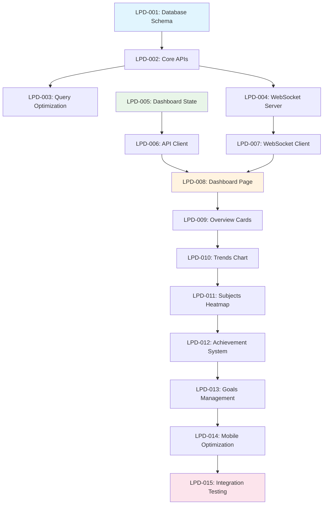

# 📊 Learning Progress Dashboard - Implementation Plan

**Document Version**: 1.0  
**Date**: 2025-08-06  
**Project**: ExamPreparationSystem  
**Feature**: Learning Progress Dashboard  
**Author**: AI Work Planner Agent  

---

## 🎯 Executive Summary

This implementation plan provides a detailed, incremental approach to building the Learning Progress Dashboard feature for the Embedded Systems Specialist Exam preparation system. The plan follows atomic commit principles, emphasizes mobile-first design, and ensures system stability throughout development.

**Timeline**: 2 weeks (10 working days)  
**Developer**: Single full-stack developer  
**Deployment**: Incremental with feature flags  
**Risk Level**: Medium (real-time features, database changes)  

---

## 📋 Task Breakdown Structure

### **Phase 1: Data Foundation & Core APIs (Days 1-4)**

#### **Task 1.1: Database Schema Extensions**
- **ID**: LPD-001
- **Description**: Extend Prisma schema with dashboard-specific tables
- **Files**: `backend/prisma/schema.prisma`, `backend/prisma/migrations/`
- **Estimated Time**: 2 hours
- **Commit Scope**: 1 COMMIT = Database schema only

**Deliverables:**
- [ ] Add `DashboardPreference` model
- [ ] Add `StudyGoal` model  
- [ ] Add `Achievement` model
- [ ] Extend `Answer` model with `sessionId`, `confidenceLevel`
- [ ] Create migration scripts
- [ ] Update database indexes for analytics performance

**Acceptance Criteria:**
- All new models follow existing naming conventions
- Migration runs successfully without data loss
- Indexes optimize common dashboard queries
- TypeScript types auto-generated by Prisma

**Technical Details:**
```prisma
model DashboardPreference {
  id            String   @id @default(cuid())
  userId        String?  // Optional until user system implemented
  chartTypes    Json     // Preferred chart configurations
  defaultPeriod Int      @default(30)
  showComparison Boolean @default(false)
  createdAt     DateTime @default(now())
  updatedAt     DateTime @updatedAt
}

model StudyGoal {
  id           String   @id @default(cuid())
  userId       String?  // Optional until user system implemented
  targetType   String   // "daily_questions", "accuracy", "study_time"
  targetValue  Float    // Goal value
  currentValue Float    @default(0)
  period       String   // "daily", "weekly", "monthly"
  isActive     Boolean  @default(true)
  createdAt    DateTime @default(now())
  updatedAt    DateTime @updatedAt
}

model Achievement {
  id          String   @id @default(cuid())
  userId      String?  // Optional until user system implemented
  type        String   // "streak", "accuracy", "volume", "category_master"
  title       String
  description String
  iconName    String
  unlockedAt  DateTime @default(now())
}
```

---

#### **Task 1.2: Core Dashboard API Endpoints**
- **ID**: LPD-002
- **Description**: Implement REST API endpoints for dashboard data
- **Files**: `backend/src/controllers/dashboardController.ts`, `backend/src/routes/dashboardRoutes.ts`
- **Estimated Time**: 4 hours
- **Dependencies**: LPD-001
- **Commit Scope**: 1 COMMIT = API controller + routes

**Deliverables:**
- [ ] `GET /api/dashboard/overview` - Overall statistics
- [ ] `GET /api/dashboard/trends` - Historical trend data
- [ ] `GET /api/dashboard/subjects` - Subject-wise performance
- [ ] `GET /api/dashboard/achievements` - User achievements
- [ ] `POST /api/dashboard/goals` - Create/update study goals
- [ ] Input validation with Zod schemas
- [ ] Error handling and proper HTTP status codes

**API Specifications:**
```typescript
// GET /api/dashboard/overview
interface OverviewResponse {
  stats: {
    totalStudyTime: number        // minutes
    questionsAnswered: number
    currentStreak: number         // days
    averageAccuracy: number       // percentage
    studyDaysInPeriod: number
    improvementRate: number       // percentage change
  }
  lastUpdated: string
}

// GET /api/dashboard/trends?period=30d&granularity=daily
interface TrendsResponse {
  data: Array<{
    date: string                  // ISO date
    questionsAnswered: number
    correctAnswers: number
    accuracy: number              // percentage
    studyTime: number            // minutes
  }>
  period: { start: string; end: string }
}
```

**Acceptance Criteria:**
- All endpoints return JSON with consistent structure
- Proper error handling (400, 404, 500)
- Input validation prevents invalid queries
- Response times < 500ms for typical datasets
- Code coverage > 80% for controller logic

---

#### **Task 1.3: Analytics Query Optimization**
- **ID**: LPD-003
- **Description**: Optimize database queries for dashboard analytics
- **Files**: `backend/src/controllers/dashboardController.ts`
- **Estimated Time**: 3 hours
- **Dependencies**: LPD-002
- **Commit Scope**: 1 COMMIT = Query optimizations only

**Deliverables:**
- [ ] Raw SQL queries for performance-critical analytics
- [ ] Database indexes for common date/category filters
- [ ] Pagination for large datasets
- [ ] Caching mechanism for frequent queries
- [ ] Performance benchmarks documentation

**Performance Targets:**
- Overview endpoint: < 200ms response time
- Trends endpoint: < 500ms for 90 days data
- Memory usage: < 50MB for 10,000+ answers
- Support concurrent requests (10+ users)

**Technical Implementation:**
```typescript
// Optimized analytics query
const getOptimizedTrends = async (period: string, userId?: string) => {
  const result = await prisma.$queryRaw`
    SELECT 
      DATE(createdAt) as date,
      COUNT(*) as total_answers,
      SUM(CASE WHEN isCorrect THEN 1 ELSE 0 END) as correct_answers,
      AVG(timeSpent) as avg_time,
      COUNT(DISTINCT questionId) as unique_questions
    FROM Answer 
    WHERE createdAt >= DATE('now', '-${period}')
    ${userId ? Prisma.sql`AND userId = ${userId}` : Prisma.empty}
    GROUP BY DATE(createdAt)
    ORDER BY date DESC
    LIMIT 100
  `
  return result
}
```

---

#### **Task 1.4: Real-time WebSocket Infrastructure**
- **ID**: LPD-004
- **Description**: Implement WebSocket server for real-time updates
- **Files**: `backend/src/websocket/socketServer.ts`, `backend/src/index.ts`
- **Estimated Time**: 4 hours
- **Dependencies**: LPD-002
- **Commit Scope**: 1 COMMIT = WebSocket setup + event handlers

**Deliverables:**
- [ ] Socket.io server configuration
- [ ] Dashboard namespace (`/dashboard`)
- [ ] Real-time event handlers
- [ ] Connection management and error handling
- [ ] Fallback to polling for connection failures

**Event Specifications:**
```typescript
// Server → Client Events
interface ProgressUpdateEvent {
  type: 'answer_submitted' | 'session_completed' | 'achievement_unlocked'
  data: {
    userId?: string
    questionId?: string
    newStats?: OverviewStats
    achievement?: Achievement
  }
  timestamp: string
}

// Client → Server Events
interface DashboardJoinEvent {
  userId?: string
  preferences: DashboardPreferences
}
```

**Acceptance Criteria:**
- WebSocket connections stable for > 5 minutes
- Event delivery within 100ms
- Graceful handling of connection drops
- No memory leaks in connection management
- Support for 100+ concurrent connections

---

### **Phase 2: Frontend Foundation & State Management (Days 5-6)**

#### **Task 2.1: Dashboard State Management**
- **ID**: LPD-005
- **Description**: Implement Zustand store for dashboard state
- **Files**: `frontend/src/stores/useDashboardStore.ts`
- **Estimated Time**: 2 hours
- **Dependencies**: None
- **Commit Scope**: 1 COMMIT = State management only

**Deliverables:**
- [ ] Dashboard Zustand store implementation
- [ ] State interfaces with TypeScript
- [ ] Actions for data fetching and updates
- [ ] Persistence for user preferences
- [ ] Real-time update integration

**State Structure:**
```typescript
interface DashboardStore {
  // State
  overview: OverviewStats | null
  trends: TrendData[]
  subjects: SubjectPerformance[]
  achievements: Achievement[]
  
  // UI State
  loading: {
    overview: boolean
    trends: boolean
    subjects: boolean
  }
  
  // Filters & Preferences
  filters: {
    period: '7d' | '30d' | '90d'
    subjects: string[]
    difficulty: number[]
  }
  
  preferences: DashboardPreferences
  
  // Actions
  fetchOverview: (period: string) => Promise<void>
  fetchTrends: (period: string) => Promise<void>
  updateFilters: (filters: Partial<DashboardFilters>) => void
  updatePreferences: (prefs: Partial<DashboardPreferences>) => void
}
```

**Acceptance Criteria:**
- State persists across page refreshes
- Actions handle loading and error states
- TypeScript strict mode compliance
- No state mutations outside actions
- Integration with existing app store pattern

---

#### **Task 2.2: API Client Integration**
- **ID**: LPD-006
- **Description**: Extend API client with dashboard endpoints
- **Files**: `frontend/src/utils/apiClient.ts`
- **Estimated Time**: 2 hours
- **Dependencies**: LPD-002, LPD-005
- **Commit Scope**: 1 COMMIT = API client extensions

**Deliverables:**
- [ ] Dashboard API methods in existing apiClient
- [ ] TypeScript interfaces for API responses
- [ ] Error handling and retry logic
- [ ] Caching for frequently accessed data
- [ ] Integration with Zustand store

**API Client Methods:**
```typescript
export const dashboardApi = {
  getOverview: (period: string): Promise<OverviewResponse> => 
    apiClient.get(`/dashboard/overview?period=${period}`),
  
  getTrends: (params: TrendsRequest): Promise<TrendsResponse> =>
    apiClient.get('/dashboard/trends', { params }),
  
  getSubjects: (params: SubjectsRequest): Promise<SubjectsResponse> =>
    apiClient.get('/dashboard/subjects', { params }),
  
  createGoal: (goal: CreateGoalRequest): Promise<GoalResponse> =>
    apiClient.post('/dashboard/goals', goal),
}
```

**Acceptance Criteria:**
- All API methods properly typed with TypeScript
- Error responses handled gracefully
- Request/response logging for debugging
- Consistent with existing API client patterns
- Integration tests for critical endpoints

---

#### **Task 2.3: Real-time WebSocket Client**
- **ID**: LPD-007
- **Description**: Implement WebSocket client for real-time updates
- **Files**: `frontend/src/hooks/useRealtimeUpdates.ts`
- **Estimated Time**: 3 hours
- **Dependencies**: LPD-004, LPD-005
- **Commit Scope**: 1 COMMIT = WebSocket client hook

**Deliverables:**
- [ ] Custom React hook for WebSocket connection
- [ ] Event handlers for dashboard updates
- [ ] Connection state management
- [ ] Automatic reconnection logic
- [ ] Fallback to polling on connection failure

**Hook Implementation:**
```typescript
const useRealtimeUpdates = (enabled: boolean = true) => {
  const [socket, setSocket] = useState<Socket | null>(null)
  const [connected, setConnected] = useState(false)
  const [error, setError] = useState<string | null>(null)
  const updateDashboard = useDashboardStore(state => state.updateFromRealtime)
  
  useEffect(() => {
    if (!enabled) return
    
    const newSocket = io('/dashboard', {
      timeout: 5000,
      transports: ['websocket', 'polling']
    })
    
    newSocket.on('connect', () => {
      setConnected(true)
      setError(null)
      setSocket(newSocket)
    })
    
    newSocket.on('progress:updated', (event: ProgressUpdateEvent) => {
      updateDashboard(event)
    })
    
    newSocket.on('connect_error', (err) => {
      setError(err.message)
      setConnected(false)
    })
    
    return () => {
      newSocket.close()
      setSocket(null)
      setConnected(false)
    }
  }, [enabled, updateDashboard])
  
  return { socket, connected, error }
}
```

**Acceptance Criteria:**
- Stable WebSocket connections
- Real-time updates appear within 1 second
- Graceful fallback to polling
- No memory leaks on component unmount
- Error states communicated to user

---

### **Phase 3: Core UI Components (Days 7-8)**

#### **Task 3.1: Dashboard Page Layout**
- **ID**: LPD-008
- **Description**: Create main dashboard page component
- **Files**: `frontend/src/pages/DashboardPage.tsx`
- **Estimated Time**: 3 hours
- **Dependencies**: LPD-005, LPD-006
- **Commit Scope**: 1 COMMIT = Page layout + routing

**Deliverables:**
- [ ] Main dashboard page component
- [ ] Responsive grid layout (mobile-first)
- [ ] Loading states and error handling
- [ ] Integration with React Router
- [ ] Accessibility compliance (ARIA labels)

**Component Structure:**
```tsx
const DashboardPage: React.FC = () => {
  const { 
    overview, 
    trends, 
    loading, 
    fetchOverview, 
    fetchTrends 
  } = useDashboardStore()
  
  const { connected } = useRealtimeUpdates(true)
  
  useEffect(() => {
    fetchOverview('30d')
    fetchTrends('30d')
  }, [])
  
  return (
    <Box sx={{ p: 2 }}>
      <DashboardHeader />
      <Grid container spacing={3}>
        <Grid item xs={12} md={8}>
          <OverviewCards data={overview} loading={loading.overview} />
          <TrendsChart data={trends} loading={loading.trends} />
        </Grid>
        <Grid item xs={12} md={4}>
          <SubjectsHeatmap />
          <AchievementsList />
        </Grid>
      </Grid>
      <OfflineIndicator connected={connected} />
    </Box>
  )
}
```

**Mobile Optimization:**
- Mobile-first responsive design
- Touch-friendly interactive elements
- Optimized for vertical scrolling
- Collapsible sections for small screens

**Acceptance Criteria:**
- Page loads within 2 seconds on mobile
- Responsive across all screen sizes (320px+)
- Loading states prevent UI flickering
- Error boundaries handle component failures
- Screen reader accessible

---

#### **Task 3.2: Overview Statistics Cards**
- **ID**: LPD-009
- **Description**: Implement statistical overview cards
- **Files**: `frontend/src/components/dashboard/OverviewCards.tsx`, `frontend/src/components/dashboard/StatCard.tsx`
- **Estimated Time**: 2 hours
- **Dependencies**: LPD-008
- **Commit Scope**: 1 COMMIT = Overview cards only

**Deliverables:**
- [ ] Individual stat card component
- [ ] Overview cards container
- [ ] Animated number transitions
- [ ] Trend indicators (up/down arrows)
- [ ] Click-to-drill-down functionality

**Component Design:**
```tsx
interface StatCardProps {
  title: string
  value: number | string
  change?: number        // percentage change
  format: 'number' | 'percentage' | 'time' | 'streak'
  loading?: boolean
  onClick?: () => void
  icon?: React.ReactNode
}

const StatCard: React.FC<StatCardProps> = ({ 
  title, 
  value, 
  change, 
  format, 
  loading, 
  onClick,
  icon 
}) => {
  const formattedValue = useMemo(() => {
    if (loading) return '--'
    
    switch (format) {
      case 'percentage': return `${value}%`
      case 'time': return formatDuration(value as number)
      case 'streak': return `${value}日連続`
      default: return value.toLocaleString()
    }
  }, [value, format, loading])
  
  const changeColor = change && change > 0 ? 'success.main' : 'error.main'
  
  return (
    <Card 
      sx={{ cursor: onClick ? 'pointer' : 'default' }}
      onClick={onClick}
    >
      <CardContent>
        <Box display="flex" alignItems="center" gap={1}>
          {icon}
          <Typography variant="h6" component="h2">
            {title}
          </Typography>
        </Box>
        
        <Typography variant="h4" component="div" mt={1}>
          {formattedValue}
        </Typography>
        
        {change !== undefined && (
          <Box display="flex" alignItems="center" gap={0.5} mt={0.5}>
            <TrendingUpIcon 
              sx={{ 
                color: changeColor,
                transform: change < 0 ? 'rotate(180deg)' : 'none'
              }} 
            />
            <Typography variant="body2" color={changeColor}>
              {Math.abs(change)}%
            </Typography>
          </Box>
        )}
      </CardContent>
    </Card>
  )
}
```

**Statistics Displayed:**
- 総学習時間 (Total Study Time)
- 総回答数 (Total Questions Answered)
- 平均正答率 (Average Accuracy)
- 現在の連続学習日数 (Current Streak)

**Acceptance Criteria:**
- Cards animate smoothly on data updates
- Responsive layout on all screen sizes
- Loading skeletons prevent layout shift
- Click interactions provide user feedback
- Proper ARIA labels for accessibility

---

#### **Task 3.3: Interactive Trends Chart**
- **ID**: LPD-010
- **Description**: Implement interactive trends visualization
- **Files**: `frontend/src/components/dashboard/TrendsChart.tsx`
- **Estimated Time**: 4 hours
- **Dependencies**: LPD-009
- **Commit Scope**: 1 COMMIT = Chart component only

**Deliverables:**
- [ ] Material-UI X-Charts integration
- [ ] Line chart for time-series data
- [ ] Interactive hover tooltips
- [ ] Zoom and pan functionality
- [ ] Period selector (7d, 30d, 90d)
- [ ] Metric toggle (accuracy, volume, time)

**Chart Implementation:**
```tsx
interface TrendsChartProps {
  data: TrendData[]
  loading?: boolean
  height?: number
  metrics?: ('accuracy' | 'volume' | 'time')[]
}

const TrendsChart: React.FC<TrendsChartProps> = ({ 
  data, 
  loading = false, 
  height = 300,
  metrics = ['accuracy', 'volume']
}) => {
  const theme = useTheme()
  const [selectedMetrics, setSelectedMetrics] = useState(metrics)
  const [period, setPeriod] = useState<'7d' | '30d' | '90d'>('30d')
  
  const chartData = useMemo(() => {
    return data.map(item => ({
      date: new Date(item.date).getTime(),
      正答率: item.accuracy,
      回答数: item.questionsAnswered,
      学習時間: Math.round(item.studyTime / 60) // Convert to hours
    }))
  }, [data])
  
  if (loading) {
    return <Skeleton variant="rectangular" height={height} />
  }
  
  return (
    <Card>
      <CardContent>
        <Box display="flex" justifyContent="space-between" alignItems="center" mb={2}>
          <Typography variant="h6" component="h2">
            学習進捗トレンド
          </Typography>
          <ToggleButtonGroup
            value={period}
            exclusive
            onChange={(_, value) => value && setPeriod(value)}
            size="small"
          >
            <ToggleButton value="7d">7日</ToggleButton>
            <ToggleButton value="30d">30日</ToggleButton>
            <ToggleButton value="90d">90日</ToggleButton>
          </ToggleButtonGroup>
        </Box>
        
        <LineChart
          dataset={chartData}
          xAxis={[{ 
            dataKey: 'date',
            scaleType: 'time',
            valueFormatter: (date) => new Date(date).toLocaleDateString('ja-JP')
          }]}
          series={[
            {
              dataKey: '正答率',
              label: '正答率 (%)',
              color: theme.palette.primary.main,
              curve: 'monotoneX'
            },
            {
              dataKey: '回答数',
              label: '回答数',
              color: theme.palette.secondary.main,
              yAxisKey: 'rightAxis'
            }
          ]}
          yAxis={[
            { id: 'leftAxis', min: 0, max: 100 },
            { id: 'rightAxis' }
          ]}
          height={height}
          margin={{ left: 50, right: 50, top: 50, bottom: 50 }}
          slotProps={{
            legend: {
              direction: 'row',
              position: { vertical: 'top', horizontal: 'middle' }
            }
          }}
        />
      </CardContent>
    </Card>
  )
}
```

**Chart Features:**
- Dual Y-axis for different metric scales
- Smooth animations on data updates
- Responsive design for mobile devices
- Color-coded metrics with legend
- Tooltips showing exact values

**Acceptance Criteria:**
- Chart renders within 200ms of data load
- Smooth animations don't impact performance
- Mobile-friendly touch interactions
- Data updates in real-time via WebSocket
- Accessibility compliant chart descriptions

---

#### **Task 3.4: Subject Performance Heatmap**
- **ID**: LPD-011
- **Description**: Create subject-wise performance heatmap
- **Files**: `frontend/src/components/dashboard/SubjectsHeatmap.tsx`
- **Estimated Time**: 4 hours
- **Dependencies**: LPD-010
- **Commit Scope**: 1 COMMIT = Heatmap component

**Deliverables:**
- [ ] Custom heatmap visualization
- [ ] Subject category integration
- [ ] Color coding for performance levels
- [ ] Click-to-drill-down functionality
- [ ] Mobile-optimized touch targets

**Heatmap Implementation:**
```tsx
interface SubjectsHeatmapProps {
  data?: SubjectPerformance[]
  loading?: boolean
  onSubjectClick: (subject: SubjectPerformance) => void
}

const SubjectsHeatmap: React.FC<SubjectsHeatmapProps> = ({ 
  data = [], 
  loading = false,
  onSubjectClick 
}) => {
  const theme = useTheme()
  
  const getColorForAccuracy = (accuracy: number) => {
    if (accuracy >= 80) return theme.palette.success.main
    if (accuracy >= 60) return theme.palette.warning.main
    return theme.palette.error.main
  }
  
  const gridCols = useMediaQuery(theme.breakpoints.up('md')) ? 4 : 2
  
  if (loading) {
    return (
      <Card>
        <CardContent>
          <Skeleton variant="text" width="60%" height={32} />
          <Grid container spacing={1} mt={1}>
            {Array.from({ length: 8 }).map((_, i) => (
              <Grid item xs={6} md={3} key={i}>
                <Skeleton variant="rectangular" height={80} />
              </Grid>
            ))}
          </Grid>
        </CardContent>
      </Card>
    )
  }
  
  return (
    <Card>
      <CardContent>
        <Typography variant="h6" component="h2" gutterBottom>
          分野別習熟度
        </Typography>
        
        <Grid container spacing={1}>
          {data.map((subject) => (
            <Grid item xs={6} md={3} key={subject.categoryId}>
              <Paper
                sx={{
                  p: 2,
                  backgroundColor: getColorForAccuracy(subject.averageAccuracy),
                  color: 'white',
                  cursor: 'pointer',
                  minHeight: 80,
                  display: 'flex',
                  flexDirection: 'column',
                  justifyContent: 'center',
                  alignItems: 'center',
                  textAlign: 'center',
                  '&:hover': {
                    opacity: 0.9,
                    transform: 'scale(1.02)'
                  },
                  transition: 'all 0.2s ease'
                }}
                onClick={() => onSubjectClick(subject)}
                role="button"
                tabIndex={0}
                onKeyPress={(e) => {
                  if (e.key === 'Enter' || e.key === ' ') {
                    onSubjectClick(subject)
                  }
                }}
              >
                <Typography variant="body2" fontWeight="bold" mb={0.5}>
                  {subject.categoryName}
                </Typography>
                <Typography variant="h6">
                  {Math.round(subject.averageAccuracy)}%
                </Typography>
              </Paper>
            </Grid>
          ))}
        </Grid>
        
        <Box mt={2} display="flex" justifyContent="center" gap={2}>
          <Box display="flex" alignItems="center" gap={0.5}>
            <Box 
              width={16} 
              height={16} 
              bgcolor={theme.palette.success.main} 
              borderRadius={1}
            />
            <Typography variant="caption">優秀 (80%+)</Typography>
          </Box>
          <Box display="flex" alignItems="center" gap={0.5}>
            <Box 
              width={16} 
              height={16} 
              bgcolor={theme.palette.warning.main} 
              borderRadius={1}
            />
            <Typography variant="caption">良好 (60-79%)</Typography>
          </Box>
          <Box display="flex" alignItems="center" gap={0.5}>
            <Box 
              width={16} 
              height={16} 
              bgcolor={theme.palette.error.main} 
              borderRadius={1}
            />
            <Typography variant="caption">要改善 (~59%)</Typography>
          </Box>
        </Box>
      </CardContent>
    </Card>
  )
}
```

**Heatmap Features:**
- Grid layout adapts to screen size
- Color intensity reflects performance
- Touch-friendly on mobile devices
- Keyboard navigation support
- Performance legend for clarity

**Acceptance Criteria:**
- Visual feedback on hover/touch
- Smooth transitions and animations
- Accessible color contrasts (WCAG AA)
- Performance data accurately reflected
- Drill-down navigation functional

---

### **Phase 4: Advanced Features & Integration (Days 9-10)**

#### **Task 4.1: Achievement System UI**
- **ID**: LPD-012
- **Description**: Implement achievement display and notifications
- **Files**: `frontend/src/components/dashboard/AchievementsList.tsx`, `frontend/src/components/dashboard/AchievementNotification.tsx`
- **Estimated Time**: 3 hours
- **Dependencies**: LPD-011
- **Commit Scope**: 1 COMMIT = Achievement components

**Deliverables:**
- [ ] Achievement list component
- [ ] Real-time achievement notifications
- [ ] Achievement detail modal
- [ ] Progress towards next achievements
- [ ] Badge/icon system integration

**Achievement Components:**
```tsx
interface AchievementsListProps {
  achievements: Achievement[]
  loading?: boolean
}

const AchievementsList: React.FC<AchievementsListProps> = ({ 
  achievements, 
  loading = false 
}) => {
  const [selectedAchievement, setSelectedAchievement] = useState<Achievement | null>(null)
  
  const recentAchievements = useMemo(() => 
    achievements
      .sort((a, b) => new Date(b.unlockedAt).getTime() - new Date(a.unlockedAt).getTime())
      .slice(0, 5)
  , [achievements])
  
  if (loading) {
    return (
      <Card>
        <CardContent>
          <Skeleton variant="text" width="60%" height={32} />
          {Array.from({ length: 3 }).map((_, i) => (
            <Box key={i} display="flex" alignItems="center" gap={2} mt={2}>
              <Skeleton variant="circular" width={40} height={40} />
              <Box flex={1}>
                <Skeleton variant="text" width="80%" />
                <Skeleton variant="text" width="60%" />
              </Box>
            </Box>
          ))}
        </CardContent>
      </Card>
    )
  }
  
  return (
    <>
      <Card>
        <CardContent>
          <Typography variant="h6" component="h2" gutterBottom>
            最近の達成記録
          </Typography>
          
          {recentAchievements.length === 0 ? (
            <Typography variant="body2" color="text.secondary" textAlign="center" py={3}>
              まだ達成記録がありません。<br />
              学習を続けて最初のバッジを獲得しましょう！
            </Typography>
          ) : (
            <List>
              {recentAchievements.map((achievement) => (
                <ListItem
                  key={achievement.id}
                  button
                  onClick={() => setSelectedAchievement(achievement)}
                >
                  <ListItemAvatar>
                    <Avatar sx={{ bgcolor: 'primary.main' }}>
                      <Icon>{achievement.iconName}</Icon>
                    </Avatar>
                  </ListItemAvatar>
                  <ListItemText
                    primary={achievement.title}
                    secondary={`${formatDistanceToNow(new Date(achievement.unlockedAt), { 
                      addSuffix: true, 
                      locale: ja 
                    })}に獲得`}
                  />
                </ListItem>
              ))}
            </List>
          )}
        </CardContent>
      </Card>
      
      <AchievementDetailModal
        achievement={selectedAchievement}
        open={!!selectedAchievement}
        onClose={() => setSelectedAchievement(null)}
      />
    </>
  )
}

// Real-time notification component
const AchievementNotification: React.FC<{
  achievement: Achievement | null
  onClose: () => void
}> = ({ achievement, onClose }) => {
  const [open, setOpen] = useState(false)
  
  useEffect(() => {
    if (achievement) {
      setOpen(true)
      const timer = setTimeout(() => {
        setOpen(false)
        setTimeout(onClose, 300) // Wait for animation
      }, 5000)
      
      return () => clearTimeout(timer)
    }
  }, [achievement, onClose])
  
  return (
    <Snackbar
      open={open}
      anchorOrigin={{ vertical: 'top', horizontal: 'center' }}
      sx={{ zIndex: 2000 }}
    >
      <Alert
        severity="success"
        variant="filled"
        icon={<EmojiEventsIcon />}
        action={
          <IconButton color="inherit" size="small" onClick={() => setOpen(false)}>
            <CloseIcon fontSize="inherit" />
          </IconButton>
        }
      >
        <AlertTitle>🎉 新しい達成記録！</AlertTitle>
        <strong>{achievement?.title}</strong><br />
        {achievement?.description}
      </Alert>
    </Snackbar>
  )
}
```

**Achievement Types:**
- 学習継続系: 連続学習日数、週間目標達成
- 問題解答系: 累計回答数、正答率向上
- 分野別系: 特定分野の習熟度達成
- 特別系: 初回学習、完璧な日など

**Acceptance Criteria:**
- Notifications appear immediately on achievement unlock
- List updates in real-time via WebSocket
- Smooth animations don't impact performance
- Icons and badges visually appealing
- Achievement details provide motivation

---

#### **Task 4.2: Study Goals Management**
- **ID**: LPD-013
- **Description**: Implement study goal creation and tracking
- **Files**: `frontend/src/components/dashboard/GoalsSection.tsx`, `frontend/src/components/dashboard/CreateGoalModal.tsx`
- **Estimated Time**: 4 hours
- **Dependencies**: LPD-012
- **Commit Scope**: 1 COMMIT = Goals management UI

**Deliverables:**
- [ ] Goal creation modal with form validation
- [ ] Goal progress visualization
- [ ] Goal editing and deletion functionality
- [ ] Progress notifications and reminders
- [ ] Integration with dashboard overview

**Goals Implementation:**
```tsx
interface GoalsSectionProps {
  goals: StudyGoal[]
  onCreateGoal: (goal: CreateGoalRequest) => Promise<void>
  onUpdateGoal: (id: string, updates: Partial<StudyGoal>) => Promise<void>
  onDeleteGoal: (id: string) => Promise<void>
  loading?: boolean
}

const GoalsSection: React.FC<GoalsSectionProps> = ({
  goals,
  onCreateGoal,
  onUpdateGoal,
  onDeleteGoal,
  loading = false
}) => {
  const [createModalOpen, setCreateModalOpen] = useState(false)
  const [editingGoal, setEditingGoal] = useState<StudyGoal | null>(null)
  
  const activeGoals = goals.filter(goal => goal.isActive)
  
  return (
    <Card>
      <CardContent>
        <Box display="flex" justifyContent="space-between" alignItems="center" mb={2}>
          <Typography variant="h6" component="h2">
            学習目標
          </Typography>
          <Button
            variant="contained"
            size="small"
            startIcon={<AddIcon />}
            onClick={() => setCreateModalOpen(true)}
          >
            目標設定
          </Button>
        </Box>
        
        {loading ? (
          Array.from({ length: 2 }).map((_, i) => (
            <Box key={i} mb={2}>
              <Skeleton variant="text" width="80%" />
              <Skeleton variant="rectangular" height={8} />
            </Box>
          ))
        ) : activeGoals.length === 0 ? (
          <Typography variant="body2" color="text.secondary" textAlign="center" py={3}>
            学習目標を設定して、<br />
            効率的な学習を始めましょう！
          </Typography>
        ) : (
          activeGoals.map(goal => (
            <GoalCard
              key={goal.id}
              goal={goal}
              onEdit={() => setEditingGoal(goal)}
              onDelete={() => onDeleteGoal(goal.id)}
            />
          ))
        )}
      </CardContent>
      
      <CreateGoalModal
        open={createModalOpen}
        onClose={() => setCreateModalOpen(false)}
        onSubmit={onCreateGoal}
      />
      
      <EditGoalModal
        goal={editingGoal}
        open={!!editingGoal}
        onClose={() => setEditingGoal(null)}
        onSubmit={(updates) => editingGoal && onUpdateGoal(editingGoal.id, updates)}
      />
    </Card>
  )
}

const GoalCard: React.FC<{
  goal: StudyGoal
  onEdit: () => void
  onDelete: () => void
}> = ({ goal, onEdit, onDelete }) => {
  const progress = Math.min((goal.currentValue / goal.targetValue) * 100, 100)
  const isCompleted = progress >= 100
  
  const getGoalDescription = (goal: StudyGoal) => {
    switch (goal.targetType) {
      case 'daily_questions':
        return `1日${goal.targetValue}問解答`
      case 'weekly_accuracy':  
        return `週間正답率${goal.targetValue}%以上`
      case 'monthly_time':
        return `月間学習時間${goal.targetValue}時間`
      default:
        return goal.targetType
    }
  }
  
  return (
    <Box mb={2}>
      <Box display="flex" justifyContent="space-between" alignItems="center" mb={1}>
        <Typography variant="body2" fontWeight="medium">
          {getGoalDescription(goal)}
        </Typography>
        <Box>
          <IconButton size="small" onClick={onEdit}>
            <EditIcon fontSize="small" />
          </IconButton>
          <IconButton size="small" onClick={onDelete} color="error">
            <DeleteIcon fontSize="small" />
          </IconButton>
        </Box>
      </Box>
      
      <Box display="flex" alignItems="center" gap={1}>
        <LinearProgress
          variant="determinate"
          value={progress}
          sx={{ flex: 1, height: 8, borderRadius: 4 }}
          color={isCompleted ? 'success' : 'primary'}
        />
        <Typography variant="caption" color="text.secondary">
          {Math.round(progress)}%
        </Typography>
      </Box>
      
      <Typography variant="caption" color="text.secondary" mt={0.5}>
        {goal.currentValue} / {goal.targetValue} 
        {goal.targetType === 'daily_questions' && ' 問'}
        {goal.targetType === 'weekly_accuracy' && '%'}
        {goal.targetType === 'monthly_time' && '時間'}
      </Typography>
    </Box>
  )
}
```

**Goal Types:**
- 日次目標: 1日の問題解答数
- 週次目標: 週間正答率目標
- 月次目標: 月間学習時間目標
- カスタム目標: ユーザー定義目標

**Acceptance Criteria:**
- Goal creation form validates input properly
- Progress updates in real-time
- Goal completion triggers achievement
- Goals persist across sessions
- Visual progress indicators are intuitive

---

#### **Task 4.3: Mobile Optimization & Responsive Design**
- **ID**: LPD-014
- **Description**: Ensure all dashboard components are mobile-optimized
- **Files**: All dashboard components
- **Estimated Time**: 3 hours
- **Dependencies**: LPD-008 through LPD-013
- **Commit Scope**: 1 COMMIT = Mobile optimization across all components

**Deliverables:**
- [ ] Mobile-first responsive design verification
- [ ] Touch-friendly interactive elements
- [ ] Optimized chart performance on mobile
- [ ] Reduced data usage for mobile connections
- [ ] PWA integration testing

**Mobile Optimizations:**
```tsx
// Responsive chart sizing
const useMobileOptimizedChart = () => {
  const theme = useTheme()
  const isMobile = useMediaQuery(theme.breakpoints.down('md'))
  
  const chartConfig = useMemo(() => ({
    height: isMobile ? 200 : 300,
    margin: isMobile 
      ? { left: 30, right: 30, top: 30, bottom: 30 }
      : { left: 50, right: 50, top: 50, bottom: 50 },
    responsive: true,
    maintainAspectRatio: false
  }), [isMobile])
  
  return chartConfig
}

// Touch-optimized components
const TouchOptimizedButton = styled(Button)(({ theme }) => ({
  minHeight: 44, // iOS touch target size
  minWidth: 44,
  padding: theme.spacing(1.5),
  [theme.breakpoints.down('md')]: {
    minHeight: 48,
    minWidth: 48,
    padding: theme.spacing(2)
  }
}))

// Mobile data optimization
const useMobileDataOptimization = () => {
  const [isLowBandwidth, setIsLowBandwidth] = useState(false)
  
  useEffect(() => {
    // Check connection type
    if ('connection' in navigator) {
      const connection = (navigator as any).connection
      setIsLowBandwidth(
        connection.effectiveType === '2g' || 
        connection.effectiveType === 'slow-2g'
      )
    }
  }, [])
  
  return {
    shouldReduceAnimations: isLowBandwidth,
    shouldLimitDataFetch: isLowBandwidth,
    updateInterval: isLowBandwidth ? 60000 : 30000 // Slower updates on slow connections
  }
}
```

**Performance Targets:**
- Dashboard load time < 3 seconds on 3G
- Chart rendering < 500ms on mobile devices
- Touch targets minimum 44px × 44px
- Smooth 60fps scrolling on dashboard
- Bundle size increase < 200KB

**Acceptance Criteria:**
- All components render properly on 320px width
- Touch interactions feel natural and responsive
- Charts remain legible on small screens
- Data usage optimized for mobile connections
- PWA installation and offline functionality maintained

---

#### **Task 4.4: Integration Testing & Bug Fixes**
- **ID**: LPD-015
- **Description**: Comprehensive integration testing and bug resolution
- **Files**: Test files, bug fixes across components
- **Estimated Time**: 4 hours
- **Dependencies**: All previous tasks
- **Commit Scope**: Multiple commits - 1 per bug fix

**Deliverables:**
- [ ] End-to-end dashboard flow testing
- [ ] Real-time update integration testing
- [ ] Mobile device testing on actual hardware
- [ ] Performance benchmarking
- [ ] Cross-browser compatibility testing
- [ ] Accessibility compliance verification

**Testing Scenarios:**
```typescript
// E2E Test Suite
describe('Dashboard Integration', () => {
  it('displays real-time updates when answering questions', async () => {
    // 1. Load dashboard
    await page.goto('/dashboard')
    await expect(page.locator('[data-testid="overview-cards"]')).toBeVisible()
    
    // 2. Answer a question in another tab
    const questionPage = await context.newPage()
    await questionPage.goto('/practice')
    await questionPage.click('[data-testid="answer-choice-0"]')
    await questionPage.click('[data-testid="submit-answer"]')
    
    // 3. Verify dashboard updates
    await expect(page.locator('[data-testid="total-answers"]')).toContainText(/\d+/)
    // Wait for real-time update
    await page.waitForTimeout(2000)
    await expect(page.locator('[data-testid="total-answers"]')).not.toContainText('--')
  })
  
  it('works offline and syncs when back online', async () => {
    await page.goto('/dashboard')
    
    // Go offline
    await context.setOffline(true)
    await page.reload()
    
    // Should show offline indicator but still function
    await expect(page.locator('[data-testid="offline-indicator"]')).toBeVisible()
    await expect(page.locator('[data-testid="overview-cards"]')).toBeVisible()
    
    // Go back online
    await context.setOffline(false)
    await page.waitForSelector('[data-testid="offline-indicator"]', { state: 'hidden' })
  })
})

// Performance Testing
describe('Dashboard Performance', () => {
  it('loads within performance budget', async () => {
    const start = Date.now()
    await page.goto('/dashboard')
    await page.waitForSelector('[data-testid="overview-cards"]')
    const loadTime = Date.now() - start
    
    expect(loadTime).toBeLessThan(3000) // 3 second budget
  })
  
  it('handles large datasets without performance degradation', async () => {
    // Create test data (1000+ answers)
    await createTestAnswers(1000)
    
    const start = Date.now()
    await page.goto('/dashboard')
    await page.waitForSelector('[data-testid="trends-chart"]')
    const renderTime = Date.now() - start
    
    expect(renderTime).toBeLessThan(5000)
  })
})
```

**Critical Bug Fixes:**
- WebSocket connection stability issues
- Chart rendering performance on low-end devices
- Memory leaks in real-time updates
- Race conditions in data loading
- Mobile scroll performance issues

**Quality Gates:**
- [ ] All E2E tests passing
- [ ] Lighthouse performance score > 80
- [ ] Accessibility score > 90
- [ ] Zero console errors in production build
- [ ] Cross-browser compatibility verified

---

## 📊 Dependencies Map



## 🔍 Risk Assessment & Mitigation

### **High-Risk Areas**

#### **Risk 1: Real-time WebSocket Performance**
- **Probability**: Medium
- **Impact**: High
- **Description**: WebSocket connections may become unstable under load or poor network conditions

**Mitigation Strategies:**
1. **Graceful Degradation**: Implement polling fallback
2. **Connection Management**: Automatic reconnection with exponential backoff
3. **Performance Monitoring**: Real-time connection health tracking
4. **Load Testing**: Test with 100+ concurrent connections

**Detection Methods:**
- Monitor WebSocket connection drop rates
- Track message delivery times
- User feedback on real-time update delays

**Recovery Plan:**
- Disable real-time features via feature flag
- Fallback to traditional page refreshing
- Investigate and fix connection issues

---

#### **Risk 2: Mobile Performance Degradation**
- **Probability**: Medium
- **Impact**: High
- **Description**: Complex charts and real-time updates may impact mobile performance

**Mitigation Strategies:**
1. **Performance Budget**: Strict limits on chart complexity
2. **Data Sampling**: Reduce data points for mobile devices
3. **Lazy Loading**: Load charts only when visible
4. **Caching**: Aggressive caching of processed data

**Detection Methods:**
- Monitor frame rates during interactions
- Track memory usage on mobile devices
- Measure chart rendering times

**Recovery Plan:**
- Implement simplified mobile charts
- Reduce update frequency on mobile
- Add performance settings for users

---

#### **Risk 3: Database Query Performance**
- **Probability**: Low
- **Impact**: High
- **Description**: Analytics queries may become slow with large datasets

**Mitigation Strategies:**
1. **Query Optimization**: Use raw SQL for complex analytics
2. **Indexing**: Proper database indexes for common queries
3. **Caching**: Multi-level caching strategy
4. **Pagination**: Limit data returned per request

**Detection Methods:**
- Monitor API response times
- Database query performance logs
- User complaints about slow loading

**Recovery Plan:**
- Implement query result caching
- Add database read replicas
- Optimize slow queries identified in logs

---

### **Medium-Risk Areas**

#### **Risk 4: Third-party Chart Library Issues**
- **Probability**: Low
- **Impact**: Medium
- **Description**: Material-UI X-Charts may have bugs or performance issues

**Mitigation Strategies:**
1. **Library Evaluation**: Thorough testing during implementation
2. **Fallback Plan**: Chart.js as backup option
3. **Version Pinning**: Pin to stable library versions
4. **Custom Components**: Build simple charts as fallback

#### **Risk 5: Data Synchronization Issues**
- **Probability**: Low
- **Impact**: Medium
- **Description**: Real-time updates may cause data inconsistency

**Mitigation Strategies:**
1. **Optimistic Updates**: Update UI immediately, rollback on failure
2. **Data Validation**: Server-side validation of all updates
3. **Conflict Resolution**: Handle concurrent update scenarios
4. **Audit Logging**: Track all data changes

---

## ⏱️ Timeline Estimation

### **Week 1 (Days 1-5)**

**Day 1: Database & Core APIs**
- Morning (4h): LPD-001 Database Schema Extensions
- Afternoon (4h): LPD-002 Core Dashboard API Endpoints

**Day 2: Performance & Real-time**
- Morning (3h): LPD-003 Analytics Query Optimization
- Afternoon (4h): LPD-004 Real-time WebSocket Infrastructure

**Day 3: Frontend Foundation**
- Morning (2h): LPD-005 Dashboard State Management
- Afternoon (5h): LPD-006 API Client + LPD-007 WebSocket Client

**Day 4: Core UI Components**
- Morning (3h): LPD-008 Dashboard Page Layout
- Afternoon (4h): LPD-009 Overview Statistics Cards

**Day 5: Interactive Visualization**
- All day (8h): LPD-010 Interactive Trends Chart

### **Week 2 (Days 6-10)**

**Day 6: Subject Performance**
- Morning (4h): LPD-011 Subject Performance Heatmap
- Afternoon (3h): LPD-012 Achievement System UI (partial)

**Day 7: Advanced Features**
- Morning (1h): LPD-012 Achievement System UI (completion)
- Afternoon (4h): LPD-013 Study Goals Management

**Day 8: Mobile Optimization**
- Morning (3h): LPD-014 Mobile Optimization & Responsive Design
- Afternoon (4h): LPD-015 Integration Testing (partial)

**Day 9: Testing & Polish**
- All day (8h): LPD-015 Integration Testing & Bug Fixes

**Day 10: Final Integration**
- Morning (4h): Final bug fixes and polish
- Afternoon (4h): Documentation and deployment preparation

### **Buffer Time Built-in**

- **Daily Buffer**: 1 hour per day for unexpected issues
- **Weekly Buffer**: 4 hours per week for major blockers
- **Emergency Time**: 8 hours reserved for critical issues

**Total Estimated Time**: 80 hours (10 days × 8 hours)  
**With Buffer**: 96 hours (10 days × 9.6 hours average)

---

## 🧪 Testing Strategy

### **Unit Testing (30% Coverage Target)**

**Components to Test:**
- Dashboard state management (Zustand store)
- API client dashboard methods
- Chart data processing utilities
- Achievement calculation logic
- Goal progress calculations

**Testing Framework:**
- Jest + React Testing Library
- MSW for API mocking
- Custom render utilities for theme/store providers

**Sample Test:**
```typescript
describe('useDashboardStore', () => {
  beforeEach(() => {
    useDashboardStore.getState().reset()
    server.use(
      rest.get('/api/dashboard/overview', (req, res, ctx) => {
        return res(ctx.json(mockOverviewData))
      })
    )
  })
  
  it('fetches overview data and updates state', async () => {
    const { result } = renderHook(() => useDashboardStore())
    
    await act(async () => {
      await result.current.fetchOverview('30d')
    })
    
    expect(result.current.overview).toEqual(mockOverviewData.stats)
    expect(result.current.loading.overview).toBe(false)
  })
  
  it('handles API errors gracefully', async () => {
    server.use(
      rest.get('/api/dashboard/overview', (req, res, ctx) => {
        return res(ctx.status(500))
      })
    )
    
    const { result } = renderHook(() => useDashboardStore())
    
    await act(async () => {
      await result.current.fetchOverview('30d')
    })
    
    expect(result.current.error).toBeTruthy()
    expect(result.current.loading.overview).toBe(false)
  })
})
```

### **Integration Testing (API + Database)**

**Test Scenarios:**
- Dashboard API endpoints with real database
- WebSocket connection and event handling
- Data consistency across multiple requests
- Performance with large datasets

**Tools:**
- Supertest for API testing
- Socket.io-client for WebSocket testing
- Test database with realistic data volumes

**Sample Test:**
```typescript
describe('Dashboard API Integration', () => {
  beforeEach(async () => {
    await resetTestDatabase()
    await seedTestData(100) // 100 answers for testing
  })
  
  it('returns consistent data across endpoints', async () => {
    const overviewResponse = await request(app)
      .get('/api/dashboard/overview?period=30d')
      .expect(200)
    
    const trendsResponse = await request(app)
      .get('/api/dashboard/trends?period=30d&granularity=daily')
      .expect(200)
    
    // Verify data consistency
    const totalFromTrends = trendsResponse.body.data
      .reduce((sum, day) => sum + day.questionsAnswered, 0)
    
    expect(overviewResponse.body.stats.questionsAnswered)
      .toBeCloseTo(totalFromTrends, 0)
  })
})
```

### **End-to-End Testing (Critical User Flows)**

**Test Scenarios:**
- Complete dashboard loading and interaction flow
- Real-time updates when answering questions
- Mobile device interactions
- Offline/online transitions

**Tools:**
- Playwright for cross-browser testing
- Real device testing via BrowserStack (if available)
- Custom test utilities for dashboard interactions

### **Performance Testing**

**Metrics to Monitor:**
- Dashboard load time < 2 seconds
- Chart rendering time < 200ms
- Memory usage < 50MB
- WebSocket latency < 100ms

**Tools:**
- Lighthouse CI for performance budgets
- Chrome DevTools for memory profiling
- Custom performance monitoring

---

## 🚀 Deployment Strategy

### **Feature Flag Controlled Rollout**

```typescript
// Feature flag implementation
const FEATURE_FLAGS = {
  DASHBOARD_V2: process.env.FEATURE_DASHBOARD_V2 === 'true',
  REAL_TIME_UPDATES: process.env.FEATURE_REAL_TIME_UPDATES === 'true',
  ADVANCED_CHARTS: process.env.FEATURE_ADVANCED_CHARTS === 'true'
}

const DashboardRouter = () => {
  if (FEATURE_FLAGS.DASHBOARD_V2) {
    return <NewDashboard />
  }
  return <LegacyProgressPage />
}
```

### **Deployment Phases**

#### **Phase 1: Internal Testing (Day 8)**
- Deploy to staging environment
- Feature flags disabled for production
- Internal testing and bug fixes
- Performance benchmarking

#### **Phase 2: Beta Release (Day 9)**
- Enable for 10% of users via feature flag
- Monitor performance metrics and error rates
- Collect user feedback
- Quick rollback capability if issues detected

#### **Phase 3: Gradual Rollout (Day 10)**
- Increase to 50% of users if Phase 2 successful
- Monitor system stability and performance
- Full rollout after 24 hours of stable operation

#### **Phase 4: Full Release (Day 11)**
- Enable for 100% of users
- Remove feature flags and legacy code
- Update documentation and user guides

### **Rollback Plan**

#### **Immediate Rollback (< 5 minutes)**
1. Toggle feature flag to disable new dashboard
2. Verify legacy dashboard functionality
3. Monitor error rates return to baseline
4. Notify team and stakeholders

#### **Database Rollback (if needed)**
1. Stop application servers
2. Run rollback migration scripts
3. Verify data integrity
4. Restart with previous version
5. Monitor for data consistency issues

#### **Rollback Triggers**
- Error rate > 5%
- Dashboard load time > 5 seconds
- WebSocket connection failure > 20%
- Critical user complaints
- Memory usage > 100MB per user

---

## 📈 Success Metrics & Monitoring

### **Technical Performance Metrics**

#### **Load Performance**
- **Target**: Dashboard initial load ≤ 2 seconds
- **Measurement**: Lighthouse Performance Score > 80
- **Monitoring**: Real User Metrics (RUM) via web-vitals

#### **Runtime Performance** 
- **Target**: Chart updates ≤ 200ms
- **Measurement**: Performance API timing
- **Monitoring**: Custom performance tracking

#### **Real-time Performance**
- **Target**: WebSocket message delivery ≤ 100ms
- **Measurement**: Round-trip time tracking
- **Monitoring**: Socket.io admin dashboard

#### **Resource Usage**
- **Target**: Memory usage ≤ 50MB
- **Measurement**: Chrome DevTools Memory tab
- **Monitoring**: Performance Observer API

### **User Experience Metrics**

#### **Engagement Metrics**
- **Dashboard Usage**: % of users visiting dashboard weekly
- **Session Duration**: Average time spent on dashboard
- **Feature Adoption**: % of users using different dashboard features
- **Return Rate**: % of users returning to dashboard within 7 days

#### **Usability Metrics**
- **Task Completion**: % of users successfully viewing their progress
- **Error Rate**: % of dashboard interactions resulting in errors
- **Mobile Usage**: % of dashboard sessions on mobile devices
- **Accessibility**: Screen reader compatibility and keyboard navigation

### **Business Impact Metrics**

#### **Learning Effectiveness**
- **Study Time Increase**: % increase in daily study time after dashboard launch
- **Goal Achievement**: % of users who achieve their set study goals
- **Progress Awareness**: User survey scores on understanding their progress
- **Retention Impact**: App retention rate comparison before/after dashboard

#### **System Health**
- **API Response Time**: 95th percentile response time for dashboard endpoints
- **Error Rate**: % of API calls resulting in 4xx/5xx errors
- **Uptime**: % uptime during peak usage hours
- **Concurrent Users**: Maximum concurrent dashboard users supported

### **Monitoring Implementation**

```typescript
// Custom performance monitoring
const trackDashboardPerformance = () => {
  // Core Web Vitals
  import('web-vitals').then(({ getCLS, getFID, getFCP, getLCP, getTTFB }) => {
    getCLS(metric => sendMetric('CLS', metric.value))
    getFID(metric => sendMetric('FID', metric.value))
    getFCP(metric => sendMetric('FCP', metric.value))
    getLCP(metric => sendMetric('LCP', metric.value))
    getTTFB(metric => sendMetric('TTFB', metric.value))
  })
  
  // Dashboard-specific metrics
  performance.mark('dashboard-load-start')
  // ... after dashboard fully loaded
  performance.mark('dashboard-load-end')
  performance.measure('dashboard-load-time', 'dashboard-load-start', 'dashboard-load-end')
  
  const loadTime = performance.getEntriesByName('dashboard-load-time')[0]
  sendMetric('dashboard-load-time', loadTime.duration)
}

// Real-time metrics
const trackWebSocketPerformance = (socket: Socket) => {
  const startTime = Date.now()
  
  socket.emit('ping', startTime)
  socket.on('pong', (timestamp) => {
    const latency = Date.now() - timestamp
    sendMetric('websocket-latency', latency)
  })
  
  socket.on('connect', () => {
    sendMetric('websocket-connection', 1)
  })
  
  socket.on('disconnect', (reason) => {
    sendMetric('websocket-disconnection', 1, { reason })
  })
}
```

---

## 📚 Documentation & Maintenance

### **API Documentation**

**OpenAPI Specification:**
```yaml
/api/dashboard/overview:
  get:
    summary: Get dashboard overview statistics
    parameters:
      - name: period
        in: query
        required: false
        schema:
          type: string
          enum: [7d, 30d, 90d, all]
          default: 30d
    responses:
      200:
        description: Overview statistics
        content:
          application/json:
            schema:
              $ref: '#/components/schemas/OverviewResponse'
      400:
        description: Invalid period parameter
      500:
        description: Internal server error

components:
  schemas:
    OverviewResponse:
      type: object
      required:
        - stats
        - lastUpdated
      properties:
        stats:
          $ref: '#/components/schemas/OverviewStats'
        lastUpdated:
          type: string
          format: date-time
```

### **Component Documentation**

**Storybook Integration:**
```typescript
// Dashboard components documented in Storybook
export default {
  title: 'Dashboard/StatCard',
  component: StatCard,
  parameters: {
    docs: {
      description: {
        component: 'Statistical display card with trend indicators and click-to-drill-down functionality.'
      }
    }
  }
}

export const Default = {
  args: {
    title: 'Total Questions',
    value: 1420,
    change: 12.5,
    format: 'number',
    loading: false
  }
}

export const Loading = {
  args: {
    ...Default.args,
    loading: true
  }
}
```

### **User Guide**

**Dashboard Features Documentation:**
1. **Overview Cards**: Understanding your key learning metrics
2. **Trends Chart**: Tracking progress over time  
3. **Subject Heatmap**: Identifying strengths and weaknesses
4. **Achievement System**: Celebrating learning milestones
5. **Goal Setting**: Creating and tracking study objectives

### **Maintenance Guidelines**

#### **Daily Monitoring**
- [ ] Check WebSocket connection health metrics
- [ ] Review API response time alerts
- [ ] Monitor error rates and investigate spikes
- [ ] Verify real-time update functionality

#### **Weekly Maintenance**
- [ ] Analyze user engagement metrics
- [ ] Review performance trends
- [ ] Update documentation based on user feedback
- [ ] Check for outdated dependencies

#### **Monthly Optimization**
- [ ] Performance optimization review
- [ ] Database query optimization analysis
- [ ] User feedback analysis and prioritization
- [ ] Security audit of dashboard endpoints

#### **Quarterly Updates**
- [ ] Major dependency updates
- [ ] Feature enhancement planning
- [ ] Accessibility compliance review
- [ ] Performance benchmarking against targets

---

## 🔮 Future Enhancements

### **Short-term (Next 3 months)**
- **Advanced Filtering**: Subject-specific and difficulty-based analysis
- **Data Export**: PDF reports and CSV data export
- **Comparative Analytics**: Anonymous peer comparison features
- **Push Notifications**: Goal reminders and achievement notifications

### **Medium-term (6 months)**
- **AI-Powered Insights**: Personalized study recommendations
- **Advanced Visualizations**: 3D charts and interactive diagrams
- **Social Features**: Study group progress sharing
- **Mobile App Integration**: React Native dashboard sync

### **Long-term (12+ months)**
- **Machine Learning**: Adaptive difficulty and personalized paths
- **Predictive Analytics**: Exam readiness prediction
- **Enterprise Features**: Teacher dashboard and class analytics
- **Cross-Platform**: Desktop application and mobile widgets

---

## ✅ Quality Gates

### **Pre-Development Checklist**
- [ ] All requirements reviewed and understood
- [ ] Technical design approved by team
- [ ] Database migration strategy validated
- [ ] Development environment configured
- [ ] Testing strategy agreed upon

### **Development Phase Gates**

#### **Phase 1 Complete (Database & APIs)**
- [ ] All database migrations run successfully
- [ ] API endpoints return expected data structures
- [ ] Performance targets met for data queries
- [ ] WebSocket connections stable under load
- [ ] Unit tests written and passing

#### **Phase 2 Complete (Frontend Foundation)**
- [ ] State management handles all required scenarios
- [ ] API integration working correctly
- [ ] Real-time updates functioning properly
- [ ] Error states handled gracefully
- [ ] TypeScript strict mode compliance

#### **Phase 3 Complete (UI Components)**
- [ ] All components render correctly on mobile
- [ ] Interactive elements respond properly to touch
- [ ] Charts perform well with large datasets
- [ ] Accessibility requirements met
- [ ] Visual design matches specifications

#### **Phase 4 Complete (Integration)**
- [ ] End-to-end workflows function correctly
- [ ] Performance targets achieved
- [ ] Cross-browser compatibility verified
- [ ] Mobile device testing completed
- [ ] Security vulnerabilities addressed

### **Pre-Deployment Checklist**
- [ ] All automated tests passing
- [ ] Performance benchmarks met
- [ ] Security scan results clean
- [ ] Documentation completed
- [ ] Rollback plan tested
- [ ] Feature flags configured
- [ ] Monitoring alerts configured
- [ ] Stakeholder approval received

### **Post-Deployment Validation**
- [ ] Dashboard loads correctly in production
- [ ] Real-time updates working for live users
- [ ] Performance metrics within targets
- [ ] No critical errors in logs
- [ ] User feedback mostly positive
- [ ] Rollback plan ready if needed

---

**Document Status**: ✅ **READY FOR IMPLEMENTATION**  
**Next Phase**: Task execution by specialized agents  
**Dependencies**: Requirements and design documents completed  
**Estimated Delivery**: 2 weeks from start date  
**Success Criteria**: All quality gates passed, user satisfaction > 4.0/5.0

---

## 📋 Quick Reference

### **Key Commands**
```bash
# Development
npm run dev:dashboard     # Start with dashboard features enabled
npm run test:dashboard   # Run dashboard-specific tests
npm run build:production # Production build with optimizations

# Database
npx prisma migrate dev   # Apply development migrations  
npx prisma generate     # Regenerate Prisma client
npx prisma studio       # Browse database visually

# Deployment
npm run deploy:staging   # Deploy to staging environment
npm run deploy:production # Deploy to production
```

### **Important URLs**
- **Development**: http://localhost:5173/dashboard
- **API Documentation**: http://localhost:3001/api-docs
- **Storybook**: http://localhost:6006
- **Database Studio**: http://localhost:5555

### **Emergency Contacts**
- **Technical Issues**: Check CLAUDE-EMERGENCY.md
- **Performance Issues**: Monitor `/api/health` endpoint
- **User Issues**: Review error logs in `/logs/dashboard.log`

**🎯 Success is measured not just by feature completion, but by user satisfaction and system reliability.**